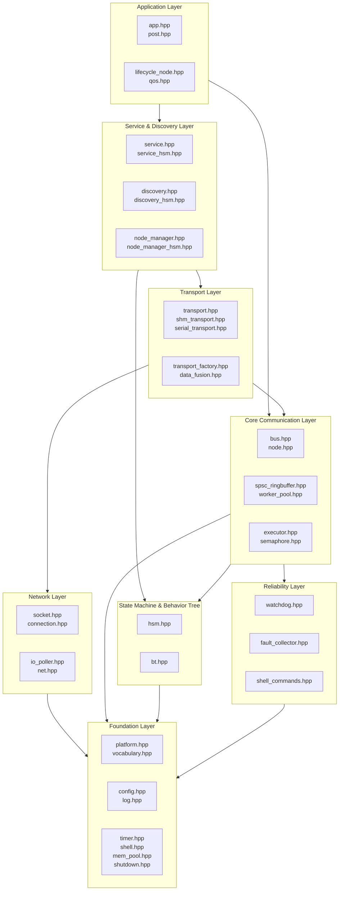
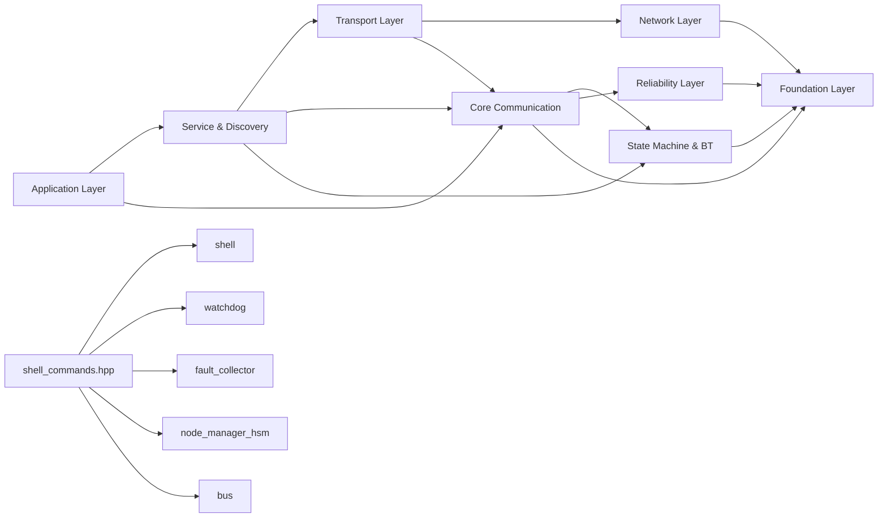

# newosp

[](https://github.com/DeguiLiu/newosp/actions/workflows/ci.yml)

Modern C++17 header-only embedded infrastructure library for ARM-Linux, extracted and modernized from the OSP (Open Streaming Platform) codebase (~140k LOC).

**[中文文档](README_zh.md)**

## Features

- **Zero global state**: All state encapsulated in objects (RAII)
- **Stack-first allocation**: Fixed-capacity containers, zero heap in hot paths
- **`-fno-exceptions -fno-rtti` compatible**: Designed for embedded ARM-Linux
- **Type-safe error handling**: `expected<V,E>` and `optional<T>` vocabulary types
- **Header-only**: Single CMake INTERFACE library, C++17 standard
- **Lock-free messaging**: MPSC ring buffer bus with priority-based admission control
- **Template-based design patterns**: Tag dispatch, variadic templates, CRTP, compile-time composition

## Modules (37 headers)

### Foundation Layer (8)

| Module | Description |
|--------|-------------|
| `platform.hpp` | Platform/architecture detection, compiler hints, `OSP_ASSERT`, `SteadyNowUs` |
| `vocabulary.hpp` | `expected`, `optional`, `FixedVector`, `FixedString`, `FixedFunction`, `function_ref`, `not_null`, `NewType`, `ScopeGuard` |
| `config.hpp` | Multi-format config parser (INI/JSON/YAML), template-based backend dispatch |
| `log.hpp` | Logging macros, compile-time level filtering (stderr backend) |
| `timer.hpp` | Timer task scheduler based on `std::chrono::steady_clock` |
| `shell.hpp` | Remote debug shell (telnet), TAB completion, command history |
| `mem_pool.hpp` | Fixed-block memory pool (`FixedPool<BlockSize, MaxBlocks>`), embedded free list |
| `shutdown.hpp` | Async-signal-safe graceful shutdown, LIFO callbacks, `pipe(2)` wakeup |

### Core Communication Layer (7)

| Module | Description |
|--------|-------------|
| `bus.hpp` | Lock-free MPSC message bus (`AsyncBus<PayloadVariant>`), CAS publish, topic routing |
| `node.hpp` | Lightweight pub/sub node (`Node<PayloadVariant>`), Bus injection, FNV-1a topic hash |
| `worker_pool.hpp` | Multi-worker thread pool, AsyncBus + SPSC per-worker queues, AdaptiveBackoff |
| `spsc_ringbuffer.hpp` | Lock-free wait-free SPSC ring buffer (trivially_copyable, batch ops, FakeTSO) |
| `executor.hpp` | Scheduler (Single/Static/Pinned + RealtimeExecutor SCHED_FIFO) |
| `semaphore.hpp` | Lightweight semaphore (futex-based LightSemaphore/PosixSemaphore) |
| `data_fusion.hpp` | Multi-source data fusion (time alignment, interpolation) |

### State Machine & Behavior Tree (2)

| Module | Description |
|--------|-------------|
| `hsm.hpp` | Hierarchical state machine (LCA transitions, guard conditions, zero heap) |
| `bt.hpp` | Behavior tree (Sequence/Fallback/Parallel, flat array storage, cache-friendly) |

### Network & Transport Layer (8)

| Module | Description |
|--------|-------------|
| `socket.hpp` | TCP/UDP RAII wrapper (sockpp) |
| `io_poller.hpp` | epoll event loop (edge-triggered + timeout) |
| `connection.hpp` | Connection pool management (auto-reconnect, heartbeat) |
| `transport.hpp` | Network transport (v0/v1 frame protocol, SequenceTracker) |
| `shm_transport.hpp` | Shared memory IPC (lock-free SPSC, ARM memory ordering, CreateOrReplace crash recovery) |
| `serial_transport.hpp` | Industrial serial transport (CRC-CCITT, PTY testing, IEC 61508) |
| `net.hpp` | Network layer wrapper (address resolution, socket options) |
| `transport_factory.hpp` | Automatic transport selection (inproc/shm/tcp) |

### Service & Discovery Layer (6)

| Module | Description |
|--------|-------------|
| `service.hpp` | RPC service (request-response, ServiceRegistry, AsyncClient) |
| `discovery.hpp` | Node discovery (UDP multicast + static config, TopicAwareDiscovery) |
| `node_manager.hpp` | Node management + heartbeat monitoring |
| `node_manager_hsm.hpp` | HSM-driven node heartbeat state machine (Connected/Suspect/Disconnected) |
| `service_hsm.hpp` | HSM-driven service lifecycle (Idle/Listening/Active/Error/ShuttingDown) |
| `discovery_hsm.hpp` | HSM-driven discovery flow (Idle/Announcing/Discovering/Stable/Degraded) |

### Application Layer (4)

| Module | Description |
|--------|-------------|
| `app.hpp` | Application/Instance two-tier model (MakeIID, HSM-driven) |
| `post.hpp` | Unified posting (AppRegistry + OspPost + OspSendAndWait) |
| `qos.hpp` | QoS configuration (Reliability/History/Deadline/Lifespan) |
| `lifecycle_node.hpp` | Lifecycle node (Unconfigured/Inactive/Active/Finalized, HSM-driven) |

### Reliability Layer (2)

| Module | Description |
|--------|-------------|
| `watchdog.hpp` | Software watchdog (deadline monitoring, timeout callbacks) |
| `fault_collector.hpp` | Fault collection and reporting (FaultReporter POD injection, ring buffer) |
| `shell_commands.hpp` | Built-in diagnostic shell command bridge (zero-intrusion, 15 Register functions) |

## Architecture



### Module Dependencies



## Build

```bash
cmake -B build -DCMAKE_BUILD_TYPE=Release
cmake --build build -j$(nproc)
ctest --test-dir build --output-on-failure
```

### Build with all config backends

```bash
cmake -B build -DCMAKE_BUILD_TYPE=Release \
    -DOSP_CONFIG_INI=ON \
    -DOSP_CONFIG_JSON=ON \
    -DOSP_CONFIG_YAML=ON
cmake --build build -j$(nproc)
```

### CMake Options

| Option | Default | Description |
|--------|---------|-------------|
| `OSP_BUILD_TESTS` | ON | Build test suite (Catch2 v3.5.2) |
| `OSP_BUILD_EXAMPLES` | OFF | Build example programs |
| `OSP_CONFIG_INI` | ON | Enable INI config backend (inih) |
| `OSP_CONFIG_JSON` | OFF | Enable JSON config backend (nlohmann/json) |
| `OSP_CONFIG_YAML` | OFF | Enable YAML config backend (fkYAML) |
| `OSP_NO_EXCEPTIONS` | OFF | Disable exceptions (`-fno-exceptions`) |
| `OSP_WITH_SOCKPP` | ON | Enable sockpp network library (socket/transport) |

## Quick Start

```cpp
#include "osp/config.hpp"
#include "osp/bus.hpp"
#include "osp/node.hpp"
#include "osp/log.hpp"

// Multi-format config
osp::MultiConfig cfg;
cfg.LoadFile("app.yaml");
int32_t port = cfg.GetInt("network", "port", 8080);

// Type-based pub/sub messaging
struct SensorData { float temp; };
struct MotorCmd { int speed; };
using Payload = std::variant<SensorData, MotorCmd>;

osp::Node<Payload> sensor("sensor", 1);
sensor.Subscribe<SensorData>([](const SensorData& d, const auto& h) {
    OSP_LOG_INFO("sensor", "temp=%.1f from sender %u", d.temp, h.sender_id);
});
sensor.Publish(SensorData{25.0f});
sensor.SpinOnce();
```

## CI Pipeline

| Job | Description |
|-----|-------------|
| **build-and-test** | Ubuntu, Debug + Release |
| **build-with-options** | `-fno-exceptions -fno-rtti` compatibility |
| **sanitizers** | AddressSanitizer, ThreadSanitizer, UBSan |
| **code-quality** | clang-format, cpplint |

## Requirements

- CMake >= 3.14
- C++17 compiler (GCC >= 7, Clang >= 5)
- Linux (ARM-Linux embedded platform)

## Third-party Dependencies

All dependencies are fetched automatically via CMake FetchContent:

| Library | Version | Usage | Condition |
|---------|---------|-------|-----------|
| [inih](https://github.com/benhoyt/inih) | r58 | INI config parsing | `OSP_CONFIG_INI=ON` |
| [nlohmann/json](https://github.com/nlohmann/json) | v3.11.3 | JSON config parsing | `OSP_CONFIG_JSON=ON` |
| [fkYAML](https://github.com/fktn-k/fkYAML) | v0.4.0 | YAML config parsing | `OSP_CONFIG_YAML=ON` |
| [sockpp](https://github.com/fpagliughi/sockpp) | v1.0.0 | TCP/UDP socket wrapper | `OSP_WITH_SOCKPP=ON` |
| [Catch2](https://github.com/catchorg/Catch2) | v3.5.2 | Unit testing | `OSP_BUILD_TESTS=ON` |

## Examples and Tests

- **Examples**: 13 single-file demos + 2 multi-file applications (15 total)
  - Single-file: `basic_demo`, `benchmark`, `bt_patrol_demo`, `client_demo`, `hsm_bt_combo_demo`, `hsm_protocol_demo`, `node_manager_hsm_demo`, `priority_demo`, `protocol_demo`, `realtime_executor_demo`, `serial_demo`, `worker_pool_demo`, `codegen_demo`
  - Multi-file apps: `shm_ipc` (shared memory IPC demo), `client_gateway` (multi-node client gateway)
  - See [docs/examples_zh.md](docs/examples_zh.md) for detailed guide
- **Unit tests**: 758 test cases covering all modules (ASan/TSan/UBSan all passing)
  - See [tests/README.md](tests/README.md) for test documentation

## Documentation

- Architecture design: [docs/design_zh.md](docs/design_zh.md)
- Coding standards: [docs/coding_standards_zh.md](docs/coding_standards_zh.md)
- Developer reference: [docs/reference_zh.md](docs/reference_zh.md)
- Shell commands design: [docs/design_shell_commands_zh.md](docs/design_shell_commands_zh.md)
- Serial integration design: [docs/cserialport_integration_analysis.md](docs/cserialport_integration_analysis.md)
- Codegen design: [docs/design_codegen_zh.md](docs/design_codegen_zh.md)
- Changelog: [docs/changelog_zh.md](docs/changelog_zh.md)
- Examples guide: [docs/examples_zh.md](docs/examples_zh.md)

## Design Patterns

This library uses template-based modern C++ patterns instead of traditional virtual-function OOP:

- **Tag dispatch + Template specialization**: Config backend selection (INI/JSON/YAML)
- **Variadic templates + `if constexpr`**: `Config<Backends...>` compile-time composition
- **CRTP**: Extensible shell commands without virtual functions
- **SBO Callback**: `FixedFunction<Sig, Cap>` with zero heap allocation
- **Lock-free MPSC**: `AsyncBus` sequence-based ring buffer with CAS publish
- **Type-based routing**: `std::variant` + `VariantIndex<T>` compile-time dispatch

## License

Apache-2.0
