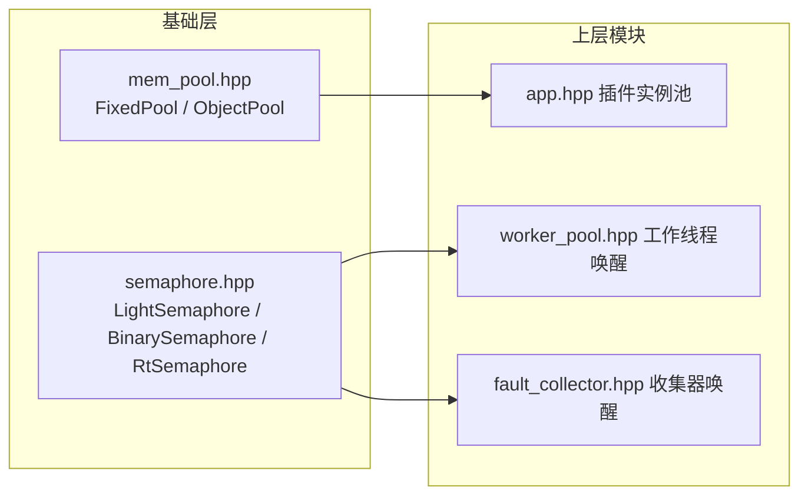
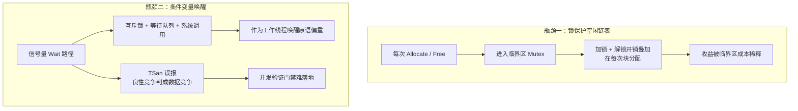
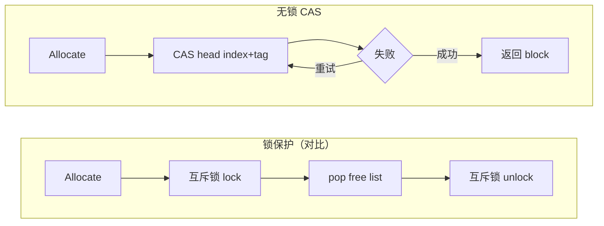
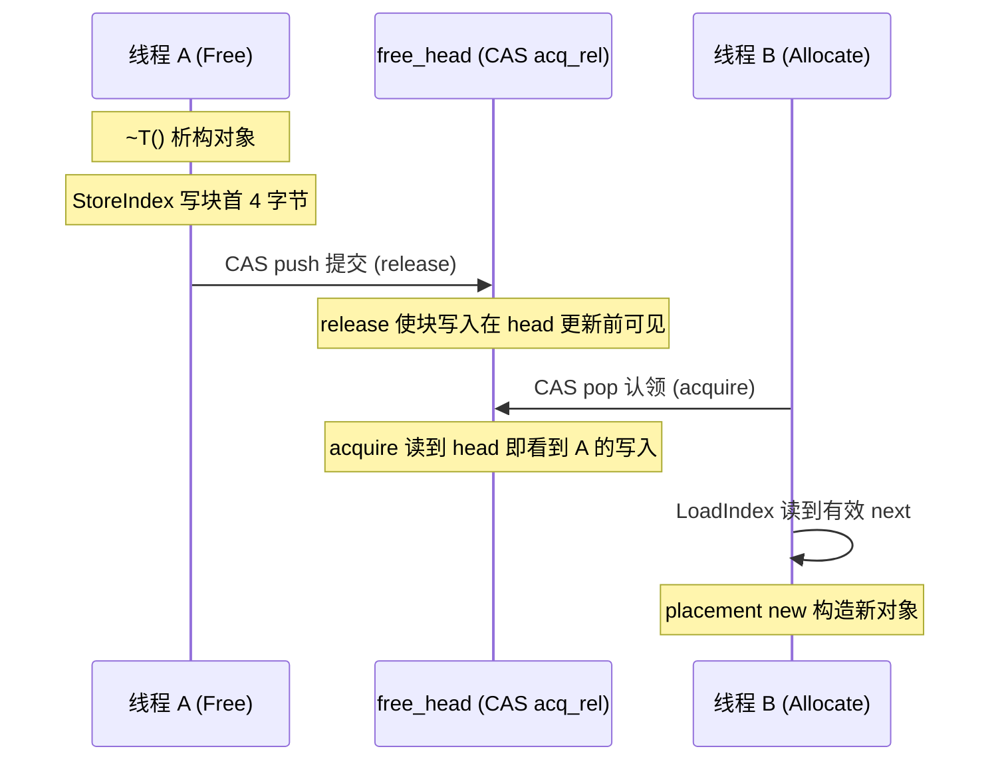
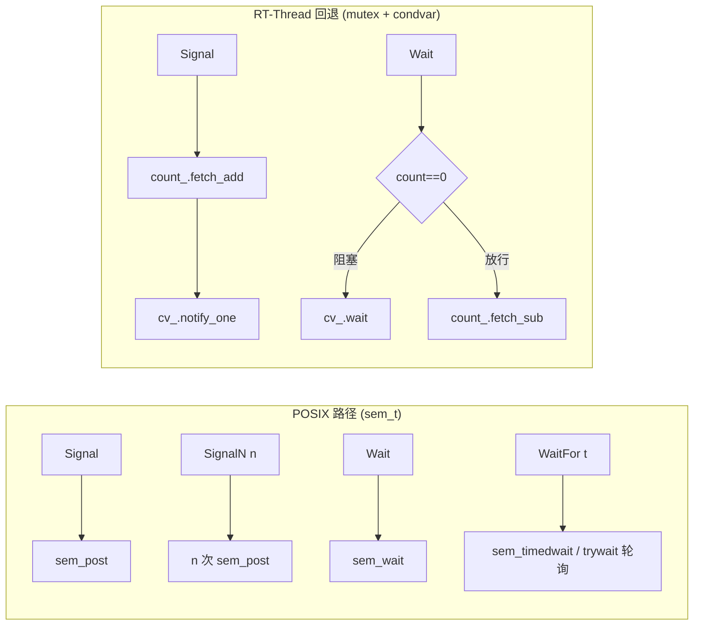
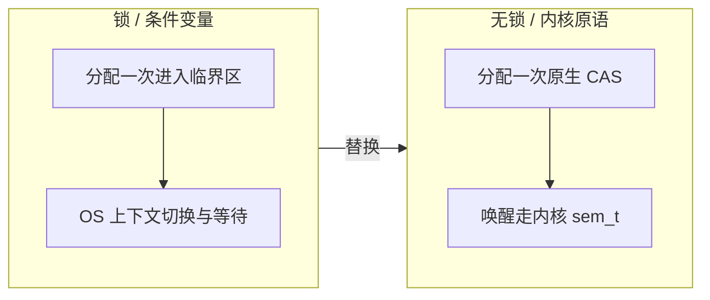

# ARM-Linux 嵌入式库：内存池与信号量的无锁设计

newosp（[https://github.com/DeguiLiu/newosp](https://github.com/DeguiLiu/newosp)）是纯头文件的 C++17 嵌入式基础库，面向 POSIX（Linux/macOS）与 RT-Thread 双平台。本文讲两个基础原语的设计思路：内存池 `FixedPool` 如何用单 32 位原子的无锁链表替代互斥锁，信号量 `LightSemaphore` 如何按平台分派并发原语。核心结论是热路径分配降到一次原生 CAS，等待路径落到内核原语。



## 1. 库的定位与三条硬约束

newosp 把整库做成 header-only，通过 `#include <osp/xxx.hpp>` 直接引入，无独立编译产物、无外部强依赖。所有状态都封装在对象中（RAII），不设全局状态，因此同一套代码可多实例并行。它同时面向 POSIX 与 RT-Thread，平台差异在 `platform.hpp` 中用宏检测收敛（`OSP_PLATFORM_LINUX` / `OSP_PLATFORM_MACOS` / `OSP_PLATFORM_RTTHREAD`），上层模块按编译期宏选择实现。

库有三条硬约束，本文的两个原语都以不破坏它们为前提：

- **热路径禁止堆分配**。嵌入式下系统调用代价高、内存碎片不可控，高频路径不允许 `new` / `malloc`。库用固定容量容器与固定块内存池承担分配职责，`mem_pool.hpp` 是其中一环。
- **兼容 `-fno-exceptions -fno-rtti`**。嵌入式 C++ 通常关闭异常与运行时类型信息。库以 `expected<V,E>`、`optional<T>` 等词汇类型代替异常。
- **共享数据必须线程安全**。所有跨线程共享的数据都要有明确同步手段，且同步不能成为热路径瓶颈。

`FixedPool` 与 `LightSemaphore` 位于基础层，被上层模块直接引用：`app.hpp` 用 `ObjectPool` 管理插件实例，`worker_pool.hpp` 与 `fault_collector.hpp` 用信号量唤醒工作线程。基础层原语若带上锁开销，会逐层传导到所有上层模块，这正是需要无锁设计的切入点。

## 2. 两个并发瓶颈

内存池最坏的开销来自互斥锁保护空闲链表，信号量最重的路径来自条件变量唤醒：



应对思路：`FixedPool` 用带 ABA 标签的 32 位 CAS 空闲链表替代互斥锁；`LightSemaphore` 在 POSIX 上用 `sem_t`，条件变量仅作 RT-Thread 回退。

## 3. 内存池：单 32 位原子装下整条空闲链表

`FixedPool<BlockSize, MaxBlocks>` 的存储完全内联在对象中：一个对齐的字节数组，共 `MaxBlocks` 块。"空闲链表"不占额外存储，而是嵌入空闲块自身——每个空闲块前 4 字节存放下一个空闲块的下标，构造时串成 `block[i].next = i + 1`，末尾指向哨兵。分配与释放均 O(1)。

无锁的关键是把链表头压缩进**单个 32 位原子** `free_head_`：


选用单字 CAS 有三个理由：

1. **原生支持**。x86 与 ARM Cortex-M（`LDREX` / `STREX`）原生支持 32 位 CAS，无需链接 `libatomic` 回退。
2. **无撕裂**。32 位原子访问在 32 位目标上天然原子，负载存储不碎裂。
3. **规避 64 位**。32 位目标普遍没有原生 64 位原子指令，单字 CAS 可直接映射为 `LDREX` / `STREX`。

作为代价，池容量上限被压缩到 16 位，对嵌入式池子足够，`static_assert(MaxBlocks <= 0xFFFF)` 在编译期保证。head 下标位为 `0xFFFF` 表示池空，`Allocate` 返回 `nullptr`。

**ABA 防护**。Treiber 栈的经典风险：链表头先被 pop 出索引 A，又被并发 push 回 A，head 索引位看似不变，持过期快照的旧线程 CAS 可能错误成功。这里每次成功的 head CAS（push 或 pop）都让标签加一，即使索引回绕，标签不同，CAS 判不等，过期快照被丢弃重试。

`Allocate` 与 `Free` 主体都是带重试的 CAS 循环：

```cpp
void* Allocate() {
  uint32_t head = free_head_.load(std::memory_order_relaxed);
  while (detail::FreePoolHeadIndex(head) != detail::kFreeIndexEmpty) {
    const uint32_t idx = detail::FreePoolHeadIndex(head);
    const uint32_t next = LoadIndex(idx);                    // 良性竞争点
    const uint32_t new_head = detail::FreePoolPackHead(next, detail::FreePoolHeadTag(head) + 1U);
    if (free_head_.compare_exchange_weak(head, new_head,
                                         std::memory_order_acq_rel, std::memory_order_relaxed)) {
      used_count_.fetch_add(1U, std::memory_order_relaxed);
      return BlockPtr(idx);
    }
    // CAS 失败：head 已刷新，重试
  }
  return nullptr;
}

void Free(void* ptr) {
  const uint32_t idx = PtrToIndex(ptr);
  uint32_t head = free_head_.load(std::memory_order_relaxed);
  for (;;) {
    StoreIndex(idx, detail::FreePoolHeadIndex(head));        // 良性竞争点
    const uint32_t new_head = detail::FreePoolPackHead(idx, detail::FreePoolHeadTag(head) + 1U);
    if (free_head_.compare_exchange_weak(head, new_head,
                                         std::memory_order_acq_rel, std::memory_order_relaxed)) {
      break;
    }
  }
  used_count_.fetch_sub(1U, std::memory_order_relaxed);
}
```

本实现相对锁保护的抽象对比：



`FixedPool` 只做裸块分配，`ObjectPool<T>` 在其上叠加 placement new 做类型化对象分配，用独立数组跟踪存活对象，并提供 `AllocateChecked` / `CreateChecked` 的 `expected` 错误通道，作为 `-fno-exceptions` 下类型安全的错误处理。

### 3.1 中断上下文安全

无锁实现带来一项互斥锁不具备的收益：中断服务例程（ISR）可用。若空闲链表由互斥锁保护，线程持有锁期间被中断抢占，ISR 内再调用同一池子的 `Allocate` / `Free` 会尝试获取同一把锁，形成自死锁。换成无锁后，ISR 内的 CAS 要么成功、要么失败后以最新 head 重试，全程无持锁等待，不存在优先级反转与自死锁窗口。

## 4. 内存序：head CAS 的 acq_rel

head CAS 的内存序选 `acq_rel`，其需求来自**对象生命周期跨线程送达**，而非链表头更新本身。以 `ObjectPool` 为例：



若 head CAS 用 `relaxed`，线程 A 的析构与 `StoreIndex` 写入、线程 B 的构造之间没有 happens-before 关系，块内容在下一次 CAS 前处于弱序状态，理论上 B 可能读到 A 尚未完成析构的数据。`acq_rel` 让 Free 一侧以 release 发布、Allocate 一侧以 acquire 认领，二者配对后块内容写入对下一持有者可见，析构、重分配、构造的先后关系得到保证。

两处细节：

- **`next` 字段的良性竞争**。`Allocate` 中 `LoadIndex(idx)` 读到的 `next` 可能已被他线程改写，但过期读数只用于构造新 head，CAS 失败即被丢弃，不构成正确性缺陷。TSan 会在此报告误报，处理是用 `OSP_TSAN_NO_RACE`（`__attribute__((no_sanitize("thread")))`）跳过该处插桩——只绕过工具，不绕过正确性，顺序仍由 head 的 `acq_rel` CAS 保证。
- **失败序用 `relaxed`**。CAS 写成功序 `acq_rel`、失败序 `relaxed`。失败时 head 已被刷新，循环重试；失败路径无发布也无认领，不需要 release 或 acquire，`relaxed` 正确且略省开销。

`used_count_` 等统计诊断数据用 `relaxed`，不参与同步。

## 5. 信号量：并发原语按平台分派

`LightSemaphore` 保留 `count_` 原子计数缓冲，供 `TryWait` 与 `Count` 使用，底层原语按平台编译期分派：



- **POSIX 路径**用 `sem_t`。构造时 `sem_init`，失败置 `valid_ = false`，对象保持可用但不阻塞（`Wait` 直接返回、`TryWait` 恒 false）。`Signal` 做 `count_.fetch_add(relaxed)` 后 `sem_post`；`Wait` 调 `sem_wait`，`EINTR` 时重试；`WaitFor` 在 Linux 走 `sem_timedwait`，macOS 因无名信号量不支持则退化为 `sem_trywait` 加短睡眠轮询。内核信号量语义天然带开门关门，notify 与 wait 间无丢失窗口。
- **RT-Thread 回退路径**保留 `count_ + condition_variable`：`Signal` 在 `fetch_add` 后 `notify_one`，`Wait` 在 `count_ == 0` 时阻塞于谓词重检。该路径与条件变量原始实现等价，仅作 RT-Thread 后备，不在 POSIX 热路径上。

```cpp
void Signal() noexcept {
  count_.fetch_add(1U, std::memory_order_relaxed);
#if defined(OSP_PLATFORM_LINUX) || defined(OSP_PLATFORM_MACOS)
  if (valid_) {
    ::sem_post(&sem_);
  }
#else
  cv_.notify_one();
#endif
}
```

`SignalN(n)` 是 `Signal` 的批量别名而非合并唤醒：先 `count_.fetch_add(n, relaxed)`，POSIX 路径循环 N 次 `sem_post` 让 N 个阻塞线程各自放行，保留计数式语义；RT-Thread 回退路径只 `notify_one`（谓词只检验 `count > 0`，单次通知足以放行一个等待者），其余计数留在 `count_` 供后续消费。它省去调用方自行写循环，不改变计数语义。

库同时提供 `BinarySemaphore`（计数钳制 0/1）与按平台别名的 `osp::Semaphore`（RT-Thread 上为 `RtSemaphore`，其余为 `LightSemaphore`）。上层经 `osp::Semaphore` 获得与平台匹配的实现，无需关心底层差异。

`Count()` 返回 `count_` 的松弛序快照，是当前值的提示而非权威读数。POSIX 路径上真正的计数语义由内核 `sem_t` 保证，`count_` 仅用于 `TryWait` 与诊断；RT-Thread 回退路径上 `count_` 与 `cv_.wait` 谓词直接绑定，才是等待逻辑的判定依据。

## 6. 设计收益



两个原语的取舍对比如下：

| 组件 | 原方案 | 现方案 | 收益 |
|------|--------|--------|------|
| `FixedPool` | 互斥锁保护空闲链表 | 32 位带标签 CAS 空闲链表 | 分配/释放一次原生 CAS，单核 ISR 安全，多生产者安全；容量上限 `MaxBlocks <= 0xFFFF` |
| `LightSemaphore`（POSIX） | `mutex + condition_variable` | `sem_t`（`sem_init` 失败降级） | 等待路径走内核原语，规避 condvar 的 TSan 误报；macOS 无 `sem_timedwait` 需轮询 |
| `LightSemaphore`（RT-Thread） | `mutex + condition_variable` | 同（回退路径） | 行为等价，仅作后备 |

`FixedPool` / `ObjectPool` 的公有接口与 `expected` 错误通道保持不变，上层模块无需改动即获得新的并发语义。

---

*本项目是开源的：<https://github.com/DeguiLiu/newosp>。相关实现见 `include/osp/mem_pool.hpp`、`include/osp/semaphore.hpp`。*
