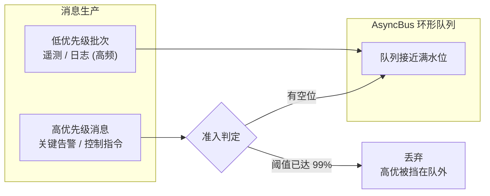
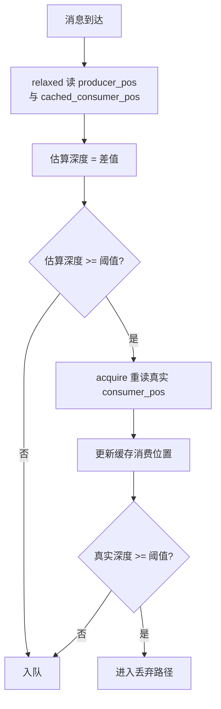
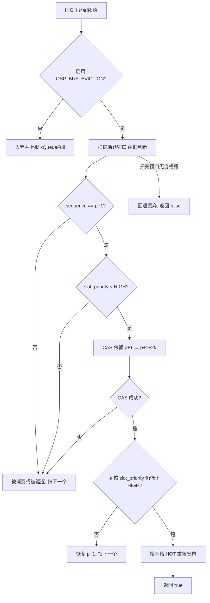
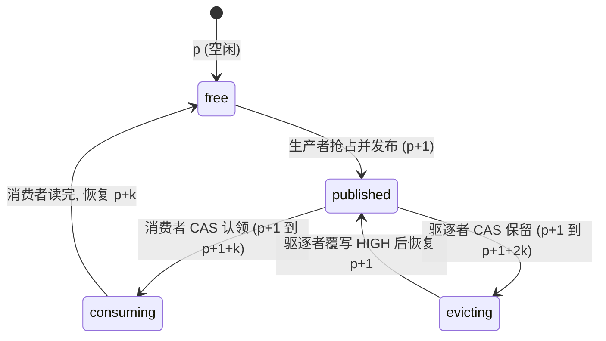
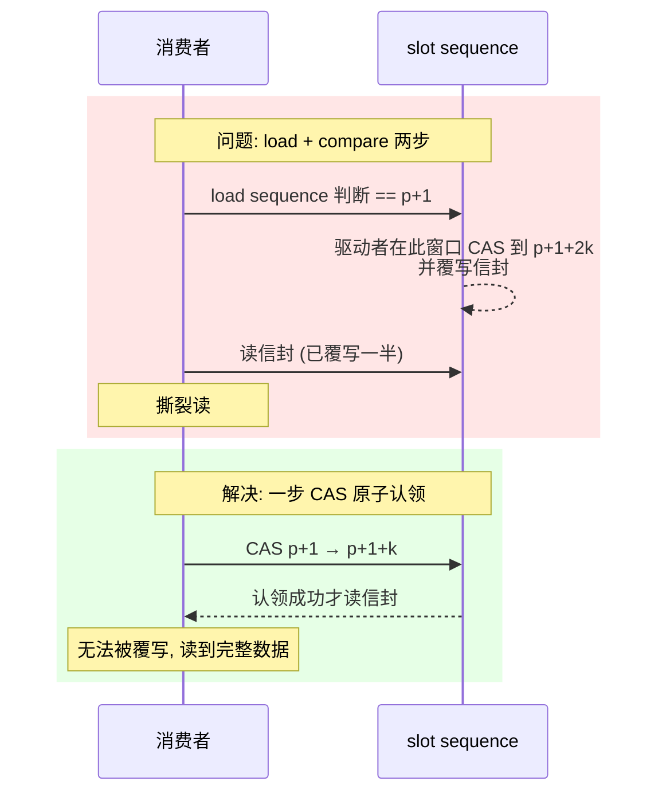
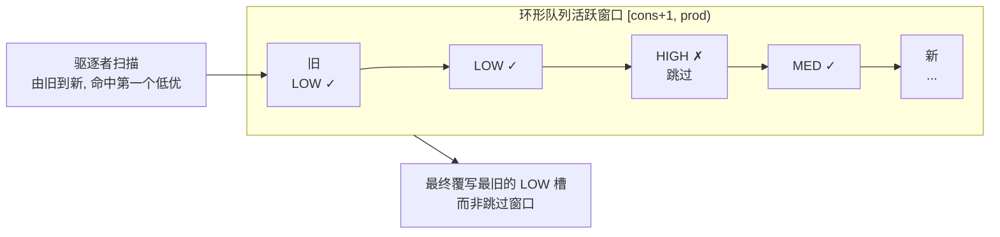

# ARM-Linux 嵌入式消息总线：AsyncBus 高优先级驱逐机制

[newosp](https://github.com/DeguiLiu/newosp) 是一个面向嵌入式 Linux 平台的现代 C++17 纯头文件基础设施库，为传感器、机器人、边缘计算等工业嵌入式系统提供消息总线、异步日志、定时任务、状态机、行为树、服务发现与 RPC 等能力。库内所有模块均以头文件形式交付，单一 CMake INTERFACE 库，零外部强依赖，兼容 `-fno-exceptions -fno-rtti`，热路径零堆分配。

`AsyncBus` 是 newosp 核心通信层的无锁 MPSC（多生产者单消费者）消息总线，采用预分配的环形缓冲区承载不同优先级的消息，并提供基于优先级的准入控制。本文介绍其中的高优先级驱逐（evict）机制：当低优先级消息的涌入把队列打满时，如何保证高优先级消息仍能入队并被消费。驱逐指将队列中一条已发布但尚未消费的低优先级消息在原位覆写，为其腾出槽位来接纳高优先级消息。

先给出结论：在启用驱逐机制前，`priority_demo` 场景下高优先级 CriticalAlert 的丢失率为 20.1%；启用后该值降为 0.0%。该机制由编译开关 `OSP_BUS_EVICTION` 控制，默认开启，上层代码无需任何改动。

## 背景与动机

`AsyncBus` 的环形缓冲区同时承载全部优先级。无锁队列的容量有限，生产速率超过消费速率时队列必然饱和。既有问题在于：低优先级消息（遥测数据、诊断日志）通常高频产生，一旦其涌入把队列打到接近满水位，高优先级消息（关键告警、控制指令）会与低优先级消息一同被准入控制拒绝，在入队阶段即被丢弃，根本没有机会被消费。



这里不是传统意义上的优先级反转（低优先级线程持锁导致高优先级线程等待），而是消息在准入阶段就被丢弃。对实时性要求高的系统，关键告警的丢失可能直接导致故障漏报，危害大于低优先级消息的丢帧。因此需要一种机制，让高优先级消息在队列已满时仍能抢占有限队列空间。

本文从准入控制的两处设计出发，说明驱逐机制的完整实现：准入阶段的分级阈值判定、队列满时的原位覆写；随后分析保证无锁正确性的 slot 状态机、消费者原子认领、公平性与有界性，最后给出验证结果。

从实现结构看，`AsyncBus` 的环形缓冲区由 `kQueueDepth`（默认 4096）个 `RingBufferNode` 组成，每个节点包含三个字段：`sequence`（`std::atomic<uint32_t>`，编码 slot 状态）、`slot_priority`（`std::atomic<uint8_t>`，记录当前消息优先级）以及信封 `envelope`（消息头加 `std::variant` 载荷）。三个位置指针按缓存行对齐隔离，避免伪共享：`producer_pos_` 与 `cached_consumer_pos_` 属于生产侧，`consumer_pos_` 属于消费侧。生产者通过 CAS 推进 `producer_pos_` 抢占空槽，消费者唯一推进 `consumer_pos_`。驱逐机制就是在该结构上加入的第三条访问路径，因此下文所有正确性论证都围绕"三个访问方如何互斥同一 slot"展开。

## 既有设计：分级阈值准入控制

准入控制按优先级分为三档编译期常量阈值（`GetThresholdForPriority` 根据优先级返回对应值）：LOW 为队列深度的 60%，MED 为 80%，HIGH 为 99%。当预估深度达到该优先级阈值时，消息被丢弃。

判定流程先在常规路径用缓存消费位置做松弛估算，只有超过阈值才重读真实位置复核：



```cpp
uint32_t threshold = GetThresholdForPriority(priority);          // 按优先级取阈值
uint32_t prod = producer_pos_.load(std::memory_order_relaxed);
uint32_t cached_cons = cached_consumer_pos_.load(std::memory_order_relaxed);
uint32_t estimated_depth = prod - cached_cons;                   // 用缓存的消费位置估算深度

if (estimated_depth >= threshold) {
  uint32_t real_cons = consumer_pos_.load(std::memory_order_acquire);  // 重读真实消费位置
  cached_consumer_pos_.store(real_cons, std::memory_order_relaxed);
  stats_.admission_rechecks.fetch_add(1, std::memory_order_relaxed);

  uint32_t real_depth = prod - real_cons;
  if (real_depth >= threshold) {
    // 队列深度确实达到阈值, 进入丢弃路径
  }
}
```

深度先以缓存消费位置做一次 `relaxed` 估算，只有超过阈值时才用 `acquire` 重读真实消费位置复核，并把真实值写回缓存供后续复用。这样避免每次入队都对消费位置做 `acquire` 读，又不会因过期缓存把"实际有空位"误判为"已满"。

准入通过后，生产者进入入队路径。入队以 CAS 循环抢占空槽：读取 `producer_pos_` 定位候选节点，校验其 `sequence` 等于当前序号 `p`（空闲）。校验失败有两种可能，一是队列确已写满（`producer_pos_ - consumer_pos_ >= kQueueDepth`），此时丢弃并上报 `kQueueFull`；二是与其他生产者竞争同一槽位，重试即可。CAS 成功推进 `producer_pos_` 后，写入信封并发布。

```cpp
uint32_t prod_pos = 0;
RingBufferNode* target = nullptr;
do {
  prod_pos = producer_pos_.load(std::memory_order_relaxed);
  target = &ring_buffer_[prod_pos & kBufferMask];

  uint32_t seq = target->sequence.load(std::memory_order_acquire);
  if (seq != prod_pos) {
    uint32_t cons = consumer_pos_.load(std::memory_order_acquire);
    if (kQueueDepth <= prod_pos - cons) {   // 队列确已写满
      stats_.messages_dropped.fetch_add(1, std::memory_order_relaxed);
      ReportError(BusError::kQueueFull, current_id);
      return false;
    }
    continue;                               // 与其他生产者竞争失败, 重试
  }
} while (!producer_pos_.compare_exchange_weak(prod_pos, prod_pos + 1, ...));

// 写入信封: header / payload / slot_priority
target->sequence.store(prod_pos + 1, std::memory_order_release);   // 发布
```

下标取 `prod_pos & kBufferMask`，其中 `kBufferMask = kQueueDepth - 1`，由于 `kQueueDepth` 是 2 的幂，该掩码即实现环形回绕。发布用 `memory_order_release` 写 `sequence`，与消费者认领的 `acquire` 构成发布-消费同步。

`priority_demo` 展示了该设计的失效路径。Phase 2 依次发布 10000 条 LOW（遥测）、5000 条 MED（诊断日志）和 1000 条 HIGH（关键告警），同时消费者以小批次慢速消费。LOW 超过 60% 阈值、MED 超过 80% 阈值被丢弃；到 HIGH 发布时队列已到接近 100% 水位，`real_depth >= 99%` 成立，HIGH 消息也进入丢弃分支。此时 CriticalAlert 丢失率达到 20.1%，这是驱逐机制引入前的基线。

## 新设计：HIGH 达到阈值时原位覆写

驱逐机制的思路是：HIGH 消息达到阈值时不直接丢弃，而是从活跃窗口 `[consumer_pos + 1, producer_pos]` 内由旧到新扫描，找到一条已发布、未消费且优先级严格更低的 slot，用 CAS 将其保留后，在原位覆写为当前 HIGH 消息并重新发布。



```cpp
// PublishInternal 的丢弃分支, 仅 kHigh 且启用 OSP_BUS_EVICTION
if (real_depth >= threshold) {
#if OSP_BUS_EVICTION
  if (priority == MessagePriority::kHigh) {
    if (TryEvictAndPublish(std::move(payload), sender_id, timestamp_us, topic_hash)) {
      return true;
    }
    // 没有更低优先级 slot 可驱逐, 回退到丢弃
  }
#endif
  stats_.messages_dropped.fetch_add(1, std::memory_order_relaxed);
  ReportError(BusError::kQueueFull, current_id);
  return false;
}
```

`TryEvictAndPublish` 只在 HIGH 且启用 `OSP_BUS_EVICTION` 时进入。它不触碰 `producer_pos_`，因此不改变生产者对队列容量的判断，也不影响消费者的读取进度。找到合格槽并成功覆写则返回 `true`，HIGH 消息入队；扫描整窗无合格槽（队列中已无 LOW/MED，或全部槽位处于竞争状态）则返回 `false`，回退到原有丢弃逻辑。

完整实现如下。它先取生产与消费位置界定活跃窗口，再由旧到新遍历；对每个候选槽，先看 `sequence` 是否为 `p + 1` 且 `slot_priority` 低于 HIGH，再以 CAS 保留，保留成功后在槽内复核优先级，最后覆写并重新发布：

```cpp
bool TryEvictAndPublish(PayloadVariant&& payload, uint32_t sender_id,
                        uint64_t timestamp_us, uint32_t topic_hash) noexcept {
  uint32_t prod = producer_pos_.load(std::memory_order_relaxed);
  uint32_t cons = consumer_pos_.load(std::memory_order_acquire);

  // 活跃窗口 [cons+1, prod), 以模运算推进, 避免 uint32_t 回绕
  for (uint32_t i = 1; i < kQueueDepth; ++i) {
    uint32_t p = cons + i;
    if (p == prod)
      break;
    RingBufferNode& node = ring_buffer_[p & kBufferMask];

    uint32_t seq = node.sequence.load(std::memory_order_acquire);
    if (seq != (p + 1))                       // 仅已发布槽可驱逐
      continue;
    if (node.slot_priority.load(std::memory_order_relaxed) >= static_cast<uint8_t>(MessagePriority::kHigh))
      continue;                               // 不驱逐 HIGH

    // CAS 保留: p+1 到 p+1+2k, 失败说明消费者或其他驱逐者刚认领
    if (!node.sequence.compare_exchange_strong(seq, p + 1 + kEvictOffset,
                                               std::memory_order_acq_rel, std::memory_order_acquire))
      continue;

    // 保留后复核: 防止生产者在预筛选与保留之间写入 HIGH
    if (node.slot_priority.load(std::memory_order_relaxed) >= static_cast<uint8_t>(MessagePriority::kHigh)) {
      node.sequence.store(p + 1, std::memory_order_release);
      continue;
    }

    // 覆写为 HIGH 并重新发布
    uint64_t msg_id = next_msg_id_.fetch_add(1, std::memory_order_relaxed);
    node.envelope.header = MessageHeader{msg_id, timestamp_us, sender_id, topic_hash, MessagePriority::kHigh};
    node.envelope.payload = std::move(payload);
    node.slot_priority.store(static_cast<uint8_t>(MessagePriority::kHigh), std::memory_order_relaxed);
    node.sequence.store(p + 1, std::memory_order_release);

    // 被逐的 LOW/MED 记 dropped, 接纳的 HIGH 记 published
    stats_.messages_dropped.fetch_add(1, std::memory_order_relaxed);
    stats_.messages_published.fetch_add(1, std::memory_order_relaxed);
    return true;
  }
  return false;
}
```

统计口径上，被驱逐的 LOW/MED 计入 `messages_dropped`，被接纳的 HIGH 计入 `messages_published`，与丢弃路径的计数语义一致。驱逐只影响统计计数与信封内容，不移动任何环形缓冲区的物理位置，这正是"原位覆写"的含义。

## slot 状态机：三套偏移量编码四种状态

无锁环境下消费者与驱逐者并发访问同一 slot，不出错的前提是 slot 的 `sequence` 状态值域互斥。对一个当前序号为 `p` 的 slot，定义四个状态和三个偏移量：

- `p`：空闲，生产者可抢占
- `p + 1`：已发布，消费者可消费、驱逐者可保留
- `p + 1 + k`：消费者已认领（`k = kQueueDepth`）
- `p + 1 + 2k`：驱逐者已保留

其中 `k` 与 `2k` 均大于活跃窗口宽度（活跃窗口不超过 `kQueueDepth`），因此 `k`、`2k` 两个偏移标签不会落入合法发布值域 `p + 1`，也就不会把一个状态误认成另一个状态。这是驱逐标记与真实发布/空闲/已消费值不可混叠（ABA-free）的依据。`static_assert(kQueueDepth <= 0x7FFFFFFFU)` 保证 `p + 2k` 在 `uint32_t` 内不会回绕。



消费者与驱逐者都从 `p + 1` 出发，CAS 到不同目标（`p + 1 + k` 与 `p + 1 + 2k`）。同一 slot 在同一时刻只有一个 CAS 成功，这是原子 `compare_exchange` 的互斥保证。成功拿到槽的一方享有其后的读写窗口；拿不到的一方退回寻找其他 slot。消费者认领到 `p + 1 + k` 后读取信封，驱逐者无法再覆写；驱逐者保留到 `p + 1 + 2k` 后覆写信封，消费者读到的仍是旧状态，CAS 失败而跳过。

`slot_priority`（`std::atomic<uint8_t>`）是驱逐者扫描时读取的旁路信息：生产者在发布时把消息优先级写入该字段，驱逐者先据此判断目标是否为 LOW/MED，足够低才尝试保留。这一筛选是尽力而为的，最终的一致性仍由 `sequence` 的 CAS 保证。把优先级放在独立原子字段中，是为了让驱逐者不必触碰非原子的信封字段即可完成预筛选。

四个状态、持有者与离开路径可概括为下表。

| `sequence` 值 | 状态 | 持有者 | 离开路径 |
|---|---|---|---|
| `p` | 空闲 | 生产者 | 抢占后发布 `p + 1` |
| `p + 1` | 已发布 | 消费者或驱逐者 | 任一方 CAS 认领 |
| `p + 1 + k` | 消费者认领中 | 消费者 | 读完后恢复 `p + k` |
| `p + 1 + 2k` | 驱逐者保留中 | 驱逐者 | 覆写后恢复 `p + 1` |

表中可见 `p + 1` 是消费者与驱逐者共享的竞争入口，二者通过 CAS 到互斥目标分岔，这是整个驱逐机制无锁正确性的核心。

## 消费者原子认领：杜绝撕裂读

修改前，消费者读 slot 是 `load` 加 `compare` 两步：先 `load` `sequence`，判断等于 `p + 1`，再读信封。驱逐者路径下这两步之间存在窗口：`load` 完、判断完、正要读信封时，驱逐者可能已把该槽 CAS 到 `p + 1 + 2k` 并覆写。此时消费者读到的是覆写了一半的信封，产生撕裂读。



修改后，两步合并为一步 `compare_exchange_strong`，把 `sequence` 从 `p + 1` 原子切换到 `p + 1 + k`，切换成功才有资格读信封：

```cpp
uint32_t expected_seq = cons_pos + 1;  // p+1, 已发布
if (!node.sequence.compare_exchange_strong(expected_seq, expected_seq + kConsumedOffset,
                                           std::memory_order_acq_rel, std::memory_order_acquire)) {
  break;  // 驱逐者或竞态抢先, 跳过这个槽, 下一轮再处理
}
// 拿到这个槽, 后面可以安全读信封
```

竞争的两条路径都安全：驱逐者先拿到槽（切到 `p + 1 + 2k`），消费者的 CAS 期望值仍为 `p + 1`，匹配失败，跳过该槽等下一轮，不读半成品；消费者先拿到槽（切到 `p + 1 + k`），驱逐者对这个槽的 CAS 也失败，只能继续扫描下一个，不覆写正在被读取的信封。`ProcessBatch` 与 `ProcessBatchWith` 两条消费路径均采用该认领方式。

认领的内存序为 `memory_order_acq_rel`（成功时）配合 `memory_order_acquire`（失败时）。成功切换写入新状态的同时建立读入屏障，保证后续信封读取不会越过认领点；失败时不写状态、仅读取，`acquire` 足以同步可见状态。由于消费者是单线程，任一槽认领失败即 `break` 退出本轮批处理，`ProcessBatch` 处理完一批后以 `relaxed` 写回推进后的 `consumer_pos_`，供下一轮及生产者复核读取。

## 公平性与有界性

驱逐者按 `[consumer_pos + 1, producer_pos)` 顺序由旧到新扫描，命中的第一个合格低优先级 slot 即队列中最旧的一条，符合"优先驱逐最不重要的消息"的直觉。每个候选 slot 只尝试一次 CAS，CAS 失败便扫下一个；扫描范围受 `kQueueDepth` 上界约束，用模运算推进避免 `uint32_t` 回绕，扫完整个窗口没有合格槽就回退到丢弃，不会无限自旋。



驱逐只在 HIGH 达到 99% 阈值后才触发，此时活跃窗口接近整个队列，扫描上界与队列深度同阶，最坏情况为一次完整扫描后回退丢弃，复杂度 O(kQueueDepth)，且每个候选槽的检查与 CAS 均为常数次操作。除最坏情况外，驱逐路径不引入任何自旋等待或互斥锁，与入队、消费路径同为无锁。

驱逐路径上还有一处重校验。驱逐者先按 `slot_priority` 预筛选，再 CAS 保留槽位，两者之间存在时间窗口：一个生产者可能在此期间把一条 HIGH 消息写入该槽。因此保留成功后，驱逐者会再次读取 `slot_priority` 复核，若发现该槽已被 HIGH 占据，则把 `sequence` 恢复为 `p + 1` 并继续扫描，避免刚插入的高优先级消息被误驱逐。

被驱逐的消息在 `Publish` 调用时曾返回过 `true`，但最终可能不送达：槽被覆写，该消息计入 `messages_dropped`。这是高优先级抢占的代价，`AsyncBus` 本身不提供端到端送达确认，需要上层的 QoS 与重发机制配合。

## 验证

验证分为功能与并发两层。功能层面，`priority_demo` 的 Phase 1 在正常负载下（每类消息各 100 条）全部送达；Phase 2 在高负载下，启用 `OSP_BUS_EVICTION`（默认值 1）后 CriticalAlert 丢失率从基线 20.1% 降为 0.0%，满足 demo 内置的"丢失率低于 1%"判定。并发层面，4 个生产者线程加 1 个消费者线程的压测中，HIGH 消息在 LOW/MED 混合发布下全部送达，无卡死。全量单测通过，GCC TSan 报告无数据竞争。

## 编译开关

该特性由 `OSP_BUS_EVICTION` 编译开关控制，定义于 `include/osp/opt.hpp`，默认值为 1。关闭时 HIGH 与其他优先级同等对待，队列满即丢弃，回归纯阈值准入行为。开关为编译期常量，上层代码无需任何改动即可在两种行为间切换。

---

本文对应的代码改动见 [newosp](https://github.com/DeguiLiu/newosp) `include/osp/bus.hpp`。
