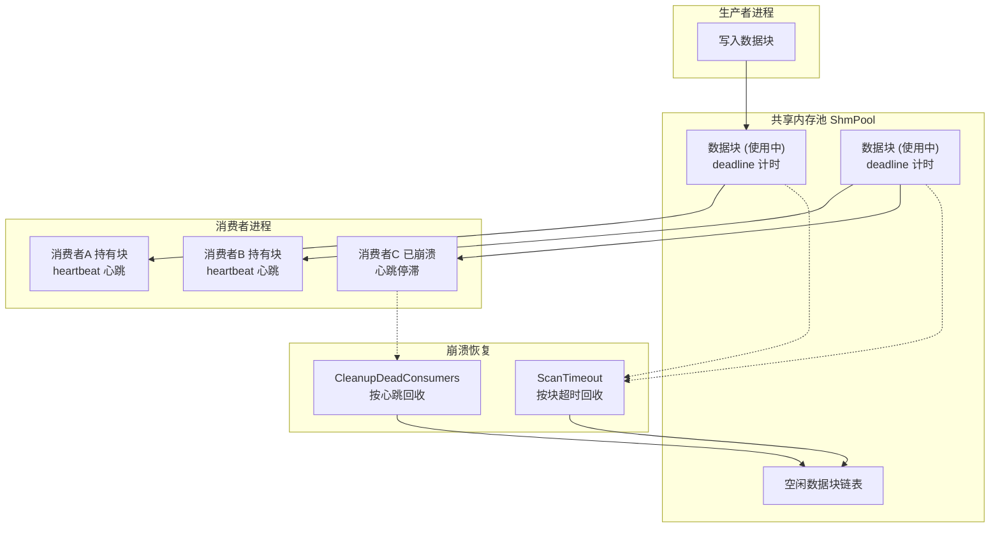
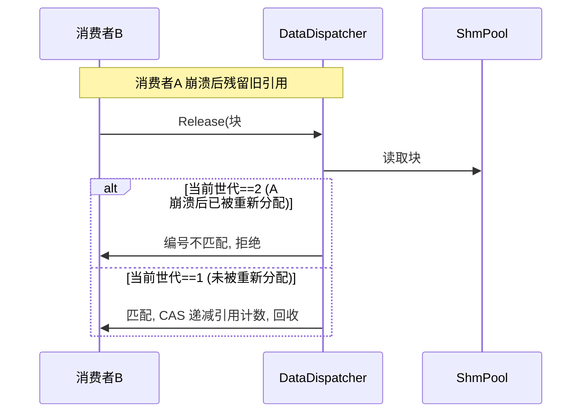
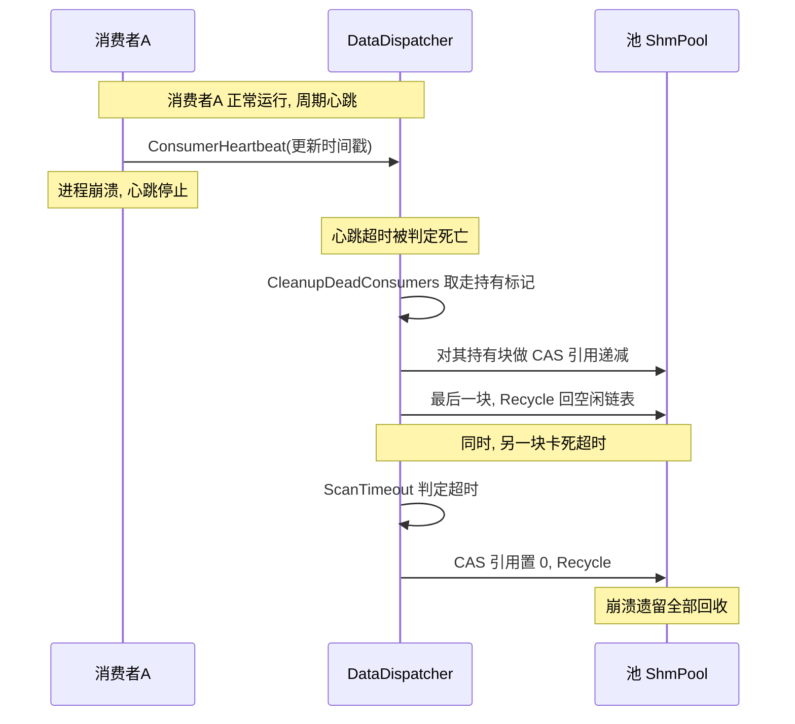

# 嵌入式共享内存的崩溃恢复：newosp 如何保证进程崩溃后不留下脏状态

> newosp（https://github.com/DeguiLiu/newosp ）是一个面向嵌入式 Linux 的 C++17 头文件基础设施库。
> 它提供共享内存、数据分发、定时器、日志、状态机等组件，供工业传感器、机器人、边缘计算等嵌入式系统使用。
> 本文介绍其中共享内存通道的崩溃恢复机制：进程崩溃后，共享内存中残留的数据如何处理，
> 以及为此引入的世代编号校验、按块超时回收与按消费者心跳回收。

## 1. 项目背景与动机

### 1.1 newosp 是什么

newosp 是一个 header-only 的 C++17 嵌入式基础设施库，定位是"现代嵌入式 Linux 项目的基础积木"。它坚持 `-fno-exceptions -fno-rtti`、热路径零堆分配、状态全部封装在对象内（无全局共享状态），并提供覆盖通信、时序、日志、状态机、可靠性等 47 个头文件。

其中与本文相关的是两块：共享内存传输（`ShmTransport`）与数据分发（`DataDispatcher`）。两者合起来构成多进程间共享内存通信通道：一个进程向共享内存写数据，多个消费者进程从中读取，典型用于进程间高频数据交换（传感器数据、控制指令、日志流等）。

源码见 <https://github.com/DeguiLiu/newosp>，核心逻辑在 `include/osp/shm_transport.hpp` 与 `include/osp/data_dispatcher.hpp`。

### 1.2 要解决的问题：进程崩溃后的脏状态

共享内存是进程间共享的一段映射内存。它的一个特殊之处是：**进程崩溃不退场**——崩溃的进程来不及清理它持有的内存段，段会保留下来，里面残留"半写"的状态：

- 某个数据块被崩溃进程标记为"正在使用"（`kProcessing` / `kReady`），但永远不会有进程去收尾；
- 某个消费者进程崩溃了，它名下持有的数据块引用计数没有释放，这些数据块永远不会被正常回收。

若不处理，共享内存会逐渐耗尽：崩溃留下的数据块越积越多，剩下的可用块越来越少。这就需要一个崩溃恢复机制：**运行时如何发现"另一个进程已经死了，它留下的东西我该回收"**。

这是本文的引子。接下来先讲这套恢复机制包含哪几部分，再展开每一处修复。

## 2. 恢复机制概览

崩溃恢复基于两套互相补充的检活机制：

| 机制 | 检活对象 | 判定方式 | 解决的问题 |
|---|---|---|---|
| 按数据块超时 | 单个数据块 | 块进入使用态后挂一个超时时间（deadline），超时即回收 | 块被占用但无人收尾 |
| 按消费者心跳 | 消费者进程 | 消费者周期性提交心跳，超时未跳动即判定死亡 | 进程崩溃后它持有的块被回收 |

第一条解决"块被占用但没写完"的崩溃；第二条解决"进程死了，它手中的所有块"的崩溃。两者配合：前者应对单个块的卡死，后者回收死亡进程的整批持有。

两套机制在数据分发管道中各自作用的位置如下：



生产者为消费者提交数据块，消费者持有块并通过心跳维持存活。`ScanTimeout` 面向池中的使用中块，超时即回收回空闲链表；`CleanupDeadConsumers` 面向已崩溃的消费者（心跳停滞），回收其持有的块。两条路径都回收到空闲链表，供后续分配复用。

## 3. 修复一：孤儿数据块的超时回收

在介绍修复前，先说明原实现的一个缺口。

原代码的注释一直写"崩溃恢复通过心跳实现"，但 `DataDispatcher` 的实际代码里没有任何心跳逻辑。`Release` 接口也不校验调用者身份，于是会出现：

一个**失效的块编号**（block_id）仍能引用到一块已经被回收、又被重新分配给其他用途的数据块。这时引用计数被错误地递增，最终导致内存泄漏，甚至访问已释放内存（use-after-free）。

修复分两步，同时进行：

1. 实现按数据块的超时回收（下文的 `ScanTimeout`）；
2. 给每个数据块附加一个**世代编号**（generation），`Release` 在回收前先校验世代编号匹配，不匹配就拒绝。

`ScanTimeout` 遍历所有数据块，对处于"使用中"（`kProcessing` / `kReady`）且超过 deadline 的块，尝试用原子比较交换（CAS）把引用计数置为 0 以抢占回收权，成功者才真正回收。

```cpp
uint32_t cur = blk->refcount.load(std::memory_order_acquire);
bool claimed = false;
while (cur > 0U) {
  if (blk->refcount.compare_exchange_weak(cur, 0U, std::memory_order_acq_rel, std::memory_order_acquire)) {
    claimed = true;
    break;
  }
}
if (claimed) {
  blk->SetState(BlockState::kTimeout);
  ...
  Recycle(i);
}
// 没抢到: Release 已经回收了它, 跳过
```

这段 CAS 的目的在于避免竞争：正常的 `Release` 也可能在回收同一块（引用计数降到 0、状态置为"空闲"）。若 `ScanTimeout` 不抢占权就把状态写成"超时"，可能覆盖掉正常的"空闲"状态。只有 CAS 抢占成功才改状态，保证一块数据只被一个回收方处理。

`Release` 里的引用计数递减同样用 CAS（以 `while (cur > 0U)` 防负数），避免并发时把计数减成负数。

## 4. 修复二：世代编号校验

解决"失效块编号仍能引用到已重分配块"的办法，是给每个数据块一个**世代编号**。分配时写入，存在数据块的保留字段里，不额外占内存。

代际编号取自空闲链表头的 ABA 标签，每分配一次自增一，跳过 0 作标记用的保留值：

```cpp
uint32_t gen = detail::JobHeadTag(head) + 1U;
if (gen == 0U) {
  gen = 1U;  // 32 位标签回绕时跳过 0
}
...
blk->reserved = gen;
```

`Release(uint32_t block_id, uint32_t generation)` 先校验世代编号匹配才执行回收：若传入的编号与块当前编号不符，说明这块数据已经被回收又重新分配过，当前引用是失效引用，直接拒绝。同样的校验也加到 `GetReadable`、`GetPayloadSize`、`AddRef`，让消费者的所有接口在遇到跨进程、跨通知边界的失效引用时一律拒绝，从安全上"关死"。

需要说明的是：世代编号取自空闲链表头的标签克隆，不是数据块自己的计数值。一块数据经"分配-回收-再分配"后，新世代编号取决于链表头标签当时的取值——**可能不同，也可能因标签回绕而相同**（32 位标签约 40 亿次分配转一圈）。因此设计上不承诺"一定不同"，而是接受"编号空间充足，撞上相同编号的概率极低，且有超时与心跳兜底"。



## 5. 修复三：按消费者心跳回收

这是"心跳回收"的主体实现。消费者注册后，周期性调用 `ConsumerHeartbeat` 更新自己的心跳时间。`CleanupDeadConsumers` 遍历消费者槽，对心跳超时（距上次心跳超过阈值）的消费者，回收它持有的全部数据块。

回收时的时序很关键：**先取走该消费者持有的数据块标记（holding_mask），再翻转其存活标记，避免竞争**：

```cpp
// 先取走持有的块标记, 再翻转存活标记 1→0
uint64_t mask = slot->holding_mask.exchange(0U, std::memory_order_acq_rel);
if (active == 1U) {
  uint32_t expected = 1U;
  if (!slot->active.compare_exchange_strong(expected, 0U, std::memory_order_acq_rel, ...)) {
    // 竞争: 另一个回收进程已抢先翻转 active。
    // 把拿到的标记还给仍处于非存活的槽;
    // 若槽已被复用, 标记归新消费者自己。孤立的数据块由按块超时回收兜底。
    ...
  }
}
```

先取走持有的块标记、再翻转存活标记，是为了保证：某个消费者稍后注册进这个槽时，不会被仍在运行的旧回收进程顺走它新写入的持有标记。存活槽的初始心跳时间设为 0 也出于同样考虑——心跳为 0 表示"存活状态未知"，回收逻辑对此直接放行（不视为死亡），从而封住从注册时的存活标记设置到第一次心跳写入之间的一段窗口。

取到标记后，对其中每个被持有的数据块做引用计数 CAS 递减；减到计数为 1 时说明这是最后一个消费者，可整体回收。即：消费者进程崩溃后，它持有块的引用靠心跳回收释放；单个块的卡死超时则靠按块超时回收处理，两者互不冲突。

一个典型崩溃场景下，两套机制如何配合：



左侧是心跳超时触发的消费者回收，右侧是块自身卡死触发的超时回收，两者并行、互不干扰，最终都回到空闲链表。

## 6. 其余缺陷与同步清理

除上述三条修复外，这次改动还一并处理了其他几处问题。

### 6.1 队列指针的原子化

在单生产者、多消费者（SPMC）场景里，生产者/消费者的位置指针原本用普通 `uint32_t` 读写，靠 `volatile` 保证可见性。多核上这不可靠——两个消费者同时读头尾指针，可能读到不一致的取值。

改为 `std::atomic<uint32_t>` 并用 `acquire` / `release` 内存序标注后，可见性由内存模型保证，不再依赖平台特有的 `volatile` 行为。

### 6.2 示例代码里的访问已释放内存

`data_dispatcher` 示例里有一处隐藏的访问已释放内存问题：`consumer_fusion` 和 `consumer_logging` 在析构时没有显式退订，而它们注册的回调捕获了对象的 `this`。对象销毁后，回调仍可能被触发，运行时写入已回收的内存。

修复方式是析构时自动退订——对象持有总线引用，析构时遍历并退订它注册的全部句柄。

### 6.3 同步完成的清理

- `RealtimeExecutor` 的 `stack_size` 配置此前在 Linux 上被忽略，修复为实际调用 `pthread_attr_setstacksize`；
- 注释统一压缩到不超过五行（项目规范）；
- 涉及 60 个文件改动，核心逻辑集中在 `data_dispatcher.hpp` 与 `shm_transport.hpp`。

## 7. 使用场景与收益

这套崩溃恢复机制面向的是以共享内存为进程间通信主通道的嵌入式系统。典型于以下场景：

- **高频传感器数据分发**：采集进程向共享内存写入传感器读数，多个消费者进程订阅。采集进程或某个消费者进程崩溃后，其余进程需要继续工作，不能因残留数据耗尽共享内存而整体瘫痪；
- **控制指令下发**：控制进程向执行进程下发指令，执行进程崩溃时需回收其持有数据，防止下次上线时读到过期的指令残影；
- **日志与监控流**：日志进程向共享内存写入日志，消费者按需读取。日志消费者崩溃退出后，其持有块的引用应被回收，避免内存被占满影响新日志写入。

这三类场景的共同点是"高可用"：其中一个参与者崩溃，不应拖垮整个系统。若没有崩溃恢复，每次进程异常都需手动清理共享内存（`ipcrm`）或重启整套应用，运维成本高且可能丢失重要状态。

收益体现在三处：

- **自动回收**：崩溃进程遗留的数据块由按块超时与按消费者心跳自动回收，无需人工干预，杜绝共享内存持续耗尽；
- **防误操作**：世代编号校验让失效引用访问已重分配内存的概率趋近于零，避免访问已释放内存与数据错乱；
- **运行时自愈**：检测到进程死亡后，其余进程继续以完好状态运行，系统不必整体重启。

代价是引入两类定时检活（deadline 扫描与心跳扫描）与世代编号的额外字段。对可靠性优先的嵌入式系统，这笔开销在运行时自动完成、换来自愈能力，是值得的换入。

## 8. 总结

进程崩溃后的脏状态回收，本质是对"另一个进程已经死亡"这一事实的探测与应对。newosp 用两条互补路径实现：按数据块的超时回收，解决单块卡死；按消费者的心跳回收，解决一整个进程的整批持有崩溃。再配上世代编号校验，封死失效引用访问已重分配内存的口子。对使用共享内存做进程间通信的嵌入式系统，这套机制把"崩溃后手动清理或重启清空"变成了运行时自动完成的可靠恢复。

崩溃恢复建立在若干底层机制之上，相关设计与实现可参阅本系列其他文章：无锁空闲链表与信号量（`01-lockfree-pool-semaphore.md`）、无锁队列的内存序（`04-ring-buffer-memory-ordering.md`）、世代编号校验的细节与局限（`05-generation-check.md`）。这些机制共同构成 newosp 在共享内存、无锁并发与崩溃自愈上的整体能力。

---

*本项目是开源的，欢迎使用与反馈：<https://github.com/DeguiLiu/newosp>。核心代码见 `include/osp/shm_transport.hpp`、`include/osp/data_dispatcher.hpp`。*
