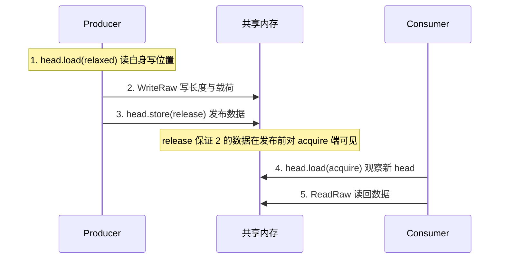
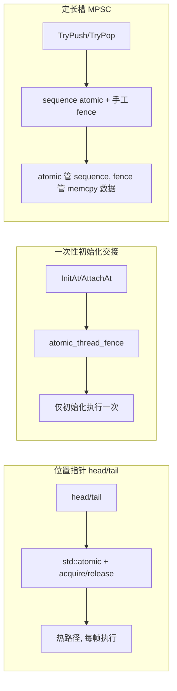

# ARM-Linux 嵌入式共享内存环形缓冲区：内存序的设计选择

newosp（[https://github.com/DeguiLiu/newosp](https://github.com/DeguiLiu/newosp)）是面向 ARM-Linux 嵌入式场景的 C++17 纯头文件基础库，兼容 `-fno-exceptions` 与 `-fno-rtti`，通过 POSIX 共享内存与 futex 提供跨进程通信能力。本文讨论其中 `ShmSpscByteRing` 的内存序设计，它是运行在共享内存里的 SPSC（单生产者单消费者）字节流环形缓冲区，承载 LiDAR 点云、视频帧等大载荷。

结论先行。跨进程共享的 head/tail 位置指针应当使用 `std::atomic<uint32_t>` 配合显式 memory order，而不是裸 `uint32_t` 加手工 `atomic_thread_fence`。热路径上的内存序分工为：`store(release)` 发布数据、`load(acquire)` 读取对方进度、`load(relaxed)` 读取自身位置。仅"一次性初始化交接"与定长槽 MPSC 的 memcpy 数据路径保留手工 fence。相关代码位于 `include/osp/shm_transport.hpp`。

## 1. 项目背景与主题

newosp 的共享内存 IPC 传输层位于 `include/osp/shm_transport.hpp`，包含四层能力：

- `SharedMemorySegment`：`shm_open`/`mmap`/`munmap` 的 RAII 封装，管理共享内存段的生命周期，创建、打开、卸载与移动语义齐备。
- `ShmSpscByteRing`：SPSC 字节流环形缓冲区，消息格式为 [4 字节小端长度][载荷]，针对变长大载荷设计，避免定长槽的存储浪费。
- `ShmSpmcByteRing`：SPMC（单生产者多消费者）字节流环形缓冲区，一个生产者广播、多个消费者各自独立读取，用于传感器数据分发。
- `ShmRingBuffer`：MPSC（多生产者单消费者）定长槽环形缓冲区，基于 sequence 序号与 CAS 争用生产者槽位，用于控制类小消息聚合。

这些缓冲区共享同一个设计前提：head/tail 位置指针跨进程共享，生产者和消费者分属不同进程。跨进程可见性不能依赖进程私有的缓存与寄存器，必须由 C++ 内存模型显式给出保证。本次改动把 `ShmByteRingHeader` 与 `ShmSpmcByteRingHeader` 中跨端共享的位置字段全部改为 `std::atomic<uint32_t>`，并以 static_assert 确认其无锁且布局兼容。

内存序问题在嵌入式多进程并发中最难排查，它在弱内存序平台或高负载下偶发、单看逻辑难以复现、一旦出现即数据错乱。本文以 `shm_transport.hpp` 的真实代码为对象，展开三个场景下内存序的选择依据：位置指针 atomic 化、一次性初始化交接保留手工 fence、定长槽 MPSC 的 atomic 与 fence 混合。这套判断框架可直接套用到类似的跨进程无锁数据结构上。

## 2. 位置指针层：head/tail 改为 atomic

`ShmByteRingHeader` 是共享内存段首部的 16 字节结构，head/tail 为跨进程共享位置指针，capacity 与 reserved 由 `InitAt` 一次性写入后不再变化，因此保持普通字段：

```cpp
struct ShmByteRingHeader {
  std::atomic<uint32_t> head;   // 生产者写位置, 单调递增
  std::atomic<uint32_t> tail;   // 消费者读位置, 单调递增
  uint32_t capacity;            // 数据区大小, 2 的幂
  uint32_t reserved;            // 对齐填充
};
static_assert(sizeof(ShmByteRingHeader) == 16, "ShmByteRingHeader must be 16 bytes");
```

head/tail 单调递增，回绕由 2 的幂掩码完成（`pos & mask_`），避免显式取模。改动前，head/tail 是裸 `uint32_t`，靠手工 fence 提供顺序：

```cpp
// 改动前: 裸 uint32_t + 手工 fence
uint32_t head = header_->head;                    // 裸读
WriteRaw(head, &len, 4);                          // 写长度前缀
WriteRaw(head + 4, data, len);                    // 写载荷
std::atomic_thread_fence(std::memory_order_release);
header_->head = head + total;                     // 裸写发布

// 消费者侧: 裸读 tail, acquire fence, 裸读 head
uint32_t tail = header_->tail;
std::atomic_thread_fence(std::memory_order_acquire);
uint32_t head = header_->head;
```

改动后，head/tail 为 `std::atomic<uint32_t>`，读写直接携带内存序参数。生产者侧 `Write` 与 `WriteableBytes`：

```cpp
// 生产者: Write
const uint32_t head = header_->head.load(std::memory_order_relaxed);  // 读自身写位置
WriteRaw(head, &len, 4);
WriteRaw(head + 4, data, len);
header_->head.store(head + total, std::memory_order_release);          // 发布数据

// 生产者: WriteableBytes, 读消费者进度决定可写空间
const uint32_t tail = header_->tail.load(std::memory_order_acquire);
```

消费者侧 `Read` 与 `ReadableBytes`：

```cpp
// 消费者: Read
const uint32_t tail = header_->tail.load(std::memory_order_relaxed);   // 读自身读位置
const uint32_t head = header_->head.load(std::memory_order_acquire);   // 观察已发布数据
ReadRaw(tail, &msg_len, 4);
ReadRaw(tail + 4, out, msg_len);
header_->tail.store(tail + msg_len + 4, std::memory_order_release);    // 交还空间给生产者
```

内存序分工固定在三个档位：

| 端点 | 读自身位置 | 读对方位置 | 写回自身位置 |
| --- | --- | --- | --- |
| 生产者 | `head.load(relaxed)` 取写偏移 | `tail.load(acquire)` 计算可写空间 | `head.store(release)` 发布数据字节 |
| 消费者 | `tail.load(relaxed)` 取读偏移 | `head.load(acquire)` 观察已发布数据 | `tail.store(release)` 交还已读空间 |

- `relaxed` 读自身位置。head 只由生产者写入、tail 只由消费者写入，读自己写的递增位置不需要顺序约束，`Write` 中的 `head.load(relaxed)` 与 `Read` 中的 `tail.load(relaxed)` 即此用途，省去不必要的屏障。
- `acquire` 读对方位置。生产者用 `tail.load(acquire)` 观察消费者已释放的空间，避免覆盖未消费数据；消费者用 `head.load(acquire)` 观察生产者已发布的数据。acquire 同步边同时保证其后的数据字节读取可见。
- `release` 写回自身位置。生产者 `head.store(release)` 发布数据字节，消费者 `tail.store(release)` 把已消费空间交还生产者。

SPSC 字节流的位置更新是独占 store，无需 CAS：head 只有生产者写、tail 只有消费者写，天然没有写竞争，这正是它能用普通 acquire/release 而非 RMW 指令的原因。

`store(release)` 保证 `WriteRaw` 的写入在 head 发布之前对消费者可见；`load(acquire)` 保证读到 head 之后能读到对应数据。两侧配对构成完整的 happens-before 链：



数据方向上的 happens-before 链为：生产者的数据写入 -> `head.store(release)` -> 消费者的 `head.load(acquire)` -> 消费者的数据读取。空间交还方向上的反向链同样成立，保证生产者不会覆盖未消费数据。

### 消息格式与空间计算

消息以 [4 字节小端长度][载荷] 的形式连续写入数据区。`WriteRaw` 与 `ReadRaw` 处理回绕：先取 `offset = pos & mask_`，若 `capacity - offset` 不足以容纳整段数据，则拆成两段 `memcpy`，一段写数据区尾部、一段写数据区头部：

```cpp
void WriteRaw(uint32_t pos, const void* src, uint32_t len) noexcept {
  const uint32_t offset = pos & mask_;
  const uint32_t first = header_->capacity - offset;
  if (first >= len) {
    std::memcpy(data_ + offset, src, len);
  } else {
    std::memcpy(data_ + offset, src, first);
    std::memcpy(data_, static_cast<const uint8_t*>(src) + first, len - first);
  }
}
```

可写与可读字节数由单调计数器直接相减得出，不需要取模：

- 生产者 `WriteableBytes = capacity - (head - tail)`，即总容量减去在途未读数据。
- 消费者 `ReadableBytes = head - tail`，即已发布未读数据。

SPSC 约束下 tail 恒不大于 head、head 恒不大于 tail 加 capacity，因此两个差值不会下溢，这是 SPSC 相比多写者模型简化空间计算的地方。

## 3. 裸 uint32_t 加手工 fence 方案的限制

裸 `uint32_t` 加手工 fence 方案的问题同时存在于编译器侧与硬件侧。

编译器侧，裸 `uint32_t` 在 C++ 抽象机中没有 atomic 语义。编译器可以把它缓存到寄存器、合并多次读写、消除"看似冗余"的重复 load，也可能把访问搬移到 fence 之外。fence 约束的是指令顺序，但优化之后真正需要排序的指令可能已不在预期位置；编译器也不了解该变量跨进程共享，没有任何理由保守对待。

硬件侧，`atomic_thread_fence` 只约束 fence 前后的指令顺序，不提供读写自身的原子性，也不附带语言层面的访问保留保证。x86 依赖 TSO 模型天然保持 store 顺序，此方案可正常运行，属于平台偶然性；ARM 弱内存模型下，裸读写在 fence 之间没有顺序保证，fence 前的 store 到 fence 执行时未必已对其他核可见。

改为 `std::atomic<uint32_t>` 之后，`load`/`store` 携带的内存序参数同时约束编译器与指令序列：ARMv8 上 acquire 读编译为 `ldar`、release 写编译为 `stlr`；x86 的 TSO 模型使 acquire 读与 release 写直接映射为普通 load/store 指令，无需额外屏障。两平台行为一致，语义在 C++ 内存模型中可论证，不再依赖平台偶然性。

## 4. 残留手工 fence 与通知路径

### 一次性初始化交接

字节流环中仍保留两处手工 `atomic_thread_fence`，位于"一次性初始化交接"，不在每帧数据的热路径上：

```cpp
// InitAt: 生产者侧初始化进程
ring.header_->head.store(0, std::memory_order_relaxed);
ring.header_->tail.store(0, std::memory_order_relaxed);
ring.header_->capacity = cap;
ring.header_->reserved = 0;
std::atomic_thread_fence(std::memory_order_release);   // 初始化写完, 才允许其他进程 attach
ring.mask_ = cap - 1;

// AttachAt: 消费者侧 attach
ring.header_ = static_cast<ShmByteRingHeader*>(shm_base);
ring.data_ = static_cast<uint8_t*>(shm_base) + kHeaderSize;
std::atomic_thread_fence(std::memory_order_acquire);   // 读到初始化结果, 后续才能安全使用
ring.mask_ = ring.header_->capacity - 1;
```

这是一次性的生产者-消费者交接：`InitAt` 把首部字段写好后，其他进程才通过 `AttachAt` 读取。`InitAt` 中的 release fence 覆盖其前的全部共享内存写入，`AttachAt` 中的 acquire fence 与它配对，保证 fence 之后读取 `capacity` 时看到的是初始化完成后的值。fence 在这里安全，因为它在程序启动阶段只执行一次，且与 head/tail 热路径的 atomic 操作不重叠。

fence 并非绝对要消除。同一文件中定长槽 MPSC 环形缓冲区 `ShmRingBuffer` 的 `TryPush`/`TryPop` 仍保留 `store(release)` 前的 release fence 与 `load(acquire)` 后的 acquire fence。那里 sequence 字段本身是 atomic，而 `memcpy` 搬运的数据字段不是；fence 用于为 sequence 之外的 memcpy 数据提供顺序保证。另外，`ShmRingBuffer` 的 `producer_pos_` 与 `consumer_pos_` 各自 64 字节对齐并填充，避免两端频繁写入的位置落进同一缓存行造成 false sharing。

判断标准：手工 fence 留在非热路径、且与 atomic 正确配对，才是安全用法。



### 通知路径与 head 的关系

`ShmByteChannel` 的写侧在 `ring_.Write` 成功后调用 `FutexWake(ring_.HeadPtr())` 唤醒等待的读者，读侧 `WaitReadable` 先走快速路径 `HasData()`，未命中则加载 head 后执行 `FutexWait(ring_.HeadPtr(), cur_head, timeout_ms)`，被唤醒后再次检查 `HasData()`：

```cpp
// WaitReadable 中的等待与重查
uint32_t cur_head = ring_.HeadPtr()->load(std::memory_order_acquire);
detail::FutexWait(ring_.HeadPtr(), cur_head, timeout_ms);
if (ring_.HasData()) {
  ...
}
```

futex 以 head 字段为等待字，`FutexWait` 对 `std::atomic<uint32_t>*` 做 `reinterpret_cast<uint32_t*>` 后直接调用 `SYS_futex`，这一转换的安全前提是文件开头的 static_assert：`sizeof(std::atomic<uint32_t>) == sizeof(uint32_t)`。唤醒后的重查走 `HasData()`，其内部 `ReadableBytes` 使用 `head.load(acquire)`，与生产者的 `head.store(release)` 配对，保证最终读到的数据字节通过 acquire/release 建立 happens-before，不依赖 futex 内核语义来传递数据可见性。

## 5. 不使用 seq_cst 的原因

`memory_order_seq_cst` 是默认内存序，但代价体现在硬件指令上。ARMv8 上：

- `store(release)` 编译为 `stlr`，指令本身即 release 语义，零额外屏障。
- `store(seq_cst)` 除 `stlr` 之外还需一条 `dmb ish`，为全局总序补足屏障。

SPSC 是一对一模型，生产者和消费者各自只有一个写点，数据流方向唯一，不需要全局总序。每帧数据都要更新 head 的热路径上，多一条 `dmb ish` 的代价逐帧累加。acquire/release 已构成完整的 happens-before 链，seq_cst 不带来额外正确性收益，只增加指令开销。

## 6. SPMC 同步影响

改动同样波及 `ShmSpmcByteRingHeader`，其 head 与 per-consumer tails 一并改为 `std::atomic`：

```cpp
struct ShmSpmcByteRingHeader {
  std::atomic<uint32_t> head;                                // 生产者写位置, 单调递增
  uint32_t capacity;                                         // 数据区大小, 2 的幂
  uint32_t max_consumers;                                    // 最大消费者数
  std::atomic<uint32_t> consumer_count;                      // 活跃消费者计数 (CAS 管理)
  std::atomic<uint32_t> tails[OSP_SHM_SPMC_MAX_CONSUMERS];   // 各消费者读位置
  std::atomic<uint32_t> active[OSP_SHM_SPMC_MAX_CONSUMERS];  // 1 活跃 / 0 不活跃
};
```

SPMC 语义下，生产者要避免覆盖任何消费者尚未读取的数据，可写空间由所有活跃消费者中最慢的 tail 决定。`WriteableBytes` 调用 `SlowestTail`，逐一读取各活跃消费者的 tail 后取最小值：

```cpp
uint32_t SlowestTail() const noexcept {
  uint32_t slowest = header_->head.load(std::memory_order_relaxed);
  for (uint32_t i = 0; i < header_->max_consumers; ++i) {
    if (header_->active[i].load(std::memory_order_relaxed) != 0) {
      const uint32_t t = header_->tails[i].load(std::memory_order_acquire);
      if (static_cast<int32_t>(slowest - t) > 0) {   // 有符号比较处理单调回绕
        slowest = t;
      }
    }
  }
  return slowest;
}
```

这里的每个 `tail.load(acquire)` 都是必要的：生产者必须看到消费者最新的消费进度，否则会基于过期 tail 计算可写空间，覆盖未消费数据。若 tail 是裸 `uint32_t`，编译器与硬件都无法保证读到最新值。消费者侧读 head 同样使用 `load(acquire)` 观察生产者发布的字节。SPMC 的消费者注册与注销通过 `active[]` 的 CAS 完成，`consumer_count` 以 relaxed 计数即可，不需要与其他字段构成同步边。

## 7. 三种缓冲区的内存序对照

同一传输层内三种环形缓冲区的内存序选择可以对照来看：

| 缓冲区 | 模型 | 位置字段 | 同步方式 | 热路径显式屏障 |
| --- | --- | --- | --- | --- |
| `ShmSpscByteRing` | SPSC | head/tail atomic | `store(release)`/`load(acquire)` | 无 |
| `ShmSpmcByteRing` | SPMC | head/tails[]/active[] atomic | `store(release)`/`load(acquire)` | 无 |
| `ShmRingBuffer` | MPSC | producer_pos_/consumer_pos_/sequence atomic | CAS acq_rel + 手工 fence | TryPush/TryPop 各一条 |

字节流两兄弟（SPSC 与 SPMC）把全部顺序保证收敛到位置指针的 acquire/release 上，热路径不出现手工 fence；定长槽 MPSC 因 sequence 与 memcpy 数据字段分离，保留手工 fence 为数据搬运提供顺序保证。三者的共同点是位置字段全部为 `std::atomic<uint32_t>`，且都以 `is_always_lock_free` 保证无锁。

## 8. 验证与小结

本次改动不是功能变更，而是正确性加固，验证围绕"改 atomic 是否引入新问题"展开：

- 全量 TSan（ThreadSanitizer）通过，无数据竞争报告。`test_shm_transport.cpp` 中 SPSC 并发、MPSC 压测与 SPMC 生产消费并发用例均在 TSan 下运行，说明 release/acquire 配对在共享内存场景下没有暴露新的竞争。
- SPSC/SPMC 跨进程压测通过，长时间运行下未出现读到未写完数据或覆盖未消费数据的现象。
- `std::atomic<uint32_t>::is_always_lock_free` 在 x86 与 ARM 上均为 true，代码库中的 static_assert 确认跨进程使用 atomic 未引入额外锁。

共享内存中使用 `std::atomic` 的前提是布局兼容且无锁。文件中的 static_assert 同时校验 `is_always_lock_free` 与 `sizeof(std::atomic<uint32_t>) == sizeof(uint32_t)`，后者保证 futex 可以直接作用于 head 字段做唤醒等待。

综上，`ShmSpscByteRing` 的内存序设计可归纳为一句话：热路径上的位置指针用 `std::atomic` 配合 acquire/release，relaxed 读自身、acquire 读对方、release 发布；冷路径的一次性初始化交接保留手工 fence，与 atomic 路径互不干扰；定长槽 MPSC 的 memcpy 数据排序保留 atomic 加 fence 混合。seq_cst 因热路径额外 `dmb ish` 代价被排除。该设计在 ARM 弱内存模型与 x86 TSO 上获得一致且可论证的行为。

---

本文对应的代码改动见 [newosp](https://github.com/DeguiLiu/newosp) `include/osp/shm_transport.hpp`。
