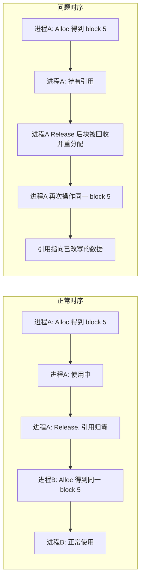
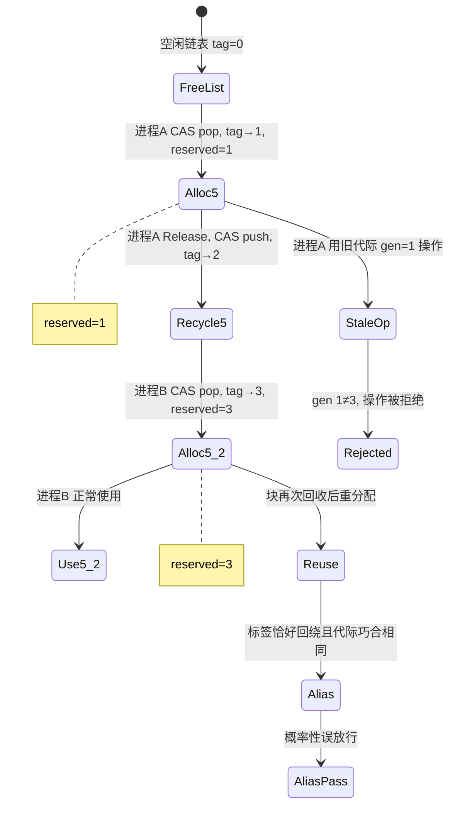
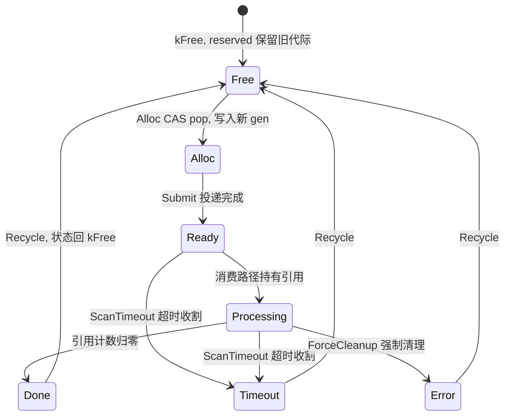
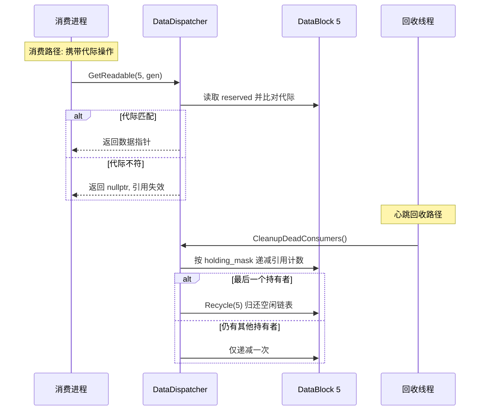

# ARM-Linux 嵌入式无锁内存池：失效引用的世代编号校验

## 项目背景与本文动机

newosp 是一个面向 ARM-Linux 嵌入式场景的 C++17 纯头文件基础设施库，开源地址为 https://github.com/DeguiLiu/newosp 。库内全部组件以单头文件形式交付，兼容 `-fno-exceptions` 与 `-fno-rtti`，无外部强制依赖，目标环境包括传感器、机器人、边缘计算等资源受限的工业设备。newosp 共包含 47 个头文件，覆盖固定容量容器、无锁消息总线、共享内存 IPC、异步日志、HSM 状态机与行为树、看门狗与故障收集、服务发现与 RPC 等能力。

`include/osp/data_dispatcher.hpp` 提供了共享数据块管道 `DataDispatcher`。该组件按 StorePolicy 抽象出进程内（`InProcStore`）与共享内存（`ShmStore`）两种存储后端，数据块在固定大小的块池中分配，生产者写入后沿静态 DAG 流水线投递，多个消费者进程并行处理，引用计数归零后回收到空闲链表。`Alloc` 与 `Release` 基于 Treiber 栈式的 CAS 空闲链表，不依赖锁。

本文讨论该组件在共享内存模式下遇到的一个经典问题：块号复用导致失效引用。共享内存池的块号（`block_id`）在回收后会被重新分配，一个进程持有某个 `block_id` 的引用时，另一个进程可能已将同一块回收并再次分配，旧持有者随后对这块数据的读写实际上访问的是已被改写的内存。该问题在单进程内可由锁或引用计数延迟回收解决，在跨进程共享内存场景下需要新的思路。DataDispatcher 采用世代编号（generation）校验：每个数据块在分配时携带一个由空闲链表头标签派生的代际值，消费方在跨进程、跨通知边界操作前先比对代际，代际不符即拒绝操作。该方案不占用额外内存、不在热路径引入额外原子操作，并将"引用指向已被复用的块"这类误操作拦截在入口。

值得读这篇文章的读者是关注无锁共享内存数据结构的嵌入式开发者。文章从问题本质、方案设计、与 ABA 标签的关系、与心跳回收的分工四个层面展开，所有细节与 `data_dispatcher.hpp` 源码一一对应，便于对照阅读。

## 问题本质：块号复用与引用合法性

在锁保护下，引用计数与生命周期同步：持有引用的线程使对象保持存活，对象不会在被引用期间被回收。无锁路径上不存在这样的同步屏障，`Release` 将块放回空闲链表之后，另一个 `Alloc` 可能立即取得同一个 `block_id`，此时旧引用指向的是新写入的数据，旧持有者却无从察觉。

块号复用造成的风险在于引用合法性与块号有效性脱钩。块号本身始终合法（在池容量范围内），但"这个块号当前承载的数据"已经不是旧持有者所见的那一份。引用计数与延迟回收（epoch-based reclamation）是经典解法，但在跨进程共享内存中不适用：进程崩溃后 epoch 无法继续推进，被遗留的块将永远无法回收。



## 方案：世代编号校验

世代编号（generation）是分配给数据块的一次性代际标识，语义为"该块在空闲链表上处于第几代"。块被分配时写入一个代际值，之后每次回收再分配，代际随之更新。持有引用的进程在操作前将本地保存的代际与块内当前代际比对，不一致即说明引用对应的那一代数据已被回收，操作应被拒绝。

DataDispatcher 的实现将代际值存入 `DataBlock::reserved` 字段，并在 `Alloc` 时从空闲链表头标签派生。`Release(block_id, generation)` 先校验代际再执行引用释放，代际不匹配直接返回失败。

```cpp
// Alloc: 从空闲链表头标签派生代际
uint32_t gen = detail::JobHeadTag(head) + 1U;
if (gen == 0U) {
  gen = 1U;  // 32 位标签回绕到 0 时跳过 sentinel
}
// ...
blk->reserved = gen;

// Release: 带代际校验的版本
bool Release(uint32_t block_id, uint32_t generation) noexcept {
  if (generation != GetGeneration(block_id)) {
    return false;  // 代际不符, 引用已失效
  }
  return Release(block_id);  // 无校验版本
}
```

除 `Release` 外，组件还提供带代际校验的 `GetReadable`、`GetPayloadSize` 与 `AddRef` 重载，分别在代际不符时返回 `nullptr`、`0` 与空操作。这些接口面向跨进程、跨通知边界的消费路径，采用"代际不符即失败"的封闭语义。

```cpp
// 其余带代际校验的重载: 代际不符时以失败值返回
const uint8_t* GetReadable(uint32_t block_id, uint32_t generation) const noexcept {
  if (generation != GetGeneration(block_id)) {
    return nullptr;  // 引用失效, 不暴露数据指针
  }
  return GetReadable(block_id);
}

uint32_t GetPayloadSize(uint32_t block_id, uint32_t generation) const noexcept {
  if (generation != GetGeneration(block_id)) {
    return 0U;  // 引用失效, 数据长度不可用
  }
  return GetPayloadSize(block_id);
}

void AddRef(uint32_t block_id, uint32_t count, uint32_t generation) noexcept {
  if (generation != GetGeneration(block_id)) {
    return;  // 引用失效, 不增加引用
  }
  AddRef(block_id, count);
}
```

代际为 0 被保留为无效值。`DataBlock::Reset` 将 `reserved` 清零，空闲链表初始化后所有块的代际均为 0，因此代际 0 表示"从未分配"。标签回绕到 `0xFFFFFFFF` 后，`gen = tag + 1` 会回绕到 0，此时强制置 1，避免新分配的块携带与"未分配"相同的代际。

## generation 是标签的克隆，不是块的计数值

这里需要澄清一个容易误读的细节：块的代际值不是块自己维护的原子计数值，而是空闲链表头标签的采样。空闲链表头是一个 64 位 tagged 值，高 32 位为标签（tag），低 32 位为块索引（`kJobHeadTagShift = 32`）。标签是一个全局计数器，每次成功的 CAS pop 或 push 都自增 1，块被分配时当前链表头标签加 1 即为它的代际。

因此旧持有者的代际是否被拒绝，取决于它分配时的标签与块重分配时刻的标签是否不同。两次分配之间隔着大量 push 与 pop，标签几乎必然不同，但并非逻辑保证：

- 若两次分配之间的 CAS 次数恰好为 2 的 32 次方，即标签恰好完成一次完整回绕，重分配时刻的代际可能与旧代际相同，校验会误放行。
- 这是概率性保证而非确定性保证，依赖两点：32 位标签空间足够大，回绕周期远超运行时长；心跳与超时回收作为补充保障，在代际误放行的极端情形下仍能收回失效引用。



## 块生命周期与代际写入时机

`DataBlock` 的状态机定义了块的完整生命周期，代际的写入与读取落在其中的两个点上。`BlockState` 枚举包括 `kFree`（空闲链表）、`kAllocated`（生产者填充）、`kReady`（数据就绪）、`kProcessing`（至少一个消费者处理中）、`kDone`（消费完成）、`kTimeout`（超时）与 `kError`（错误）共 7 个状态，状态迁移表在编译期以 constexpr 数组固化。

代际只在 `Alloc` 的 CAS pop 成功那一刻写入：块从 `kFree` 迁到 `kAllocated`，同时 `reserved = gen`。此后块经历填充、投递与消费，代际保持不变。直到引用计数归零，`Recycle` 将块状态置回 `kFree` 并 push 回空闲链表，下一次 `Alloc` 再写入新的代际。因此"代际不变"等价于"块自本次分配以来未被回收再分配"，这正是消费方校验代际所依赖的不变量。

值得注意的是 `Recycle` 并不清零 `reserved`。块回到空闲链表后仍携带旧代际，直至再次被分配时覆盖。这与代际 0 表示"从未分配"的 sentinel 设计不冲突：校验只发生在持有引用的消费路径上，而消费路径上的块必然已经完成过一次 `Alloc`。



## 配套设计：字段与心跳回收

### 复用 reserved 字段

`reserved` 是 `DataBlock` 中原本闲置的保留字段，复用后不占用额外内存。代际只在 `Alloc` 写入、在带代际校验的接口中读取：

- `Alloc` 已经为 CAS 读取了链表头标签，代际由该标签加 1 派生，不引入额外原子操作。
- 带代际校验的 `Release` 只多一次 `reserved` 读取与比较。

无校验版本 `Release(block_id)` 仍然保留，供内部回收路径使用。`Recycle` 在引用计数归零时直接归还空闲链表，`CleanupDeadConsumers` 在收割死亡消费者时直接递减引用计数，这些路径的调用方自身保证引用有效，代际校验是多余的。

### 与心跳回收的分工

代际校验解决的是"失效引用误操作"，但失效引用本身需要被清除。数据块在消费者进程崩溃或被长时间停摆时会留下未归还的引用，这一部分由心跳与超时机制负责：

- `ScanTimeout` 按块的 `deadline_us` 扫描超时的块，通过 CAS 将引用计数原子清零后把块置为超时态并回收。它只收割 `kProcessing` 与 `kReady` 态且 deadline 已过的块，由 CAS 抢得引用计数的线程负责置态与回收，避免与 `Release` 的回收路径产生竞态。
- `CleanupDeadConsumers` 按消费者槽位的心跳时间（`heartbeat_us`，超时阈值 `OSP_JOB_CONSUMER_TIMEOUT_US`）判定消费者是否死亡，取出其 `holding_mask` 位图，对每个被持有的块做引用计数 CAS 递减，最后一个持有者将块回收。

消费者进程的接入与退出也有完整流程。进程通过 `RegisterConsumer(pid)` 获取一个槽位，处理期间以 `ConsumerHeartbeat` 更新心跳，以 `TrackBlockHold` 与 `TrackBlockRelease` 维护 `holding_mask` 位图，正常退出时以 `UnregisterConsumer` 清空位图与心跳。`CleanupDeadConsumers` 遍历全部槽位，仅对心跳超时或已释放的槽位执行收割，先以 `exchange` 取走位图再递减引用计数，避免与并发注册到同一槽位的消费者发生位图互踩。

两层机制各司其职。代际校验管"持引用进程操作的块是否仍是它当初拿到的同一代"，心跳与超时管"死亡消费者遗留的引用如何交还"。前者拦截误操作，后者回收泄漏引用，二者互不依赖。共享内存模式下 `holding_mask` 为 `uint64_t` 位图，块容量上限为 64。



## 与 ABA 标签的关系

空闲链表头的 tagged 值同时承担两重职责。`DataDispatcher` 的空闲链表头是 64 位 tagged 值（高 32 位标签 + 低 32 位块索引，`kJobHeadTagShift = 32`），`FixedPool` 的空闲链表头是 32 位 tagged 值（高 16 位标签 + 低 16 位索引）。二者同一思路：标签随每次 CAS 推进，索引回弹到旧值时标签不复原，从而在 Treiber 栈上阻断经典的 ABA 失效指针 pop。

在 `DataDispatcher` 中标签被扩展出第二重用途：派生每个块的代际。标签在每次 pop 与 push 时自增，块的代际由成功 pop 时的标签加 1 得到，因此代际是全局单调序列的一个采样。与 ABA 防护只在 CAS 瞬间有效不同，代际的作用域覆盖块的整个生命周期，直至块被回收再分配。这也是代际校验可以跨进程、跨通知边界生效的原因：消费方持有的代际自然包含"这一代"的信息，块被重分配后该代际即与当前值分道扬镳。

一个需要如实说明的约束是 64 位原子在 32 位 ARM 上的实现代价：tagged 链表头需要 64 位原子操作，32 位 ARM 会退化为 libatomic 加锁实现。DataDispatcher 将无锁逻辑收敛在单点 CAS 上，锁退化范围有限，但严格意义上已不是全程无锁。

## 小结

DataDispatcher 用一层 32 位标签同时解决两个问题：CAS 层面的 ABA 防护，以及跨进程引用合法性的代际校验。代际派生自空闲链表头标签，是全局单调序列的采样，不占用额外内存、热路径无额外原子操作，代价只是概率性保证——它依靠标签空间远大于运行期 CAS 次数来压低误放行概率，心跳与超时回收作为补充保障。

失效引用的处理因此分成两条互不依赖的路径。消费方携带代际操作，代际不符即拒绝，拦截的是对已复用块的误操作；回收线程依据心跳与超时收割死亡消费者遗留的引用，回收的是泄漏。前者回答"引用是否仍属于当前这一代"，后者回答"遗留的引用如何回到空闲链表"，两层合起来覆盖了失效引用从产生到清除的全过程。

---

本文对应的代码改动见 [newosp](https://github.com/DeguiLiu/newosp) `include/osp/data_dispatcher.hpp`。
