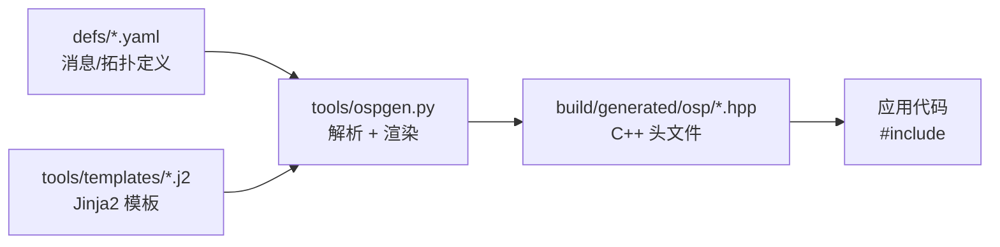
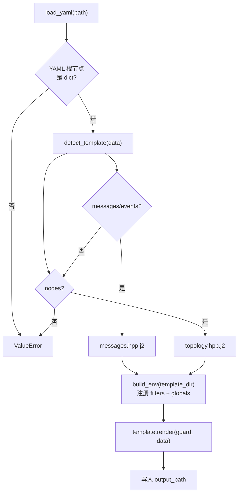
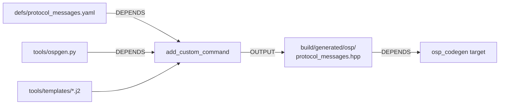
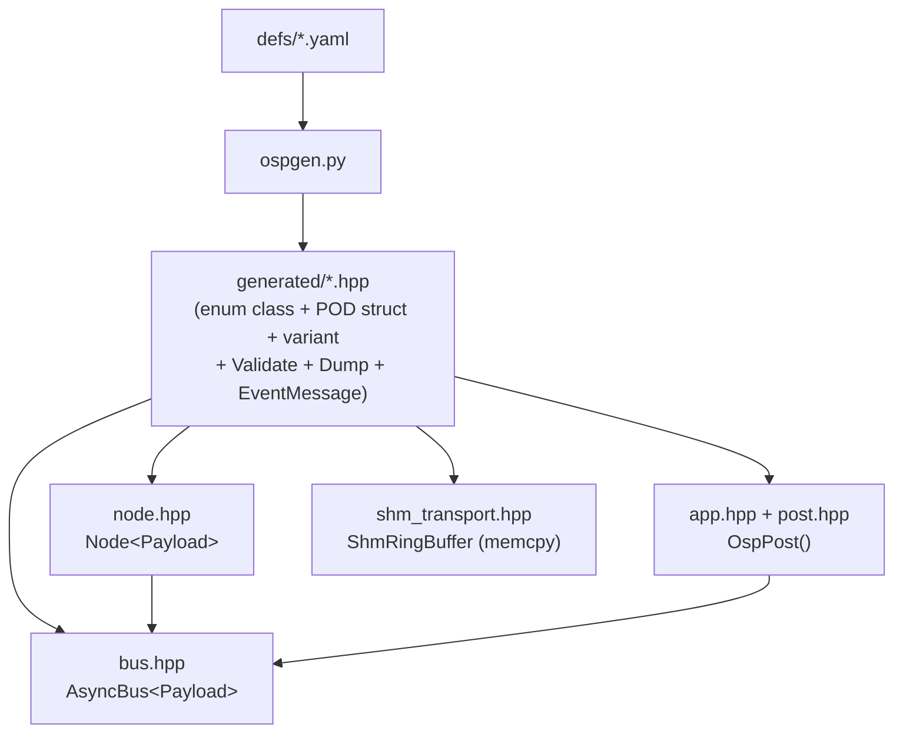

# newosp 代码生成设计: ospgen v2

> 从属于 [design_zh.md](design_zh.md) -- 代码生成工具
> 版本: 2.0
> 日期: 2026-02-16

## 1. 概述

ospgen 是 newosp 的 YAML 驱动代码生成工具，将消息/事件定义和节点拓扑描述转换为 C++17 头文件。生成的代码满足嵌入式约束: POD 结构体、`trivially_copyable`、零运行时开销。

### 1.1 为什么需要代码生成

嵌入式消息通信有两个矛盾需求:
- **正确性**: struct 必须 `trivially_copyable`、字段对齐正确、`sizeof` 精确匹配，才能安全通过 SPSC/ShmRingBuffer 传输
- **可维护性**: 手写 20+ 个消息 struct，每个都要默认构造、static_assert、event enum 同步，维护成本高

代码生成将这两个需求统一到 YAML 单一数据源: 定义一次，生成的代码自动满足所有约束。

### 1.2 ospgen vs 业界方案

| 方案 | 定义语言 | 运行时依赖 | trivially_copyable | 生成器复杂度 |
|------|----------|-----------|-------------------|-------------|
| **ospgen** | YAML | 无 (header-only) | 强制 static_assert | ~200 行 Python |
| Protobuf | .proto | libprotobuf (堆分配) | 不保证 | protoc 编译器 |
| FlatBuffers | .fbs | flatbuffers 库 | 仅 struct 模式 | flatc 编译器 |
| nanopb | .proto | nanopb 运行时 (C) | 是 (C struct) | Python 生成器 |
| ROS2 IDL | .msg/.srv | rclcpp 生态 | 不保证 | rosidl 工具链 |

ospgen 的定位: **比 Protobuf 轻、比手写安全、比 nanopb 更 C++17**。

### 1.3 设计目标

| 目标 | 实现方式 |
|------|----------|
| 单一数据源 | YAML 定义文件是消息/拓扑的唯一真实来源 |
| 零运行时开销 | `constexpr`/`static_assert`/`enum class`，无运行时反射 |
| 嵌入式安全 | POD struct + `trivially_copyable` + `sizeof` 静态断言 |
| 编译期绑定 | Event <-> Message 模板特化，零开销类型分发 |
| 增量构建 | CMake `add_custom_command` + `DEPENDS` 依赖追踪 |
| 模板可扩展 | Jinja2 模板与生成逻辑分离，新增类型只需新模板 |

### 1.4 工具链依赖

| 组件 | 版本要求 | 用途 |
|------|----------|------|
| Python3 | >= 3.6 | 生成器运行时 |
| PyYAML | >= 5.0 | YAML 解析 |
| Jinja2 | >= 3.0 | 模板渲染 |
| CMake | >= 3.14 | 构建集成 (`OSP_CODEGEN=ON`) |

## 2. 架构

### 2.1 数据流



### 2.2 模块结构

```
tools/
  ospgen.py              # 生成器主程序 (~200 行)
  templates/
    messages.hpp.j2      # 消息/事件/枚举模板
    topology.hpp.j2      # 节点拓扑模板
defs/
  protocol_messages.yaml # 视频流协议消息定义
  sensor_messages.yaml   # 传感器消息定义
  topology.yaml          # 节点拓扑定义
```

### 2.3 生成器内部流程



### 2.4 ospgen.py 辅助函数

| 函数 | 用途 | 示例 |
|------|------|------|
| `snake_to_camel(name)` | UPPER_SNAKE -> CamelCase | `SYN_ACK` -> `SynAck` |
| `snake_to_k_prefix(ns, name)` | 事件枚举命名 | `("protocol", "REGISTER")` -> `kProtocolRegister` |
| `upper_snake_to_k_camel(name)` | standalone enum 值命名 | `STREAM_START` -> `kStreamStart` |
| `parse_array_type(type_str)` | 解析数组类型 | `"char[32]"` -> `('char', '32')` |
| `printf_info(type_str)` | Dump() 格式化信息 | `"uint32_t"` -> `('%u', 'static_cast<unsigned>({})')` |
| `needs_bswap(type_str)` | 是否需要字节序转换 | `"uint32_t"` -> `True` |
| `bswap_lines(name, type)` | 生成 byte swap 代码 | 返回 C++ 语句列表 |
| `has_range_fields(msg)` | 消息是否有 range 约束 | 决定是否生成 Validate() |
| `range_check_expr(name, type, range)` | 生成范围检查表达式 | C++ 布尔表达式 |

## 3. YAML Schema 定义

### 3.1 消息/事件定义 (messages.hpp.j2)

```yaml
# --- 顶层字段 ---
namespace: <string>          # C++ 命名空间 (必选)
version: <uint32_t>          # 协议版本号 (可选, P1)
byte_order: native|network   # 字节序 (可选, 默认 native, P1)
includes:                    # 系统头文件列表 (必选)
  - cstdint
  - cstring

# --- 独立枚举 (P0) ---
enums:
  - name: <CamelCase>        # enum class 名称
    desc: <string>           # Doxygen 描述 (可选)
    type: <underlying_type>  # 底层类型 (默认 uint32_t)
    entries:                 # 枚举值列表
      - name: <UPPER_SNAKE>  # 转换为 kCamelCase
        value: <integer>
        desc: <string>       # 行尾 ///< 注释 (可选)

# --- 事件枚举 ---
events:
  - name: <UPPER_SNAKE>      # 转换为 kNamespaceEventName
    id: <uint32_t>
    desc: <string>           # 行尾 ///< 注释 (可选, P0)

# --- 消息结构体 ---
messages:
  - name: <CamelCase>        # 结构体名
    desc: <string>           # Doxygen @brief (可选, P2)
    event: <UPPER_SNAKE>     # 绑定的事件名 (可选, P0)
    expected_size: <uint32_t> # sizeof 断言 (可选, P0)
    packed: <bool>           # #pragma pack(push,1) (可选, P1)
    deprecated: <string>     # [[deprecated("...")]] (可选, P1)
    fields:
      - name: <snake_case>
        type: <C++ 类型>
        desc: <string>       # 行尾 ///< 注释 (可选, P0)
        default: <value>     # 默认值 (可选, 默认 0)
        range: [lo, hi]      # Validate() 范围约束 (可选, P1)
```

支持的字段类型:

| 类型 | 示例 | Dump 格式 | 需要 bswap |
|------|------|-----------|-----------|
| `uint8_t` / `int8_t` | 标量 | `%u` / `%d` | 否 |
| `uint16_t` / `int16_t` | 标量 | `%u` / `%d` | 是 |
| `uint32_t` / `int32_t` | 标量 | `%u` / `%d` | 是 |
| `uint64_t` / `int64_t` | 标量 | `%lu` / `%ld` | 是 |
| `float` / `double` | 标量 | `%.3f` / `%.6f` | 是 (memcpy) |
| `bool` | 标量 | `%d` | 否 |
| `"char[N]"` | 固定字符串 | `%s` | 否 |
| `"uint8_t[N]"` | 字节数组 | 不打印 | 否 |

### 3.2 节点拓扑定义 (topology.hpp.j2)

```yaml
payload_header: <string>     # 引用的消息头文件 (可选)

nodes:
  - name: <snake_case>       # 节点名 (用于常量命名)
    id: <uint32_t>           # 节点 ID
    desc: <string>           # Doxygen 注释 (可选, P2)
    subscriptions:           # 订阅的消息类型列表
      - <MessageTypeName>
```

### 3.3 现有定义文件

| 文件 | 内容 | 生成目标 |
|------|------|----------|
| `protocol_messages.yaml` | 2 enum + 8 event + 5 message | `protocol_messages.hpp` |
| `sensor_messages.yaml` | 2 enum + 4 event + 3 message | `sensor_messages.hpp` |
| `topology.yaml` | 4 node (含 subscription count) | `topology.hpp` |

## 4. 生成内容详解

### 4.1 messages.hpp.j2 生成顺序

```
 1. 文件头注释 (含 DO NOT EDIT + 再生成命令)
 2. Include guard
 3. #include 系统头文件 + <cstdio> + <variant> + <type_traits>
 4. namespace 开始
 5. Protocol version (constexpr)                     -- P1
 6. Standalone enums (enum class)                     -- P0
 7. Event enum (enum EventName : uint32_t)            -- 含 desc 注释
 8. Message structs:
    a. Doxygen @brief                                 -- P2
    b. [[deprecated]] 属性                             -- P1
    c. #pragma pack(push,1) / pop                     -- P1
    d. 字段声明 + ///< desc 注释                       -- P0
    e. 默认构造函数 (noexcept, 零初始化)
    f. Validate() -- 字段范围检查                       -- P1
    g. Dump() -- snprintf 调试打印                     -- P2
    h. SwapByteOrder() -- 网络字节序转换                -- P1 (byte_order: network)
 9. Payload variant (using XxxPayload = std::variant<...>)
10. Static assertions:
    a. trivially_copyable
    b. sizeof == expected_size                         -- P0
11. Event <-> Message binding:                        -- P0
    a. EventMessage<EventId>::type (正向映射)
    b. MessageEvent<MsgT>::value (反向映射)
    c. EventIdOf<MsgT>() 辅助函数
12. namespace 结束
```

### 4.2 各生成功能详解

#### 4.2.1 Standalone Enums (P0)

YAML 定义:
```yaml
enums:
  - name: StreamAction
    desc: "Stream control action"
    type: uint8_t
    entries:
      - { name: START, value: 1, desc: "Start streaming" }
```

生成代码:
```cpp
/// Stream control action
enum class StreamAction : uint8_t {
  kStart = 1  ///< Start streaming
};
```

使用 `enum class` 而非裸 `enum`，确保类型安全 (MISRA C++ 合规)。

#### 4.2.2 sizeof Assertions (P0)

YAML 定义:
```yaml
messages:
  - name: RegisterRequest
    expected_size: 50
```

生成代码:
```cpp
static_assert(sizeof(RegisterRequest) == 50,
              "RegisterRequest size mismatch (check field alignment/packing)");
```

跨进程/跨网络传输时，struct 大小必须精确匹配。编译器 padding 策略变化 (如切换 ARM -> x86) 会被 static_assert 立即捕获。

#### 4.2.3 Event <-> Message Binding (P0)

YAML 定义:
```yaml
messages:
  - name: RegisterRequest
    event: REGISTER
```

生成代码:
```cpp
// 正向: event ID -> message type
template <> struct EventMessage<kProtocolRegister> {
  using type = RegisterRequest;
};

// 反向: message type -> event ID
template <> struct MessageEvent<RegisterRequest> {
  static constexpr uint32_t value = kProtocolRegister;
};

// 辅助函数
template <typename MsgT>
constexpr uint32_t EventIdOf() noexcept {
  return MessageEvent<MsgT>::value;
}
```

使用示例:
```cpp
// 编译期验证
static_assert(protocol::EventIdOf<protocol::RegisterRequest>() ==
              protocol::kProtocolRegister, "binding mismatch");

// 类型安全获取
using MsgType = protocol::EventMessage<protocol::kProtocolRegister>::type;
// MsgType == protocol::RegisterRequest
```

#### 4.2.4 Validate() (P1)

YAML 定义:
```yaml
fields:
  - { name: port, type: uint16_t, range: [1, 65535] }
  - { name: temp, type: float, range: [-40.0, 125.0] }
```

生成代码:
```cpp
bool Validate() const noexcept {
  if (static_cast<uint16_t>(port) < static_cast<uint16_t>(1) ||
      static_cast<uint16_t>(port) > static_cast<uint16_t>(65535)) {
    return false;
  }
  if (temp < -40.0f || temp > 125.0f) {
    return false;
  }
  return true;
}
```

仅在有 range 约束的消息中生成，无约束的消息不生成 Validate()。

#### 4.2.5 Dump() (P2)

为每个消息生成 snprintf 调试打印方法:

```cpp
uint32_t Dump(char* buf, uint32_t cap) const noexcept {
  int n = std::snprintf(buf, cap,
      "RegisterRequest{device_id=%s, ip=%s, port=%u}",
      device_id, ip, static_cast<unsigned>(port));
  return (n > 0) ? static_cast<uint32_t>(n) : 0;
}
```

类型-格式映射由 `printf_info()` 自动处理。`uint8_t[N]` 等字节数组不参与 Dump 输出。

#### 4.2.6 SwapByteOrder() (P1)

仅在 `byte_order: network` 时生成。对所有多字节字段执行大小端转换:

```cpp
void SwapByteOrder() noexcept {
  session_id = static_cast<uint32_t>(__builtin_bswap32(
      static_cast<uint32_t>(session_id)));
  // float 类型通过 memcpy + bswap 处理
  uint32_t tmp_value;
  std::memcpy(&tmp_value, &value, sizeof(tmp_value));
  tmp_value = __builtin_bswap32(tmp_value);
  std::memcpy(&value, &tmp_value, sizeof(tmp_value));
}
```

调用两次恢复原始字节序 (对合操作)。

#### 4.2.7 packed structs (P1)

YAML 定义:
```yaml
messages:
  - name: WireFormat
    packed: true
    expected_size: 37  # 无 padding
```

生成代码:
```cpp
#pragma pack(push, 1)
struct WireFormat {
  // ...
};
#pragma pack(pop)
```

用于线格式 (wire format) 消息，消除编译器 padding。与 `expected_size` 配合使用可精确控制跨平台二进制布局。

### 4.3 topology.hpp.j2 生成内容

```
1. 文件头注释
2. Include guard
3. #include <cstdint> + payload_header (可选)
4. Node ID 常量 (static constexpr uint32_t) + Doxygen desc
5. Node 数量常量
6. Node 名称字符串常量
7. Node 订阅计数常量                              -- P2
```

生成示例:

```cpp
/// Device registration service
static constexpr uint32_t kNodeId_registrar = 1;
/// Heartbeat keepalive monitor
static constexpr uint32_t kNodeId_heartbeat_monitor = 2;

static constexpr uint32_t kNodeCount = 4;

static constexpr const char* kNodeName_registrar = "registrar";
static constexpr const char* kNodeName_heartbeat_monitor = "heartbeat_monitor";

static constexpr uint32_t kNodeSubCount_registrar = 2;
static constexpr uint32_t kNodeSubCount_heartbeat_monitor = 1;
```

### 4.4 命名转换规则

| 输入 | 转换函数 | 输出 | 用途 |
|------|----------|------|------|
| `REGISTER_ACK` | `snake_to_camel` | `RegisterAck` | 内部使用 |
| `REGISTER_ACK` | `snake_to_k_prefix("protocol", ...)` | `kProtocolRegisterAck` | 事件枚举值 |
| `STREAM_START` | `upper_snake_to_k_camel` | `kStreamStart` | standalone enum 值 |

## 5. CMake 集成

### 5.1 构建选项

```cmake
option(OSP_CODEGEN "Enable code generation from YAML definitions" OFF)
```

### 5.2 集成机制

启用 `OSP_CODEGEN=ON` 时:

1. `find_package(Python3)` 查找 Python 解释器
2. `file(GLOB)` 收集 `defs/*.yaml` 所有定义文件
3. 为每个 YAML 文件创建 `add_custom_command`:
   - 输入: `defs/<name>.yaml` + `tools/ospgen.py`
   - 输出: `build/generated/osp/<name>.hpp`
   - 依赖追踪: YAML 或 ospgen.py 变更时自动重新生成
4. `add_custom_target(osp_codegen ALL)` 确保构建时执行
5. `target_include_directories` 将 `build/generated/` 加入 osp INTERFACE 头文件路径

### 5.3 增量构建



YAML 文件或 ospgen.py 修改后，下次 `cmake --build` 仅重新生成受影响的头文件。

### 5.4 构建命令

```bash
# 启用代码生成
cmake -B build -DOSP_CODEGEN=ON -DOSP_BUILD_EXAMPLES=ON
cmake --build build -j$(nproc)

# 手动生成单个文件
python3 tools/ospgen.py \
    --input defs/protocol_messages.yaml \
    --output build/generated/osp/protocol_messages.hpp
```

## 6. 与 newosp 核心模块的集成

### 6.1 Bus/Node 集成

```cpp
// 生成的 variant 作为 Bus 模板参数
using ProtoBus = osp::AsyncBus<protocol::ProtocolPayload>;
osp::Node<protocol::ProtocolPayload> registrar(kNodeName_registrar, kNodeId_registrar);

// 类型安全订阅
registrar.Subscribe<protocol::RegisterRequest>(
    [](const protocol::RegisterRequest& req, const osp::MessageHeader& hdr) {
        // req.Validate() 检查字段范围
        // req.Dump(buf, cap) 调试打印
    });
```

### 6.2 App/Post 集成

```cpp
protocol::HeartbeatMsg hb{};
hb.session_id = 0x2002;
// 使用生成的 event 枚举投递
osp::OspPost(dst_iid, protocol::kProtocolHeartbeat, &hb, sizeof(hb));

// 编译期验证 event-message 绑定
static_assert(protocol::EventIdOf<protocol::HeartbeatMsg>() ==
              protocol::kProtocolHeartbeat, "");
```

### 6.3 模块依赖



## 7. 示例: codegen_demo.cpp

`examples/codegen_demo.cpp` 分四个部分演示生成代码与 newosp 核心模块的完整集成。

### 7.1 Part 1: 协议消息 + Bus/Node Pub-Sub

4 节点协议流水线:

```
Client --[RegisterRequest]--> Registrar --[RegisterResponse]--> Client
Client --[HeartbeatMsg]-----> HeartbeatMonitor
Client --[StreamCommand]----> StreamController
```

### 7.2 Part 2: 传感器消息 + 告警触发

消息驱动的级联告警链:

```
SensorNode --[SensorData]--> SensorNode (temp>40 触发)
SensorNode --[SensorAlarm]--> AlarmHandler
```

### 7.3 Part 3: App/Instance + OspPost

使用 `OspPost` + event enum 通过 Application/Instance 模型投递。

### 7.4 Part 4: ospgen v2 新功能展示

| 功能 | 验证方式 |
|------|----------|
| Standalone enums | `StreamAction::kStart`, `MediaType::kAv` |
| Validate() | port=8080 PASS, port=0 FAIL, action=5 FAIL, temp=200 FAIL |
| Dump() | `RegisterRequest{device_id=SENSOR-01, ip=10.0.0.1, port=8080}` |
| EventIdOf<T>() | `static_assert(EventIdOf<RegisterRequest>() == kProtocolRegister)` |
| EventMessage<E>::type | `static_assert(is_same<EventMessage<kProtocolRegister>::type, RegisterRequest>)` |
| Protocol version | `protocol::kVersion == 1`, `sensor::kVersion == 1` |
| Subscription counts | `kNodeSubCount_registrar == 2` |
| sizeof assertions | `sizeof(RegisterRequest) == 50` (编译期) |

### 7.5 运行输出

```
[INFO ] demo: === ospgen codegen demo ===
[INFO ] demo: --- Part 1: Protocol pub-sub ---
[INFO ] registrar: [evt=1] device CAM-001 from 192.168.1.100:5060
[INFO ] demo: protocol: reg=1 hb=1 stream=1 (nodes=4)
[INFO ] demo: --- Part 2: Sensor pub-sub ---
[INFO ] sensor: [evt=1] temp=42.8 humidity=55.0
[WARN ] alarm: [evt=3] sensor=1 code=3 val=42.8 thresh=40.0
[INFO ] demo: --- Part 3: App/Instance + OspPost ---
[INFO ] demo: app model: heartbeats processed=2
[INFO ] demo: --- Part 4: ospgen v2 features ---
[INFO ] demo: standalone enums: action=1 media=3
[INFO ] demo: validate(port=8080): PASS
[INFO ] demo: validate(port=0): FAIL
[INFO ] demo: dump: RegisterRequest{device_id=SENSOR-01, ip=10.0.0.1, port=8080}
[INFO ] demo: dump: SensorAlarm{sensor_id=42, code=3, value=85.500, threshold=80.000}
[INFO ] demo: EventIdOf<HeartbeatMsg>()=3 (expected=3)
[INFO ] demo: protocol version=1, sensor version=1
[INFO ] demo: subscription counts: registrar=2, heartbeat_monitor=1, stream_controller=2, client=1
[INFO ] demo: sizeof: RegisterRequest=50 RegisterResponse=40 HeartbeatMsg=16 StreamCommand=8 StreamData=268
```

## 8. 设计约束与规范

### 8.1 生成代码约束

| 约束 | 原因 |
|------|------|
| 所有消息必须 `trivially_copyable` | SPSC/ShmRingBuffer `memcpy` 传输 |
| 字段仅限 POD 类型 | `-fno-exceptions -fno-rtti` 兼容 |
| 固定数组替代 `std::string` | 栈分配，零堆开销 |
| enum class 替代裸 enum | MISRA C++ 类型安全 |
| 默认构造函数 `noexcept` | 嵌入式安全 |
| Validate() 返回 `bool` (不抛异常) | `-fno-exceptions` 兼容 |
| Dump() 使用 `snprintf` (不返回 std::string) | 零堆分配 |

### 8.2 命名规范

| 元素 | 规范 | 示例 |
|------|------|------|
| YAML 文件名 | `snake_case.yaml` | `protocol_messages.yaml` |
| namespace | 小写 | `protocol`, `sensor` |
| 事件名 (YAML) | `UPPER_SNAKE` | `REGISTER_ACK` |
| 事件枚举值 | `kNamespaceEventName` | `kProtocolRegisterAck` |
| Standalone enum 值 | `kCamelCase` | `kStreamStart` |
| 消息结构体 | `CamelCase` | `RegisterRequest` |
| 字段名 | `snake_case` | `device_id` |
| 节点 ID 常量 | `kNodeId_name` | `kNodeId_registrar` |
| 节点名称常量 | `kNodeName_name` | `kNodeName_registrar` |
| 订阅计数常量 | `kNodeSubCount_name` | `kNodeSubCount_registrar` |
| Payload 类型 | `NamespacePayload` | `ProtocolPayload` |
| Include guard | `OSP_GENERATED_FILENAME_HPP_` | 自动生成 |

## 9. 扩展指南

### 9.1 新增消息类型

1. 在 `defs/` 下创建或编辑 YAML 文件
2. 添加 `events`/`enums`/`messages` 条目，按需添加 `desc`/`range`/`expected_size`/`event` 绑定
3. 重新构建: `cmake --build build`
4. 在应用代码中 `#include` 生成的头文件

### 9.2 新增模板类型

1. 在 `tools/templates/` 下创建 `<type>.hpp.j2`
2. 在 YAML 中指定 `template: <type>.hpp.j2` 或扩展 `detect_template()` 自动检测
3. 可使用 Jinja2 过滤器: `snake_to_camel`, `parse_array`, `upper_snake_to_k`
4. 可使用全局函数: `snake_to_k_prefix()`, `printf_info()`, `needs_bswap()`, `bswap_lines()`, `has_range_fields()`, `range_check_expr()`

### 9.3 潜在扩展方向

| 方向 | 说明 |
|------|------|
| 序列化/反序列化 | 生成 `Serialize()`/`Deserialize()` 方法 |
| HSM 事件表 | 从 YAML 生成 HSM 事件枚举和转换表 |
| Markdown API 文档 | 从 YAML desc 字段自动生成 API 参考文档 |
| 跨文件 import | 支持 YAML 间引用共享类型 |
