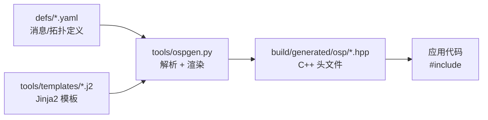
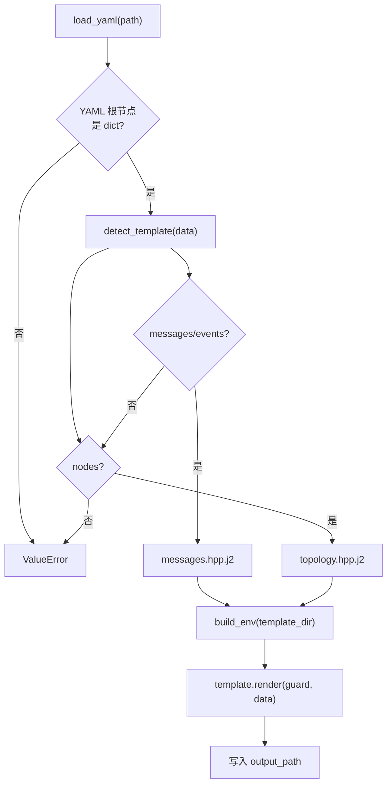
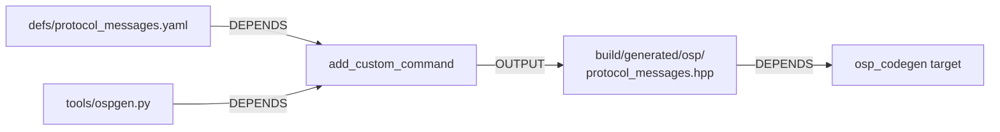
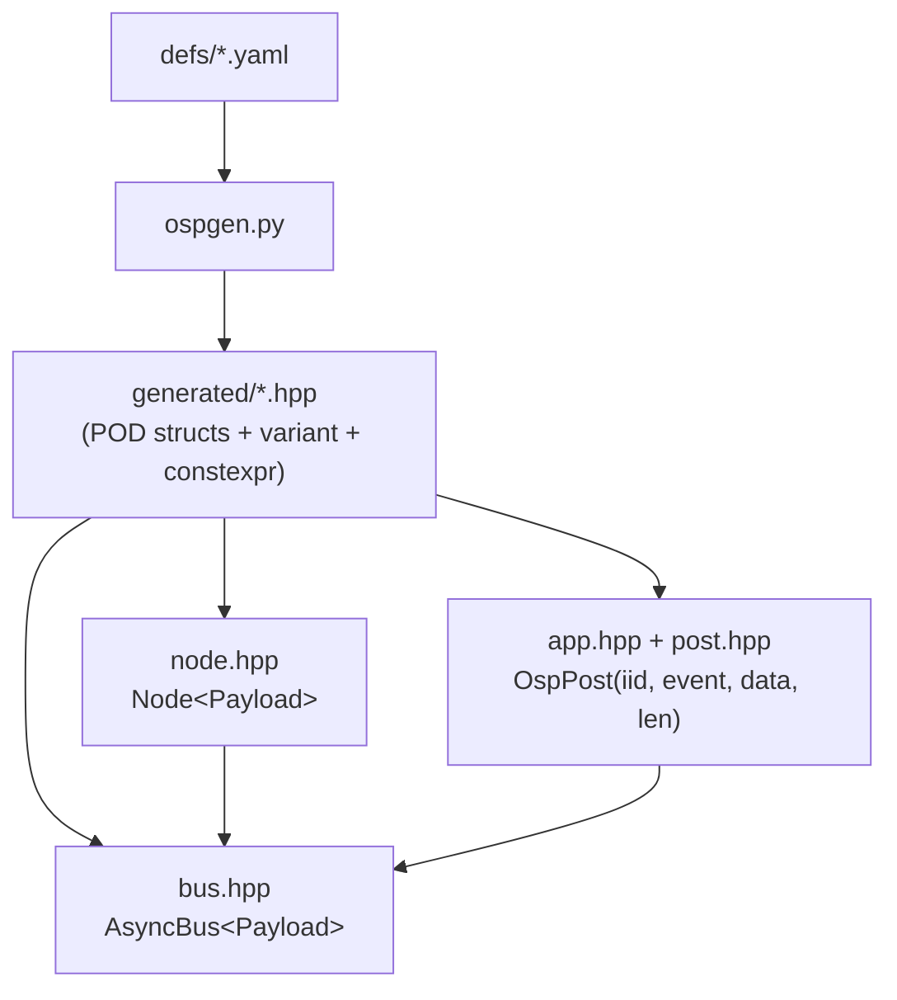

# newosp 代码生成设计: ospgen

> 从属于 [design_zh.md](design_zh.md) §9.5 代码生成工具
> 版本: 1.0
> 日期: 2026-02-14

## 1. 概述

ospgen 是 newosp 的 YAML 驱动代码生成工具，将消息/事件定义和节点拓扑描述转换为 C++17 头文件。生成的代码满足嵌入式约束: POD 结构体、`trivially_copyable`、零运行时开销。

### 1.1 设计目标

| 目标 | 实现方式 |
|------|----------|
| 单一数据源 | YAML 定义文件是消息/拓扑的唯一真实来源 |
| 零运行时开销 | 生成 `constexpr`/`static_assert`，无运行时反射 |
| 嵌入式安全 | POD 结构体 + `trivially_copyable` 静态断言 |
| 增量构建 | CMake `add_custom_command` + `DEPENDS` 依赖追踪 |
| 模板可扩展 | Jinja2 模板与生成逻辑分离，新增类型只需新模板 |

### 1.2 工具链依赖

| 组件 | 版本要求 | 用途 |
|------|----------|------|
| Python3 | >= 3.6 | 生成器运行时 |
| PyYAML | >= 5.0 | YAML 解析 |
| Jinja2 | >= 3.0 | 模板渲染 |
| CMake | >= 3.14 | 构建集成 (`OSP_CODEGEN=ON`) |

## 2. 架构

### 2.1 数据流



### 2.2 模块结构

```
tools/
  ospgen.py              # 生成器主程序 (~100 行)
  templates/
    messages.hpp.j2      # 消息/事件模板
    topology.hpp.j2      # 节点拓扑模板
defs/
  protocol_messages.yaml # 视频流协议消息定义
  sensor_messages.yaml   # 传感器消息定义
  topology.yaml          # 节点拓扑定义
```

### 2.3 生成器内部流程



## 3. YAML Schema 定义

### 3.1 消息/事件定义 (messages.hpp.j2)

```yaml
# 必选字段
namespace: <string>          # C++ 命名空间
includes:                    # 系统头文件列表
  - cstdint
  - cstring

# 可选: 事件枚举
events:
  - { name: <UPPER_SNAKE>, id: <uint32_t> }

# 可选: 消息结构体
messages:
  - name: <CamelCase>        # 结构体名
    fields:
      - { name: <snake_case>, type: <C++ 类型> }

# 可选: 覆盖自动检测
template: messages.hpp.j2
```

支持的字段类型:

| 类型 | 示例 | 说明 |
|------|------|------|
| 标量类型 | `uint8_t`, `uint16_t`, `uint32_t`, `uint64_t`, `float` | 固定宽度整数和浮点 |
| 固定数组 | `"char[32]"`, `"uint8_t[256]"` | 解析为 `char name[32]` |

### 3.2 节点拓扑定义 (topology.hpp.j2)

```yaml
# 可选: 引用生成的消息头文件
payload_header: "osp/protocol_messages.hpp"

# 必选: 节点列表
nodes:
  - name: <snake_case>       # 节点名 (用于常量命名)
    id: <uint32_t>           # 节点 ID
    subscriptions:           # 订阅的消息类型列表
      - <MessageTypeName>
```

### 3.3 现有定义文件

| 文件 | 内容 | 生成目标 |
|------|------|----------|
| `protocol_messages.yaml` | 8 事件 + 5 消息 (视频流协议) | `protocol_messages.hpp` |
| `sensor_messages.yaml` | 4 事件 + 3 消息 (传感器数据) | `sensor_messages.hpp` |
| `topology.yaml` | 4 节点 (registrar/hb_monitor/stream_ctrl/client) | `topology.hpp` |

## 4. 模板设计

### 4.1 messages.hpp.j2 生成内容

模板按以下顺序生成:

```
1. 文件头注释 (含再生成命令)
2. Include guard
3. #include 系统头文件 + <variant> + <type_traits>
4. namespace 开始
5. 事件枚举 (enum EventName : uint32_t)
6. 消息结构体 (struct + 默认构造函数)
7. Payload variant (using XxxPayload = std::variant<...>)
8. static_assert (trivially_copyable)
9. namespace 结束
```

#### 命名转换规则

| 输入 | 转换函数 | 输出 | 用途 |
|------|----------|------|------|
| `REGISTER_ACK` | `snake_to_camel` | `RegisterAck` | 内部使用 |
| `REGISTER_ACK` | `snake_to_k_prefix("protocol", ...)` | `kProtocolRegisterAck` | 枚举值命名 |

#### 生成示例

输入 `protocol_messages.yaml` 中的事件和消息定义，生成:

```cpp
namespace protocol {

enum ProtocolEvent : uint32_t {
  kProtocolRegister = 1,
  kProtocolRegisterAck = 2,
  // ...
};

struct RegisterRequest {
  char device_id[32];
  char ip[16];
  uint16_t port;
  RegisterRequest() noexcept : device_id{}, ip{}, port(0) {}
};

// ... 其他消息结构体 ...

using ProtocolPayload = std::variant<
    RegisterRequest,
    RegisterResponse,
    HeartbeatMsg,
    StreamCommand,
    StreamData
>;

static_assert(std::is_trivially_copyable<RegisterRequest>::value,
              "RegisterRequest must be trivially copyable");
// ... 其他 static_assert ...

}  // namespace protocol
```

### 4.2 topology.hpp.j2 生成内容

```
1. 文件头注释
2. Include guard
3. #include <cstdint> + payload_header (可选)
4. Node ID 常量 (static constexpr uint32_t)
5. Node 数量常量
6. Node 名称字符串常量
```

#### 生成示例

```cpp
static constexpr uint32_t kNodeId_registrar = 1;
static constexpr uint32_t kNodeId_heartbeat_monitor = 2;
static constexpr uint32_t kNodeId_stream_controller = 3;
static constexpr uint32_t kNodeId_client = 10;

static constexpr uint32_t kNodeCount = 4;

static constexpr const char* kNodeName_registrar = "registrar";
static constexpr const char* kNodeName_heartbeat_monitor = "heartbeat_monitor";
// ...
```

### 4.3 数组字段解析

`parse_array_type` 函数处理固定数组类型:

| 输入 | 解析结果 | 生成代码 |
|------|----------|----------|
| `"char[32]"` | `('char', '32')` | `char device_id[32];` |
| `"uint8_t[256]"` | `('uint8_t', '256')` | `uint8_t data[256];` |
| `uint32_t` | `None` (非数组) | `uint32_t session_id;` |

数组字段在默认构造函数中使用 `{}` 零初始化，标量字段使用 `field.default` 或默认值 `0`。

## 5. CMake 集成

### 5.1 构建选项

```cmake
option(OSP_CODEGEN "Enable code generation from YAML definitions" OFF)
```

### 5.2 集成机制

启用 `OSP_CODEGEN=ON` 时:

1. `find_package(Python3)` 查找 Python 解释器
2. `file(GLOB)` 收集 `defs/*.yaml` 所有定义文件
3. 为每个 YAML 文件创建 `add_custom_command`:
   - 输入: `defs/<name>.yaml` + `tools/ospgen.py`
   - 输出: `build/generated/osp/<name>.hpp`
   - 依赖追踪: YAML 或 ospgen.py 变更时自动重新生成
4. `add_custom_target(osp_codegen ALL)` 确保构建时执行
5. `target_include_directories` 将 `build/generated/` 加入 osp INTERFACE 头文件路径

### 5.3 增量构建



YAML 文件或 ospgen.py 修改后，下次 `cmake --build` 仅重新生成受影响的头文件。

### 5.4 构建命令

```bash
# 启用代码生成
cmake -B build -DOSP_CODEGEN=ON -DOSP_BUILD_EXAMPLES=ON
cmake --build build -j$(nproc)

# 手动生成单个文件
python3 tools/ospgen.py \
    --input defs/protocol_messages.yaml \
    --output build/generated/osp/protocol_messages.hpp
```

## 6. 与 newosp 核心模块的关系

### 6.1 生成代码与 Bus/Node 集成

生成的 `XxxPayload` (std::variant) 直接作为 `AsyncBus` 和 `Node` 的模板参数:

```cpp
// 生成的类型
using ProtocolPayload = std::variant<RegisterRequest, RegisterResponse, ...>;

// 与 newosp 核心模块集成
using ProtoBus = osp::AsyncBus<protocol::ProtocolPayload>;
osp::Node<protocol::ProtocolPayload> registrar("registrar", kNodeId_registrar);

// 类型安全的订阅
registrar.Subscribe<protocol::RegisterRequest>(
    [](const protocol::RegisterRequest& req, const osp::MessageHeader& hdr) {
        // ...
    });
```

### 6.2 生成代码与 App/Post 集成

生成的事件枚举和消息结构体可用于 `OspPost` 统一投递:

```cpp
protocol::HeartbeatMsg hb{};
hb.session_id = 0x2002;
osp::OspPost(dst_iid, protocol::kProtocolHeartbeat, &hb, sizeof(hb));
```

### 6.3 模块依赖关系



## 7. 示例: codegen_demo.cpp

`examples/codegen_demo.cpp` (272 行) 演示生成代码与 newosp 核心模块的完整集成，分三个部分。

### 7.1 Part 1: 协议消息 + Bus/Node Pub-Sub

使用生成的 `protocol::ProtocolPayload` 和拓扑常量，构建 4 节点协议流水线:

```
Client --[RegisterRequest]--> Registrar --[RegisterResponse]--> Client
Client --[HeartbeatMsg]-----> HeartbeatMonitor
Client --[StreamCommand]----> StreamController
```

关键集成点:
- `ProtoBus = osp::AsyncBus<protocol::ProtocolPayload>` -- 生成的 variant 作为 Bus 模板参数
- `osp::Node<protocol::ProtocolPayload> registrar(kNodeName_registrar, kNodeId_registrar)` -- 拓扑常量初始化节点
- `registrar.Subscribe<protocol::RegisterRequest>(...)` -- 类型安全订阅
- 事件枚举 `protocol::kProtocolRegister` 用于日志标识

### 7.2 Part 2: 传感器消息 + 告警触发

使用生成的 `sensor::SensorPayload`，演示消息驱动的告警链:

```
SensorNode --[SensorData]--> SensorNode (自订阅, temp>40 触发告警)
SensorNode --[SensorAlarm]--> AlarmHandler
```

展示同一节点发布-订阅-再发布的级联模式，事件枚举 `sensor::kSensorAlarm` 作为告警码。

### 7.3 Part 3: App/Instance + OspPost 投递

使用生成的消息和事件枚举，通过 Application/Instance 模型投递:

```cpp
osp::OspPost(dst_iid, protocol::kProtocolHeartbeat, &hb, sizeof(hb));
```

演示 `MakeIID` + `OspPost` + `OspSendAndWait` 与生成代码的配合，`HeartbeatInstance::OnMessage` 按事件枚举分发处理。

### 7.4 构建与运行

```bash
cmake -B build -DOSP_CODEGEN=ON -DOSP_BUILD_EXAMPLES=ON
cmake --build build -j$(nproc)
./build/examples/codegen_demo
```

输出示例:

```
[INFO ] demo: === ospgen codegen demo ===
[INFO ] demo: --- Part 1: Protocol pub-sub ---
[INFO ] registrar: [evt=1] device CAM-001 from 192.168.1.100:5060
[INFO ] client: [evt=2] registered CAM-001 session=0x1001
[INFO ] demo: protocol: reg=1 hb=1 stream=1 (nodes=4)
[INFO ] demo: --- Part 2: Sensor pub-sub ---
[INFO ] sensor: [evt=1] temp=23.5 humidity=61.2
[INFO ] sensor: [evt=1] temp=42.8 humidity=55.0
[WARN ] alarm: [evt=3] sensor=1 code=3 val=42.8 thresh=40.0
[INFO ] demo: sensor: data=2 alarms=1
[INFO ] demo: --- Part 3: App/Instance + OspPost ---
[INFO ] demo: app model: heartbeats processed=2
[INFO ] demo: === all demos complete ===
```

## 8. 设计约束与规范

### 8.1 生成代码约束

| 约束 | 原因 |
|------|------|
| 所有消息必须 `trivially_copyable` | SPSC 环形缓冲区 `memcpy` 传输 |
| 字段仅限 POD 类型 | `-fno-exceptions -fno-rtti` 兼容 |
| 固定数组替代 `std::string` | 栈分配，零堆开销 |
| 枚举基类型 `uint32_t` | 固定宽度，跨平台一致 |
| 默认构造函数 `noexcept` | 嵌入式安全 |

### 8.2 命名规范

| 元素 | 规范 | 示例 |
|------|------|------|
| YAML 文件名 | `snake_case.yaml` | `protocol_messages.yaml` |
| namespace | 小写 | `protocol`, `sensor` |
| 事件名 (YAML) | `UPPER_SNAKE` | `REGISTER_ACK` |
| 事件枚举值 | `kNamespaceEventName` | `kProtocolRegisterAck` |
| 消息结构体 | `CamelCase` | `RegisterRequest` |
| 字段名 | `snake_case` | `device_id` |
| 节点 ID 常量 | `kNodeId_name` | `kNodeId_registrar` |
| 节点名称常量 | `kNodeName_name` | `kNodeName_registrar` |
| Payload 类型 | `NamespacePayload` | `ProtocolPayload` |
| Include guard | `OSP_GENERATED_FILENAME_HPP_` | 自动生成 |

### 8.3 文件头标记

所有生成文件包含 `DO NOT EDIT` 标记和再生成命令:

```cpp
/**
 * @file protocol_messages.hpp
 * @brief Auto-generated by ospgen from protocol_messages.yaml. DO NOT EDIT.
 *
 * Regenerate: python3 tools/ospgen.py --input defs/protocol_messages.yaml --output <path>
 */
```

## 9. 扩展指南

### 9.1 新增消息类型

1. 在 `defs/` 下创建或编辑 YAML 文件
2. 添加 `events` 和 `messages` 条目
3. 重新构建: `cmake --build build`
4. 在应用代码中 `#include` 生成的头文件

### 9.2 新增模板类型

1. 在 `tools/templates/` 下创建 `<type>.hpp.j2`
2. 在 YAML 中指定 `template: <type>.hpp.j2` 或扩展 `detect_template()` 自动检测
3. 可使用内置 Jinja2 过滤器: `snake_to_camel`, `parse_array`
4. 可使用全局函数: `snake_to_k_prefix()`, `parse_array_type()`

### 9.3 潜在扩展方向

| 方向 | 说明 |
|------|------|
| 序列化/反序列化 | 生成 `Serialize()`/`Deserialize()` 方法 |
| 消息版本管理 | YAML 中增加 `version` 字段，生成兼容性检查 |
| 文档生成 | 从 YAML 注释生成 Markdown API 文档 |
| 校验规则 | YAML 中增加 `constraints` (范围/长度)，生成 `Validate()` |
| HSM 事件表 | 从 YAML 生成 HSM 事件枚举和转换表 |
