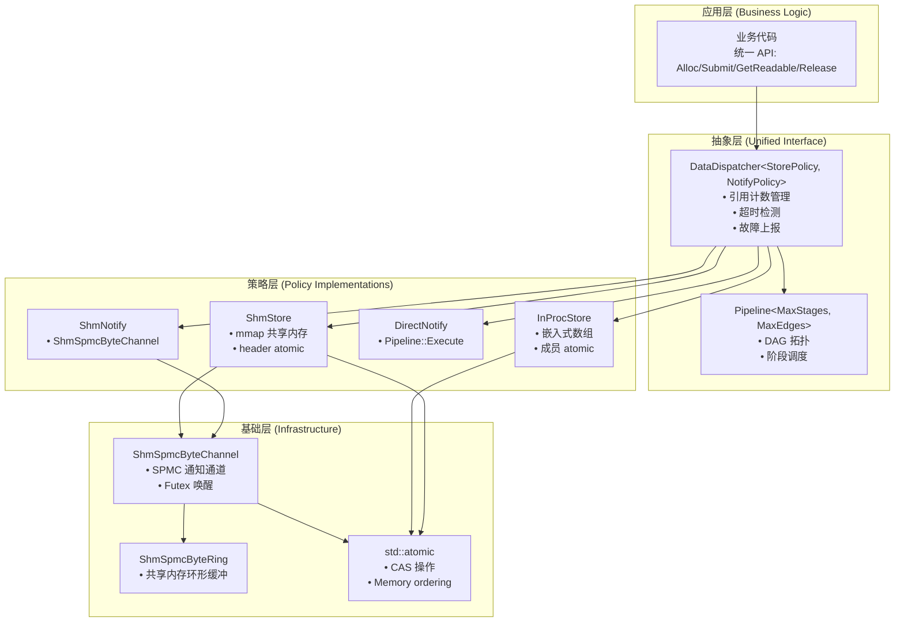
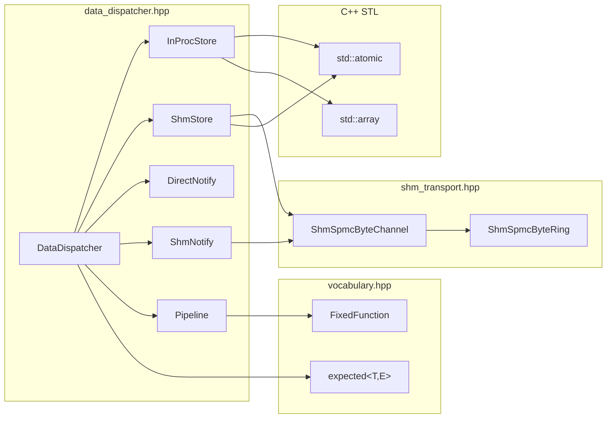

# DataDispatcher: 统一数据分发架构设计

> 版本: 3.1
> 日期: 2026-02-18
> 状态: 已实现 (Phase 0-5 完成)

---

## 目录

1. [设计目标](#1-设计目标)
2. [设计约束](#2-设计约束)
3. [架构总览](#3-架构总览)
4. [核心数据结构](#4-核心数据结构)
5. [Pipeline 与 DAG 拓扑](#5-pipeline-与-dag-拓扑)
6. [StorePolicy 实现](#6-storepolicy-实现)
7. [NotifyPolicy 实现](#7-notifypolicy-实现)
8. [DataDispatcher 完整 API](#8-datadispatcher-完整-api)
9. [生命周期流程](#9-生命周期流程)
10. [层次结构](#10-层次结构)
11. [依赖关系与对比](#11-依赖关系与对比)

---

## 1. 设计目标

为 newosp 提供统一的数据分发与流水线执行框架，满足工业嵌入式场景的以下需求:

- 消费者 (Visitor/Worker) 对数据来源无感知 (进程内/跨进程统一接口)
- 数据块共享内存 + 引用计数，最后一个消费者完成后才释放
- 支持并行扇出 (fan-out) 和串行流水线 (pipeline) 两种 DAG 拓扑
- 固定大小内存池，预分配，零运行时堆分配
- 背压机制 + FaultCollector 异常上报
- 超时检测 + Watchdog 集成
- 复用现有 WorkerPool 执行模型

### 1.1 不在范围内

- N:1 通信 (AsyncBus + Node.Subscribe / 多条 ShmChannel + DataFusion) -- 语义不同，不强行统一
- 1:1 流式传输 (ShmSpscByteRing) -- 字节流语义，不适合块池模型
- 现有 Ring Buffer 系列 (ShmRingBuffer / ShmSpscByteRing / ShmSpmcByteRing) -- 保持不变，与新方案正交共存

---

## 2. 设计约束

| 编号 | 约束 | 来源 |
|------|------|------|
| C1 | 可以破坏现有 API，允许重构合并 | 需求方确认 |
| C2 | InterProc 采用共享内存 DataBlock 零拷贝 + block_id 通知 | 需求 |
| C3 | 保留: 引用计数、DAG Pipeline、背压、故障上报、超时检测 | 需求 |
| C4 | 编译期确定部署模式，不需要运行时切换 | 需求 |
| C5 | 零运行时开销 (编译期分发) | 嵌入式原则 |
| C6 | Header-only, C++17, `-fno-exceptions -fno-rtti` 兼容 | 项目规范 |
| C7 | 支持 1:N、N:1、1:1 三种通信模式 | 分析确认 |

---

## 3. 架构总览

```
                    SharedMemory (POSIX shm 或进程内 buffer)
                    ┌─────────────────────────────────────┐
                    │ PoolHeader                           │
                    │   pool_capacity, block_size          │
                    │   free_head (atomic, lock-free CAS)  │
                    │   alloc_count (atomic)               │
                    │                                      │
                    │ DataBlock[0] { refcount, state,      │
                    │                deadline_us, fault_id, │
                    │                payload[block_size] }  │
                    │ DataBlock[1] ...                      │
                    │ DataBlock[N-1] ...                    │
                    └─────────────────────────────────────┘
                              │
                    ┌─────────┴──────────┐
                    │   DAG Pipeline     │
                    │   (静态拓扑)        │
                    │                    │
                    │  Stage A ──┬──→ Stage B ──→ Stage D
                    │            └──→ Stage C
                    └────────────────────┘
                              │
                    ┌─────────┴──────────┐
                    │   StorePolicy      │
                    │   InProc / Shm     │
                    │                    │
                    │   NotifyPolicy     │
                    │   Direct / Shm     │
                    └────────────────────┘
```

### 3.1 策略模板设计

DataDispatcher 通过策略模板实现编译期多态:

```cpp
template <typename StorePolicy, typename NotifyPolicy,
          uint32_t MaxStages = 8, uint32_t MaxEdges = 16>
class DataDispatcher {
  // 统一的 CAS 无锁逻辑 (只写 1 份)
  // StorePolicy 提供存储访问接口
  // NotifyPolicy 提供通知机制
};
```

**StorePolicy 实现**:
- `InProcStore<BlockSize, MaxBlocks>`: 嵌入式数组 + 成员 atomic
- `ShmStore<BlockSize, MaxBlocks>`: mmap 共享内存 + header atomic

**NotifyPolicy 实现**:
- `DirectNotify`: 空操作 (Pipeline 内部驱动)
- `ShmNotify`: 函数指针回调 (push block_id 到 ShmSpmcByteChannel)

---

## 4. 核心数据结构

### 4.1 DataBlock -- 共享数据块

```cpp
struct DataBlock {
  std::atomic<uint32_t> refcount;    // 引用计数 (跨进程 atomic)
  std::atomic<uint8_t>  state;       // BlockState 枚举
  uint8_t  pad[3];
  uint32_t block_id;                 // 池内索引
  uint32_t payload_size;             // 实际数据大小
  uint32_t fault_id;                 // 关联的 fault code (0 = 无异常)
  uint64_t alloc_time_us;            // 分配时间戳
  uint64_t deadline_us;              // 超时截止时间 (0 = 无超时)
  uint32_t next_free;                // 嵌入式 free list 指针
  uint32_t reserved;
  // alignas(16) uint8_t payload[];  // 柔性数组 (实际通过偏移计算)
};

enum class BlockState : uint8_t {
  kFree       = 0,   // 在 free list 中
  kAllocated  = 1,   // 已分配，生产者填充中
  kReady      = 2,   // 数据就绪，等待消费
  kProcessing = 3,   // 至少一个消费者正在处理
  kDone       = 4,   // 所有消费者完成，待回收
  kTimeout    = 5,   // 超时未完成
  kError      = 6,   // 处理异常
};
```

**内存布局** (每个 DataBlock):
```
+0    refcount      (4B, atomic)
+4    state         (1B, atomic)
+5    pad           (3B)
+8    block_id      (4B)
+12   payload_size  (4B)
+16   fault_id      (4B)
+20   alloc_time_us (8B)
+28   deadline_us   (8B)
+36   next_free     (4B)
+40   reserved      (4B)
+44   [padding to 48B or 64B cache line]
+48/64 payload[block_size]
```

### 4.2 ConsumerSlot -- 跨进程消费者追踪 (ShmStore only)

```cpp
struct ConsumerSlot {
  std::atomic<uint32_t> active;      // 1 = 活跃, 0 = 空闲
  uint32_t pid;                      // 消费者进程 PID
  uint64_t heartbeat_us;             // 最后心跳时间戳
  uint64_t holding_mask;             // 持有的数据块 bitmap (MaxBlocks <= 64)
};
```

用于崩溃恢复: `CleanupDeadConsumers()` 扫描 ConsumerSlot，回收死亡进程持有的数据块。

---

## 5. Pipeline 与 DAG 拓扑

### 5.1 StageConfig -- DAG 节点配置

```cpp
using JobHandler = void (*)(const uint8_t* data, uint32_t len, void* ctx);

struct StageConfig {
  const char* name;                  // Stage 名称 (调试用)
  JobHandler handler;                // 处理函数
  void* handler_ctx;                 // 处理函数上下文
  uint32_t timeout_ms;               // 单块处理超时 (0 = 无超时)
};
```

### 5.2 Pipeline 类

```cpp
template <uint32_t MaxStages = 8, uint32_t MaxEdges = 16>
class Pipeline {
 public:
  // --- 构建 (初始化时调用，运行时不变) ---
  int32_t AddStage(const StageConfig& cfg);
  void AddEdge(int32_t from, int32_t to);  // from 完成后触发 to
  void SetEntryStage(int32_t stage_id);     // 入口 stage

  // --- 提交数据块进入 pipeline ---
  void Submit(uint32_t block_id);

  // --- 查询 ---
  uint32_t StageCount() const;
  const char* StageName(int32_t stage_id) const;

 private:
  struct StageSlot {
    StageConfig config;
    int32_t successors[MaxEdges];    // 出边列表 (fan-out)
    uint32_t successor_count = 0;
  };

  StageSlot stages_[MaxStages];
  uint32_t stage_count_ = 0;
  int32_t entry_stage_ = -1;

  void OnStageComplete(int32_t stage_id, uint32_t block_id);
};
```

### 5.3 DAG 拓扑示例

**Fan-out (并行扇出)**:
```
Entry ──┬──→ Logging
        └──→ Fusion
```

**Pipeline (串行流水线)**:
```
Entry ──→ Preprocess ──→ Logging
```

**混合 DAG**:
```
Entry ──→ Preprocess ──┬──→ Logging
                       └──→ Fusion
```

---
## 6. StorePolicy 实现

### 6.1 InProcStore

嵌入式数组存储，适用于进程内模式。

```cpp
template <uint32_t BlockSize, uint32_t MaxBlocks>
struct InProcStore {
    static constexpr uint32_t kBlockStride = /* aligned(header_size + BlockSize) */;

    void Init() noexcept;                      // 初始化 free list + atomic 计数器
    DataBlock* GetBlock(uint32_t id) noexcept;  // &storage_[id * kBlockStride]

    std::atomic<uint32_t>& FreeHead() noexcept;
    std::atomic<uint32_t>& FreeCount() noexcept;
    std::atomic<uint32_t>& AllocCount() noexcept;

    // 误调用 Attach / Init(void*, uint32_t) 时编译报错
    template <typename T = void>
    void Attach(void*) noexcept { static_assert(sizeof(T) == 0, "Use ShmStore"); }
    template <typename T = void>
    void Init(void*, uint32_t) noexcept { static_assert(sizeof(T) == 0, "Use ShmStore"); }

private:
    alignas(OSP_JOB_BLOCK_ALIGN) uint8_t storage_[kBlockStride * MaxBlocks];
    alignas(kCacheLineSize) std::atomic<uint32_t> free_head_{0};
    alignas(kCacheLineSize) std::atomic<uint32_t> free_count_{MaxBlocks};
    alignas(kCacheLineSize) std::atomic<uint32_t> alloc_count_{0};
};
```

### 6.2 ShmStore

共享内存存储，适用于跨进程模式。

```cpp
namespace detail {
struct ShmPoolHeader {
    uint32_t magic;        // 0x4A4F4250 ('JOBP')
    uint32_t version;      // 1
    uint32_t block_size;   // BlockSize 模板参数
    uint32_t max_blocks;   // MaxBlocks 模板参数
    uint32_t block_stride; // kBlockStride
    uint32_t total_size;   // RequiredShmSize()
    uint32_t reserved[2];
    alignas(64) std::atomic<uint32_t> free_head;
    alignas(64) std::atomic<uint32_t> free_count;
    alignas(64) std::atomic<uint32_t> alloc_count;
};
}

template <uint32_t BlockSize, uint32_t MaxBlocks>
struct ShmStore {
    static constexpr uint32_t kShmHeaderSize =
        (sizeof(ShmPoolHeader) + OSP_JOB_BLOCK_ALIGN - 1) & ~(OSP_JOB_BLOCK_ALIGN - 1);

    /// Creator 路径: 初始化 header + free list
    void Init(void* shm_base, uint32_t shm_size) noexcept;

    /// Opener 路径: 验证 magic/version/params, 不初始化
    void Attach(void* shm_base) noexcept;

    DataBlock* GetBlock(uint32_t id) noexcept;
    std::atomic<uint32_t>& FreeHead() noexcept;   // header_->free_head
    std::atomic<uint32_t>& FreeCount() noexcept;   // header_->free_count
    std::atomic<uint32_t>& AllocCount() noexcept;  // header_->alloc_count

    static constexpr uint32_t RequiredShmSize() noexcept;

    // 误调用 Init() 无参版本时编译报错
    template <typename T = void>
    void Init() noexcept { static_assert(sizeof(T) == 0, "Use Init(shm_base, size)"); }

private:
    ShmPoolHeader* header_{nullptr};
    uint8_t* blocks_base_{nullptr};
};
```

SHM 内存布局:
```
+0                    ShmPoolHeader (cache-line aligned atomics)
+kShmHeaderSize       DataBlock[0] (header + payload)
+kShmHeaderSize+S     DataBlock[1]
...
+kShmHeaderSize+N*S   DataBlock[MaxBlocks-1]
```

### 6.3 Attach 安全校验

```cpp
void Attach(void* shm_base) noexcept {
    header_ = static_cast<ShmPoolHeader*>(shm_base);
    std::atomic_thread_fence(std::memory_order_acquire);
    OSP_ASSERT(header_->magic == OSP_JOB_POOL_MAGIC);
    OSP_ASSERT(header_->version == 1);
    OSP_ASSERT(header_->block_size == BlockSize);
    OSP_ASSERT(header_->max_blocks == MaxBlocks);
    blocks_base_ = static_cast<uint8_t*>(shm_base) + kShmHeaderSize;
}
```

---

## 7. NotifyPolicy 实现

### 7.1 DirectNotify (进程内)

```cpp
struct DirectNotify {
    void OnSubmit(uint32_t, uint32_t) noexcept {
        // 空操作 -- Pipeline::Execute() 由 DataDispatcher::Submit() 直接驱动
    }
};
```

### 7.2 ShmNotify (跨进程)

```cpp
struct ShmNotify {
    using NotifyFn = void (*)(uint32_t block_id, uint32_t payload_size, void* ctx);
    NotifyFn fn{nullptr};
    void* ctx{nullptr};

    void OnSubmit(uint32_t block_id, uint32_t payload_size) noexcept {
        if (fn != nullptr) fn(block_id, payload_size, ctx);
    }
};
```

典型用法: ShmNotify 回调向 ShmSpmcByteChannel 写入 8 字节 `{block_id, payload_size}`:

```cpp
auto& notify = disp.GetNotify();
notify.fn = [](uint32_t bid, uint32_t size, void* ctx) {
    auto* ch = static_cast<osp::ShmSpmcByteChannel*>(ctx);
    NotifyMsg msg{bid, size};
    ch->Write(reinterpret_cast<const uint8_t*>(&msg), sizeof(msg));
};
notify.ctx = &notify_channel;
```

---

## 8. DataDispatcher 完整 API

```cpp
template <typename Store,
          typename Notify = DirectNotify,
          uint32_t MaxStages = OSP_JOB_MAX_STAGES,
          uint32_t MaxEdges = OSP_JOB_MAX_EDGES>
class DataDispatcher {
public:
    // ====== 初始化 ======
    void Init(const Config& cfg) noexcept;                               // InProc
    void Init(const Config& cfg, void* shm_base, uint32_t size) noexcept; // InterProc Creator
    void Attach(void* shm_base) noexcept;                                 // InterProc Opener
    void Attach(const Config& cfg, void* shm_base) noexcept;              // Opener + Config

    // ====== Producer API ======
    expected<uint32_t, JobPoolError> Alloc() noexcept;
    uint8_t* GetWritable(uint32_t block_id) noexcept;
    void Submit(uint32_t block_id, uint32_t payload_size) noexcept;
    void Submit(uint32_t block_id, uint32_t size, uint32_t consumer_count) noexcept;

    // ====== Consumer API ======
    const uint8_t* GetReadable(uint32_t block_id) const noexcept;
    uint32_t GetPayloadSize(uint32_t block_id) const noexcept;
    bool Release(uint32_t block_id) noexcept;
    void AddRef(uint32_t block_id, uint32_t count) noexcept;

    // ====== Pipeline 配置 ======
    int32_t AddStage(const StageConfig& cfg) noexcept;
    bool AddEdge(int32_t from, int32_t to) noexcept;
    void SetEntryStage(int32_t id) noexcept;

    // ====== Backpressure + Fault ======
    void SetBackpressureCallback(BackpressureFn cb, void* ctx) noexcept;
    void SetFaultReporter(const FaultReporter& r, uint16_t slot) noexcept;

    // ====== Notify 配置 ======
    Notify& GetNotify() noexcept;

    // ====== 监控 ======
    uint32_t ScanTimeout() noexcept;
    uint32_t ForceCleanup(bool (*pred)(uint32_t, void*), void* ctx) noexcept;
    uint32_t FreeBlocks() const noexcept;
    uint32_t AllocBlocks() const noexcept;
    BlockState GetBlockState(uint32_t id) const noexcept;
    static constexpr uint32_t Capacity() noexcept;

    // ====== Consumer 管理 (ShmStore only, SFINAE-guarded) ======
    int32_t RegisterConsumer(uint32_t pid) noexcept;
    void UnregisterConsumer(int32_t slot_id) noexcept;
    void ConsumerHeartbeat(int32_t slot_id) noexcept;
    void TrackBlockHold(int32_t consumer_id, uint32_t block_id) noexcept;
    void TrackBlockRelease(int32_t consumer_id, uint32_t block_id) noexcept;
    uint32_t CleanupDeadConsumers() noexcept;
};
```

### 8.1 Consumer 管理 API (ShmStore only)

| 方法 | 说明 | 可用条件 |
|------|------|----------|
| `RegisterConsumer(pid)` | 注册消费者进程，返回 slot index (-1 = 满) | ShmStore only |
| `UnregisterConsumer(slot_id)` | 注销消费者 | ShmStore only |
| `ConsumerHeartbeat(slot_id)` | 更新心跳时间戳 | ShmStore only |
| `TrackBlockHold(consumer_id, block_id)` | 标记持有的数据块 (bitmap set) | ShmStore only |
| `TrackBlockRelease(consumer_id, block_id)` | 清除持有标记 (bitmap clear) | ShmStore only |
| `CleanupDeadConsumers()` | 回收死亡消费者持有的数据块 | ShmStore only |

### 8.2 便利别名

```cpp
// 进程内
template <uint32_t BS, uint32_t MB, uint32_t MS = 8, uint32_t ME = 16>
using InProcDispatcher = DataDispatcher<InProcStore<BS, MB>, DirectNotify, MS, ME>;

// 跨进程
template <uint32_t BS, uint32_t MB, uint32_t MS = 8, uint32_t ME = 16>
using ShmDispatcher = DataDispatcher<ShmStore<BS, MB>, ShmNotify, MS, ME>;
```

---


## 9. 生命周期流程

### 11.1 数据块生命周期

```
Alloc()          Submit()         Stage完成          最后一个Release()
  │                │                │                    │
  ▼                ▼                ▼                    ▼
kFree ──→ kAllocated ──→ kReady ──→ kProcessing ──→ kDone ──→ kFree
                                       │                       ▲
                                       ├── 超时 ──→ kTimeout ──┘
                                       └── 异常 ──→ kError ────┘
```

### 11.2 引用计数规则

**Submit(block_id)**:
```cpp
refcount = fan_out_count  // 入口 stage 的后继数量
state = kReady
```

**Stage[i] 完成**:
```cpp
for each successor[j]:
  refcount.fetch_add(1)   // 为每个后继增加引用
refcount.fetch_sub(1)     // 自己完成，减引用
if refcount == 0:
  state = kDone → 回收到 free list
```

**特殊情况**:

*Fan-out (A → B, A → C)*:
- Submit 时 refcount = 2 (B 和 C)
- B 完成: refcount 1→0? 否 → 不回收
- C 完成: refcount 0 → 回收

*Pipeline (A → B → C)*:
- Submit 时 refcount = 1 (只有 B)
- A 完成: 触发 B, refcount 保持 1 (A 减 1, B 加 1)
- B 完成: 触发 C, refcount 保持 1
- C 完成: refcount 1→0 → 回收

### 11.3 背压机制

```cpp
AllocBlock():
  free_count = pool_.FreeCount()
  if free_count < backpressure_threshold:
    bp_callback_(free_count, bp_ctx_)  // 通知生产者
    fault_collector_->ReportFault(fault_slot_, block_id, kLow)
  if free_count == 0:
    return kPoolExhausted  // 生产者决定: 丢帧 or 等待
```

### 11.4 超时检测

```cpp
ScanTimeout() -- 由 Watchdog 或 Timer 定期调用:
  for each block where state == kProcessing:
    if SteadyNowUs() > block.deadline_us:
      block.state = kTimeout
      fault_collector_->ReportFault(fault_slot_, block_id, kHigh)
      // 强制回收 (refcount 置 0)
      block.refcount = 0
      RecycleBlock(block_id)
```

### 11.5 崩溃恢复 (ShmStore only)

```cpp
CleanupDeadConsumers():
  for each ConsumerSlot:
    if active && (now - heartbeat_us > threshold):
      // 消费者进程死亡
      for each bit in holding_mask:
        block = GetBlock(bit_index)
        block.refcount.fetch_sub(1)  // 释放持有
        if block.refcount == 0:
          RecycleBlock(bit_index)
      UnregisterConsumer(slot_id)
```

---
## 10. 层次结构

DataDispatcher 采用分层架构，通过策略模板实现编译期多态：



### 11.1 层次说明

| 层次 | 职责 | 编译期/运行期 |
|------|------|--------------|
| **应用层** | 业务逻辑，使用统一 API 操作数据块 | 运行期 |
| **抽象层** | 引用计数、超时检测、Pipeline 调度 | 编译期模板实例化 |
| **策略层** | 存储位置 (InProc/Shm) + 通知方式 (Direct/Shm) | 编译期策略选择 |
| **基础层** | 共享内存、原子操作、Futex 通知 | 运行期 (零开销抽象) |

### 11.2 编译期分发

```cpp
// 编译期确定部署模式，零运行时开销
using MyDispatcher = DataDispatcher<
    InProcStore<16016, 32>,  // 策略 1: 进程内存储
    DirectNotify,            // 策略 2: 直接通知
    8,                       // MaxStages
    16                       // MaxEdges
>;

// 或跨进程模式
using MyDispatcher = DataDispatcher<
    ShmStore<16016, 32>,     // 策略 1: 共享内存存储
    ShmNotify,               // 策略 2: 通道通知
    8, 16
>;
```

---

## 11. 依赖关系

### 11.1 模块依赖图



### 11.2 依赖说明

| 组件 | 依赖项 | 用途 |
|------|--------|------|
| **DataDispatcher** | StorePolicy, NotifyPolicy, Pipeline | 核心调度器 |
| **InProcStore** | `std::atomic`, `std::array` | 进程内块存储 |
| **ShmStore** | `std::atomic`, `ShmSpmcByteChannel` | 跨进程块存储 + 通知 |
| **DirectNotify** | Pipeline | 进程内直接调用 Pipeline::Execute |
| **ShmNotify** | `ShmSpmcByteChannel` | 跨进程通知 (推送 block_id) |
| **Pipeline** | `FixedFunction` | DAG 阶段回调 (零堆分配) |
| **ShmSpmcByteChannel** | `ShmSpmcByteRing` | SPMC 字节流通道 |

### 11.3 外部依赖

| 依赖 | 来源 | 用途 |
|------|------|------|
| `shm_transport.hpp` | newosp | ShmSpmcByteChannel (SPMC 通知通道) |
| `vocabulary.hpp` | newosp | expected, FixedFunction (零堆分配回调) |
| `<atomic>` | C++ STL | CAS 操作、内存序 |
| `<array>` | C++ STL | 固定大小数组 |
| `<cstdint>` | C++ STL | 固定宽度整数类型 |

### 11.4 循环依赖避免

- **DataDispatcher 不依赖具体 StorePolicy 实现**: 通过 Concept 约束接口
- **StorePolicy 不依赖 DataDispatcher**: 纯数据存储，无反向引用
- **NotifyPolicy 不依赖 StorePolicy**: 通知与存储正交
- **Pipeline 独立于 Store/Notify**: 可单独使用或与 DataDispatcher 组合

---

### 11.4 与 SPMC 的关系

两者定位不同，共存互补:

| 维度 | ShmSpmcByteChannel | DataDispatcher |
|------|--------------------|-----------------------|
| 抽象层级 | 字节流传输 | 数据块生命周期管理 |
| 数据共享 | 每消费者独立拷贝 | 引用计数零拷贝共享 |
| 释放时机 | 消费者读完即推进 tail | 最后一个消费者 Release |
| 流水线 | 无 | DAG (fan-out + pipeline) |
| 背压 | ring full 阻塞写入 | 池满 + 阈值回调 |
| 超时检测 | 无 | 每块 deadline + 扫描 |
| 适用场景 | 简单 1:N 分发 | 复杂流水线 + 生命周期管理 |
| 复杂度 | 低 | 中 |

**使用建议**:
- 简单场景 (纯分发，消费者独立处理) 用 ShmSpmcByteChannel
- 复杂场景 (多 stage 流水线，共享数据，超时检测) 用 DataDispatcher

---
