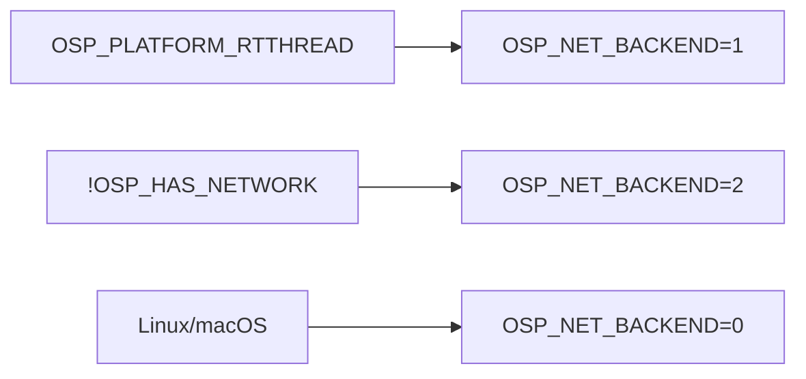

# lwIP 后端概要设计

> 本文档描述已实现的 lwIP 网络后端现状。目标平台为 RT-Thread + lwIP（RT-Thread SAL/netdev 以 lwIP 作后端协议栈）。网络模块以嵌入式友好为默认目标，后端差异收敛在 `socket.hpp` / `io_poller.hpp` 两层，业务模块零改动。

## 1. 现状

组件以 `OSP_NET_BACKEND`（0=POSIX BSD socket、1=lwIP、2=禁用）分派。后端由编译期宏选择，同一份头文件在两个平台编译不同实现；新增后端只需扩展该宏的取值与 `socket_api` 适配层。

网络依赖面如下：

| 组件 | 后端 0（POSIX） | 后端 1（lwIP） |
|---|---|---|
| `socket.hpp` | `::socket/connect/send/recv/...`、`fcntl`、`epoll` | `lwip_socket/` 系列，`LWIP_COMPAT_SOCKETS=0` |
| `io_poller.hpp` | epoll（Linux）/ kqueue（macOS） | 退化为 poll 后端 |
| `service.hpp` | 每连接一线程 accept | 同（阻塞式，天然兼容） |
| `shell.hpp` | TCP telnet | 同 |
| `discovery.hpp` | UDP 组播（`IP_ADD_MEMBERSHIP`） | UDP 组播（需 `LWIP_IGMP`） |

## 2. 后端抽象

### 2.1 `OSP_NET_BACKEND` 分派

`platform.hpp` 依平台宏选择默认后端；可用 `-D` 覆盖。



### 2.2 `socket_api` 适配层

`socket.hpp` 内的 `socket_api` 命名空间提供后端中立调用。lwIP 后端直接调 `lwip_*`，POSIX 后端调系统函数，不依赖宏，C++ 标准库头保持干净。

```cpp
inline int Socket(int domain, int type, int protocol) noexcept {
#if OSP_NET_BACKEND == 1
  return lwip_socket(domain, type, protocol);
#else
  return ::socket(domain, type, protocol);
#endif
}
```

### 2.3 `io_poller` 后端感知

lwIP fd 对 host epoll/kqueue 不可见，因此后端 1 强制走 poll：

```cpp
#if OSP_NET_BACKEND == 1
#define OSP_IO_POLLER_USE_EPOLL 0
#define OSP_IO_POLLER_USE_KQUEUE 0
#elif defined(OSP_PLATFORM_LINUX)
// epoll
#elif defined(OSP_PLATFORM_MACOS)
// kqueue
#endif
```

## 3. 测试验证

lwIP 后端测试在 `tests/`，自写 loopback netif，免 TAP/root，以外部库链接启用：

```bash
cmake -B build_lwip -DOSP_WITH_LWIP=ON \
  -DOSP_LWIP_INCLUDE_DIR="<lwip>/src/include;<lwip>/contrib/ports/unix/port/include;<lwip>/contrib/ports/unix/lib;<lwip>/contrib" \
  -DOSP_LWIP_LIBRARY=<liblwip>
```

- `test_lwip_backend.cpp`：TCP/UDP 回环。
- `test_lwip_modules.cpp`：业务模块（service/shell/discovery/transport/node_manager）在 `OSP_NET_BACKEND=1` 下的编译 + 链接门禁，属入仓验证。

lwIP 库需以 `LWIP_COMPAT_SOCKETS=0`、`LWIP_NETIF_LOOPBACK=1` 编译。

## 4. 已知限制

| 限制 | 说明 | 现状 |
|---|---|---|
| AF_UNIX | lwIP 不支持 | 本地通信改走 `shm_transport` |
| 组播 | 依赖 `LWIP_IGMP` | 目标配置需开启 |
| lwIP 多线程 | 依赖 `tcpip_thread` + `CORE_LOCKING` | 目标平台需配置 |
| `MSG_NOSIGNAL` | lwIP 不实现 | 值透传，被静默忽略 |
| `suseconds_t` | lwIP 私有 timeval 无此类型 | 已改用 `decltype(tv.tv_usec)` |
| `epoll` | 无，退化为 poll | 无 edge-triggered 语义 |

## 5. 设计说明

本节回顾本移植的关键设计决策（对应章节参考 2.2 与 2.3）。

### 5.1 后端抽象而非条件宏散落

采用中央 `socket_api` 适配层而非 `LWIP_COMPAT_SOCKETS=1` 的同名宏方案：同名宏会定义 `read/write/close` 宏，污染 C++ 标准库头。适配层把差异收敛在单点，`MSG_NOSIGNAL`、`AF_UNIX` 等平台差异随分派收拢，业务层零改动，新增后端成本低。

### 5.2 epoll 缺口用 poll 承接

`epoll` 无 edge-triggered 语义，但当前 `io_poller.hpp` 无调用方，风险可控；选择在 lwIP 后端强制 poll 而非模拟 epoll。

### 5.3 阻塞线程模型保留

每连接一线程的阻塞模型与 lwIP 多线程 socket 天然兼容，无需改造为事件驱动；连接超时经 `socket_api::Select` 承载。
