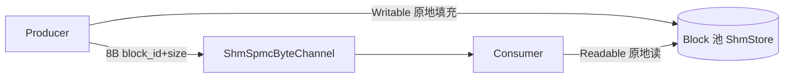
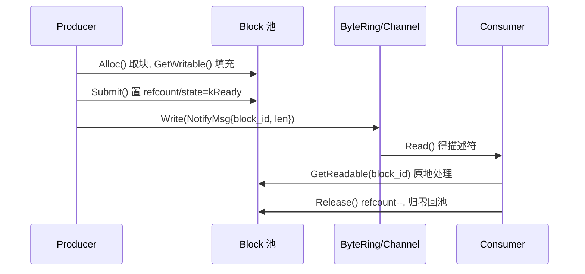

# 大帧 shm IPC 零拷贝改造设计

> 状态：设计评审（未实现）
> 历史：初稿 (2026-08-07) 经 4 subagent 评审退回——链式组帧前提 G1 不成立，改走块池路径；评审顺带发现的 4 处既有缺陷（D1-D4）已独立修复（见 git 历史）。
> 关联：`docs/design_data_dispatcher_zh.md`、`include/osp/data_dispatcher.hpp`、`include/osp/shm_transport.hpp`
> 借鉴：lwIP `struct pbuf` 引用计数链（`pbuf_ref`/`pbuf_free`）——仅作方向确认，不引入链数据结构

## 1. 结论

- `ShmStore` 单块跨进程**已是零拷贝**：全文件唯一 memset 是 shm 初始化清零（`data_dispatcher.hpp:375`），`GetWritable`/`GetReadable` 均返回块内裸指针，payload 拷贝点为零。
- **G1 不成立**：`BlockSize` 是无上限模板参数（`:225,227`），examples 已在用 16016B 单块；初稿误认的 4KB 是 `OSP_SHM_SLOT_SIZE`（`opt.hpp:112`，`ShmRingBuffer` 通知通道槽），与块池无关。**取消链式**。
- **真实缺口仅 G2**：环形缓冲 send/recv 双 memcpy（`shm_transport.hpp:366,405`）。解法：大帧改走块池，通道只传 8B 块描述符。

## 2. G2 方案：环形缓冲零拷贝模式

约束：`ShmSpscByteRing::Read` 在 `msg_len > max_len` 时静默丢弃并推进 tail，消费端需给足缓冲。设计复用块池，通道传 `NotifyMsg` 描述符（8B），payload 原地读：

### 改动点

| 文件 | 改动 |
|---|---|
| `shm_transport.hpp` | 环形缓冲新增「零拷贝 recv」：`Read` 识别描述符消息时返回共享块引用而非拷贝 payload（复用 `ShmStore`，经 bridge 连接） |
| `data_dispatcher.hpp` | 无需链 API，`PayloadCapacity()` 已支持任意 `BlockSize` |

两模块保持零直接依赖（依赖经 bridge 建立，遵守 CLAUDE.md bridge file pattern）。

## 3. 取舍分析

| 维度 | 块池路径（本设计） | 环形 memcpy（现状） |
|---|---|---|
| 大帧延迟 | 免 2 次 memcpy，缓存/DMA 友好 | 随帧长线性拷贝 |
| 小帧开销 | 描述符 + 池管理 | 最优 |
| 协议复杂度 | +1 描述符路径 | 无 |
| 生命周期 | 复用 refcount/超时/崩溃兜底 | 无需 |

**推荐**：本设计。

## 4. 落地

1. **阶段 A**：bridge 建立 `shm_transport` 与 `ShmStore` 连接，环形缓冲零拷贝 recv。
2. **阶段 B**：基准——大帧（16KB/64KB/256KB）零拷贝 vs memcpy 吞吐/延迟，host 与 ARM 分别测量。

## 5. 验证

- **零拷贝断言**：消费端读地址 == 共享块 payload 地址（TDD 断言指针相等）。
- **基准**：块池零拷贝 vs 环形 memcpy 对照，含大单块 / 双池分级。

## 6. 风险与开放问题

- **连接所有权**：阶段 A 中块池由谁创建（bridge owner）、消费者如何取得 `consumer_id`/`holding_mask`（依赖 `ShmStore::ConsumerSlot`）。
- **描述符尺寸**：若引入更大描述符会破坏按字节背压（`consumer_fusion.cpp` 的 `5 * sizeof(NotifyMsg)`）——需保持 8B 或改按条数判定。
- **规模**：`MaxBlocks <= 64`（`holding_mask` 为 `uint64_t`）；大 `BlockSize` 时 shm 总量 = `stride × MaxBlocks` 需 mmap 供足。

## 关键文件

- `include/osp/data_dispatcher.hpp`: `BlockSize`、`GetWritable/GetReadable/Release/Recycle`、`ConsumerSlot.holding_mask`
- `include/osp/shm_transport.hpp`: `ShmRingBuffer`(MPSC)、`ShmSpscByteRing`、`ShmSpmcByteRing`、`ShmSpmcByteChannel`
- `include/osp/opt.hpp`: `OSP_SHM_SLOT_SIZE`（通道槽，非块容量）
- `docs/design_data_dispatcher_zh.md`: §9 生命周期
