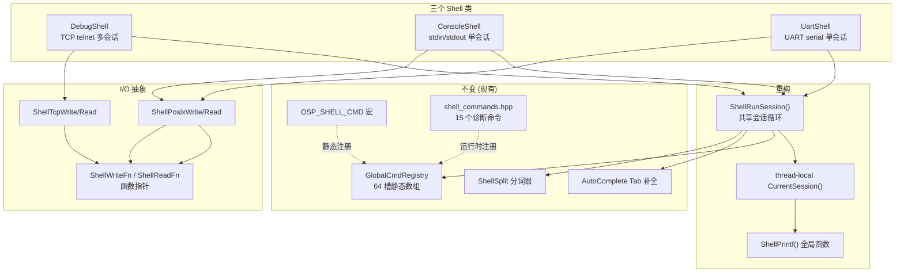

# newosp Shell 多后端架构与内置诊断命令设计

> 从属于 [design_zh.md](design_zh.md) S4.6 shell.hpp 扩展
> 版本: 2.0
> 日期: 2026-02-16
> 状态: 已完成

---

## 1. 背景与动机

### 1.1 现状分析

当前 `osp/shell.hpp` (DebugShell) 已是成熟实现:

- 64 槽静态命令表 (GlobalCmdRegistry, Meyer's singleton)
- `OSP_SHELL_CMD` 宏自动注册 (静态初始化阶段, main 之前)
- `int (*)(int argc, char* argv[])` POSIX 标准命令签名, 零间接调用开销
- 原地分词器 (ShellSplit, 移植自 RT-Thread msh_split)
- Tab 自动补全 (最长公共前缀)
- thread-local 会话指针路由 Printf 输出
- `shell_commands.hpp` 零侵入桥接 15 个诊断命令

**核心问题**: DebugShell 硬编码 TCP telnet 后端. 无网络环境 (开发板初期调试、网络驱动未就绪、Zynq-7000 串口调试、现场故障排查) 完全无法使用 shell.

### 1.2 设计目标

在保留现有 shell 引擎、命令接口、注册宏不变的前提下:

1. **I/O 后端可选**: TCP / stdin / UART 三种后端, 共享命令注册表和会话循环
2. **命令完全兼容**: 所有 `OSP_SHELL_CMD` 注册命令、`shell_commands.hpp` 桥接命令, 在任何后端下行为一致
3. **零堆分配**: 后端切换不引入动态分配
4. **单头文件**: 用户只需 `#include "osp/shell.hpp"`, 不区分后端
5. **最小改动**: 不重写 shell 引擎, 不改命令签名

### 1.3 非目标 (明确排除)

| 排除项 | 原因 |
|--------|------|
| 虚基类 OutputStream 接口 | 违反 "不优先使用 virtual" 原则 |
| 模板参数化后端 (`DebugShellT<Backend>`) | 导致命令回调中 Printf 类型不统一 |
| 脚本/管道/重定向 | 无产品需求文档支撑的假想需求 |
| Web Shell (WebSocket) | 嵌入式场景无此需求, 增加攻击面 |
| SHM IPC Shell Server | 可作为未来扩展, 不在本次范围 |

---

## 2. 总体架构

### 2.1 架构图



### 2.2 后端选择策略

| 场景 | 后端 | 触发条件 |
|------|------|----------|
| 正常运行 (有网络) | DebugShell | 默认, 与现有行为一致 |
| SSH 无 telnet 客户端 | ConsoleShell | `--console` 命令行参数 |
| 开发板串口调试 (Zynq-7000) | UartShell | 配置串口设备路径 |
| CI 自动化测试 | ConsoleShell | 管道输入命令, 验证输出 |

### 2.3 文件结构

```
shell.hpp (1287 行, 单头文件)
  ├── ShellWriteFn / ShellReadFn     -- I/O 函数指针类型
  ├── ShellTcpWrite/Read             -- TCP 后端 (send/recv)
  ├── ShellPosixWrite/Read           -- POSIX 后端 (write/read)
  ├── ShellSession                   -- 后端无关会话状态
  ├── GlobalCmdRegistry              -- 64 槽命令注册表 (不变)
  ├── ShellAutoReg / OSP_SHELL_CMD   -- 静态注册宏 (不变)
  ├── ShellSplit / AutoComplete      -- 分词/补全 (不变)
  ├── ShellRunSession()              -- 共享会话循环 (提取)
  ├── ShellPrintf()                  -- 后端无关全局 Printf
  ├── DebugShell                     -- TCP telnet 后端
  ├── ConsoleShell                   -- stdin/stdout 后端
  └── UartShell                      -- UART 串口后端

shell_commands.hpp (497 行, 零侵入桥接)
  └── 15 个 Register* 模板函数
```

---

## 3. I/O 后端抽象

### 3.1 函数指针设计

选择函数指针而非虚基类或模板参数的原因:

| 方案 | 优点 | 缺点 |
|------|------|------|
| **函数指针 (采用)** | 零 vtable 开销, 简单直接, 运行时可选 | 无法内联 |
| 虚基类 | OOP 语义清晰 | 违反 "不优先使用 virtual" 原则 |
| 模板参数 `DebugShellT<Backend>` | 编译期绑定可内联 | Printf 类型不统一, 命令回调复杂化 |

```cpp
namespace detail {

/// Write function: ssize_t write(int fd, const void* buf, size_t len).
using ShellWriteFn = ssize_t (*)(int fd, const void* buf, size_t len);

/// Read function: ssize_t read(int fd, void* buf, size_t len).
using ShellReadFn = ssize_t (*)(int fd, void* buf, size_t len);

// TCP 后端: send() with MSG_NOSIGNAL
inline ssize_t ShellTcpWrite(int fd, const void* buf, size_t len) {
  return ::send(fd, buf, len, MSG_NOSIGNAL);
}
inline ssize_t ShellTcpRead(int fd, void* buf, size_t len) {
  return ::recv(fd, buf, len, 0);
}

// POSIX 后端: write()/read() 适用于 stdin/stdout/UART
inline ssize_t ShellPosixWrite(int fd, const void* buf, size_t len) {
  return ::write(fd, buf, len);
}
inline ssize_t ShellPosixRead(int fd, void* buf, size_t len) {
  return ::read(fd, buf, len);
}

}  // namespace detail
```

### 3.2 ShellSession 统一会话状态

所有后端共享同一个 session 结构:

```cpp
struct ShellSession {
  int read_fd = -1;             // 读取文件描述符
  int write_fd = -1;            // 写入文件描述符
  std::thread thread;
  char line_buf[128] = {};
  uint32_t line_pos = 0;
  std::atomic<bool> active{false};
  ShellWriteFn write_fn = nullptr;  // 后端特定写函数
  ShellReadFn read_fn = nullptr;    // 后端特定读函数
  bool telnet_mode = false;         // TCP 模式下处理 \r\n peek
};
```

**关键点**: `telnet_mode` 区分 TCP 和 POSIX 后端的换行处理. TCP telnet 客户端发送 `\r\n`, 需要 peek 下一个字符; stdin/UART 只发送 `\n` 或 `\r`.

### 3.3 thread-local Printf 路由

```
命令执行前: CurrentSession() = &session
  -> cmd->func(argc, argv)
    -> DebugShell::Printf(...)  /  ShellPrintf(...)
      -> CurrentSession()->write_fn(write_fd, buf, len)
命令执行后: CurrentSession() = nullptr
```

无论 TCP/stdin/UART, Printf 始终路由到正确的输出目标.

---

## 4. Shell 类实现

### 4.1 DebugShell (TCP telnet, 默认后端)

```cpp
class DebugShell final {
  struct Config {
    uint16_t port = 5090;
    uint32_t max_connections = 2;
    const char* prompt = "osp> ";
  };

  // AcceptLoop: listen -> accept -> 分配 session slot -> 启动 SessionLoop 线程
  // SessionLoop: 委托给 ShellRunSession() + TCP 清理 (close socket)
  // Printf: thread-local 路由, 与现有 API 100% 兼容
};
```

**会话管理**:
- 动态分配 `max_connections` 个 session slot
- accept 线程 + 每个连接一个 session 线程
- 连接满时发送 "Too many connections." 拒绝

### 4.2 ConsoleShell (stdin/stdout, 无网络)

```cpp
class ConsoleShell final {
  struct Config {
    const char* prompt = "osp> ";
    int read_fd = -1;   // -1 = STDIN_FILENO
    int write_fd = -1;  // -1 = STDOUT_FILENO
    bool raw_mode = true;
  };
};
```

**关键特性**:
- 单会话, 单线程
- `raw_mode=true` 时设置 termios: `ICANON|ECHO` off, `VMIN=1, VTIME=0`
- Stop() 时恢复原始 termios 设置
- `read_fd/write_fd` 可覆盖为 pipe fd (用于 Catch2 测试)

### 4.3 UartShell (UART 串口)

```cpp
class UartShell final {
  struct Config {
    const char* device = "/dev/ttyS0";
    uint32_t baudrate = 115200;
    const char* prompt = "osp> ";
    int override_fd = -1;  // 测试用: PTY master fd
  };
};
```

**关键特性**:
- `::open(device, O_RDWR | O_NOCTTY)` 打开串口
- `cfmakeraw()` + `cfsetispeed/cfsetospeed()` 配置波特率
- 支持 9600/19200/38400/57600/115200/230400/460800/921600
- `override_fd` 可设为 PTY fd (用于 Catch2 测试)

### 4.4 共享会话循环 ShellRunSession()

从 DebugShell::SessionLoop 提取为自由函数, 三个后端复用:

```
ShellRunSession(session, running_flag, prompt):
  1. 写入提示符 (prompt)
  2. 逐字符读取 (read_fn):
     - '\r' / '\n' -> ShellExecuteLine (分词 + 查表 + 执行)
     - 0x7F / 0x08 -> 退格处理
     - 0x03 -> Ctrl-C 清行
     - '\t' -> AutoComplete
     - 普通字符 -> 追加到 line_buf, 回显
  3. 循环直到 running=false 或 read 返回 <= 0
```

---

## 5. 内置诊断命令 (shell_commands.hpp)

### 5.1 依赖方向

```
shell.hpp (OSP_SHELL_CMD, DebugShell::Printf)
    ^
    |
shell_commands.hpp (桥接层, 按需 include)
    ^
    |
各模块头文件 (bus.hpp, watchdog.hpp, app.hpp, ...)
```

shell_commands.hpp 依赖 shell.hpp + 各模块头文件. 各模块本身不依赖 shell.hpp.

### 5.2 实现模式

模板函数 + 静态局部变量捕获对象指针, 编译期绑定, 无虚函数:

```cpp
template <typename WatchdogType>
inline void RegisterWatchdog(WatchdogType& wd) {
  static WatchdogType* s_wd = &wd;
  static auto cmd = [](int /*argc*/, char* /*argv*/[]) -> int {
    // 使用 s_wd 访问模块状态, DebugShell::Printf 输出
    return 0;
  };
  osp::detail::GlobalCmdRegistry::Instance().Register(
      "osp_watchdog", +cmd, "Show thread watchdog status");
}
```

### 5.3 命令清单 (15 个)

#### 可靠性层

| 命令 | 注册函数 | 模块 | 输出内容 |
|------|---------|------|----------|
| `osp_watchdog` | `RegisterWatchdog()` | watchdog.hpp | 各 slot 名称/超时配置/最后心跳/是否超时 |
| `osp_faults` | `RegisterFaults()` | fault_collector.hpp | total/dropped/per-severity + 最近 N 条故障 |

#### 通信层

| 命令 | 注册函数 | 模块 | 输出内容 |
|------|---------|------|----------|
| `osp_bus` | `RegisterBusStats()` | bus.hpp | published/processed/dropped/rechecks/backpressure |
| `osp_pool` | `RegisterWorkerPool()` | worker_pool.hpp | dispatched/processed/queue_full + bus stats |

#### 网络传输层

| 命令 | 注册函数 | 模块 | 输出内容 |
|------|---------|------|----------|
| `osp_transport` | `RegisterTransport()` | transport.hpp | received/lost/reordered/duplicates/loss_rate |
| `osp_serial` | `RegisterSerial()` | serial_transport.hpp | frames/bytes/errors 全量统计 |

#### 服务层

| 命令 | 注册函数 | 模块 | 输出内容 |
|------|---------|------|----------|
| `osp_nodes` | `RegisterHsmNodes()` | node_manager_hsm.hpp | 各节点 HSM 状态、心跳、丢失计数 |
| `osp_nodes_basic` | `RegisterNodeManager()` | node_manager.hpp | 各节点连接状态 |
| `osp_service` | `RegisterServiceHsm()` | service_hsm.hpp | 服务 HSM 状态 |
| `osp_discovery` | `RegisterDiscoveryHsm()` | discovery_hsm.hpp | 发现 HSM 状态、丢失节点数 |

#### 应用层

| 命令 | 注册函数 | 模块 | 输出内容 |
|------|---------|------|----------|
| `osp_lifecycle` | `RegisterLifecycle()` | lifecycle_node.hpp | 粗粒度状态 + 详细状态名 |
| `osp_qos` | `RegisterQos()` | qos.hpp | reliability/history/durability/depth/deadline/lifespan |
| `osp_app` | `RegisterApp()` | app.hpp | 应用名/ID/实例数/待处理消息数 |

#### 基础层

| 命令 | 注册函数 | 模块 | 输出内容 |
|------|---------|------|----------|
| `osp_sysmon` | `RegisterSystemMonitor()` | system_monitor.hpp | CPU/温度/内存/磁盘 |
| `osp_mempool` | `RegisterMemPool()` | mem_pool.hpp | 容量/已用/空闲 |

### 5.4 输出格式示例

#### 可靠性层

```
osp> osp_watchdog
[osp_watchdog] ThreadWatchdog (3/32 active, 0 timed out)
  [0] timer_scheduler   timeout=2000ms  last_beat=12ms_ago  OK
  [1] worker_dispatch   timeout=5000ms  last_beat=3ms_ago   OK
  [2] fault_consumer    timeout=5000ms  last_beat=8ms_ago   OK

osp> osp_faults
[osp_faults] FaultCollector Statistics
  total_reported:  42
  total_processed: 42
  total_dropped:   0
  Critical   reported=2  dropped=0
  High       reported=5  dropped=0
  Medium     reported=15  dropped=0
  Low        reported=20  dropped=0
  queue_usage: Critical=0/256 High=0/256 Medium=0/256 Low=0/256
  recent faults:
    [0] fault=0 detail=42 pri=High ts=1707900000000us
    [1] fault=1 detail=100 pri=Medium ts=1707899999000us
```

#### 通信层

```
osp> osp_bus
[osp_bus] AsyncBus Statistics
  published:     12345
  processed:     12340
  dropped:           5
  rechecks:          0
  backpressure:  Normal
```

#### 网络传输层

```
osp> osp_transport
[osp_transport] SequenceTracker
  total_received:  10000
  lost:                3
  reordered:           1
  duplicates:          0
  loss_rate:       0.03%

osp> osp_serial
[osp_serial] SerialTransport Statistics
  frames_sent:      1000
  frames_received:   998
  bytes_sent:      64000
  bytes_received:  63872
  crc_errors:          2
  retransmits:         2
```

#### 服务层

```
osp> osp_nodes
[osp_nodes] HsmNodeManager (2 active)
  node_id=1  state=Connected      last_hb=50ms_ago  missed=0
  node_id=2  state=Suspect        last_hb=3200ms_ago  missed=2

osp> osp_service
[osp_service] HsmService
  state: Active
```

#### 应用层

```
osp> osp_lifecycle
[osp_lifecycle] LifecycleNode
  state: Active (Running)

osp> osp_app
[osp_app] Application 'my_app' (id=1)
  instances:    3
  pending_msgs: 0

osp> osp_qos
[osp_qos] QosProfile 'sensor'
  reliability:   Reliable
  history:       KeepLast
  durability:    Volatile
  history_depth: 10
  deadline_ms:   100
  lifespan_ms:   5000
```

#### 基础层

```
osp> osp_sysmon
[osp_sysmon] SystemMonitor
  CPU:  total=23%  user=15%  sys=8%  iowait=0%
  Temp: 45.2 C
  Mem:  total=524288kB  avail=312456kB  used=40%
  Disk[0]: total=8589934592B  avail=4294967296B  used=50%

osp> osp_mempool
[osp_mempool] sensor_pool
  capacity: 64
  used:     12
  free:     52
```

---

## 6. 使用示例

### 6.1 TCP 模式 (与现有代码 100% 兼容)

```cpp
#include "osp/shell.hpp"
#include "osp/shell_commands.hpp"

// 现有命令注册, 零改动
OSP_SHELL_CMD(stats, "Show statistics") {
    osp::DebugShell::Printf("sent=%u recv=%u\r\n", sent, recv);
    return 0;
}

int main() {
    osp::DebugShell::Config cfg;
    cfg.port = 5090;
    osp::DebugShell shell(cfg);
    shell.Start();
    // telnet localhost 5090
}
```

### 6.2 Console 模式 (无网络调试)

```cpp
#include "osp/shell.hpp"

int main(int argc, char* argv[]) {
    bool use_console = /* 解析 --console */;

    osp::ConsoleShell console_shell;
    osp::DebugShell tcp_shell({});

    if (use_console) {
        console_shell.Start();
        // 直接在终端交互: osp> help
    } else {
        tcp_shell.Start();
        // telnet localhost 5090
    }
}
```

### 6.3 UART 模式 (串口调试)

```cpp
#include "osp/shell.hpp"

int main() {
    osp::UartShell::Config cfg;
    cfg.device = "/dev/ttyS1";
    cfg.baudrate = 115200;

    osp::UartShell shell(cfg);
    shell.Start();
    // 通过 minicom/picocom 连接串口即可调试
}
```

---

## 7. 测试方案

### 7.1 ConsoleShell 测试 (pipe)

```cpp
TEST_CASE("ConsoleShell executes command via pipe") {
    int cmd_pipe[2], out_pipe[2];
    ::pipe(cmd_pipe);  // cmd_pipe[0]=read, cmd_pipe[1]=write
    ::pipe(out_pipe);

    osp::ConsoleShell::Config cfg;
    cfg.read_fd = cmd_pipe[0];
    cfg.write_fd = out_pipe[1];
    cfg.raw_mode = false;

    osp::ConsoleShell shell(cfg);
    shell.Start();

    // 发送命令
    const char* cmd = "help\n";
    ::write(cmd_pipe[1], cmd, strlen(cmd));

    // 读取输出并验证
    // ...
}
```

### 7.2 UartShell 测试 (PTY)

```cpp
TEST_CASE("UartShell executes command via PTY") {
    int master_fd, slave_fd;
    ::openpty(&master_fd, &slave_fd, nullptr, nullptr, nullptr);

    osp::UartShell::Config cfg;
    cfg.override_fd = slave_fd;

    osp::UartShell shell(cfg);
    shell.Start();

    // 通过 master_fd 发送命令/读取输出
    // ...
}
```

---

## 8. 资源预算与性能

### 8.1 内存占用

| 组件 | 栈占用 | 堆占用 | 线程数 |
|------|--------|--------|--------|
| GlobalCmdRegistry (64 槽) | ~2 KB | 0 | 0 |
| DebugShell (2 连接) | ~1 KB | ~4 KB | 3 |
| ConsoleShell (1 会话) | ~300 B | 0 | 1 |
| UartShell (1 会话) | ~300 B | 0 | 1 |
| shell_commands.hpp (15 命令) | ~120 B | 0 | 0 |
| **总计 (TCP)** | **~3.4 KB** | **~4 KB** | **3** |
| **总计 (Console/UART)** | **~2.6 KB** | **0** | **1** |

### 8.2 运行时开销

- 命令注册: 初始化阶段一次性, 后续零开销
- Printf 路由: thread-local 指针解引用 + 函数指针调用 (~10ns)
- 命令执行: 线性搜索 64 槽表 (最坏 ~1us, 实际 < 200ns)
- 会话 I/O: 阻塞读/写, 不影响应用线程

---

## 9. 改动评估

### 9.1 文件改动清单

| 文件 | 改动类型 | 改动量 | 说明 |
|------|----------|--------|------|
| `shell.hpp` | 重写 | 1287 行 | I/O 抽象 + ConsoleShell + UartShell |
| `vocabulary.hpp` | 修改 | +1 行 | ShellError 新增 kBindFailed |
| `shell_commands.hpp` | 修改 | +17 行 | 新增 RegisterApp() |
| `examples/serial_ota/main.cpp` | 修改 | ~20 行 | 添加 --console 支持 |
| `examples/client_gateway/main.cpp` | 修改 | ~50 行 | 添加 shell 支持 + --console |
| `examples/streaming_protocol/main.cpp` | 修改 | ~40 行 | 添加 shell 支持 + --console |
| `examples/shm_ipc/shm_monitor.cpp` | 修改 | ~20 行 | 添加 --console 支持 |
| `tests/test_shell_backend.cpp` | 新增 | ~298 行 | ConsoleShell + UartShell 测试 |
| `tests/CMakeLists.txt` | 修改 | +1 行 | 添加测试源文件 |

### 9.2 向后兼容

```cpp
// 现有代码, 零改动:
osp::DebugShell shell(cfg);       // 类型不变
osp::DebugShell::Printf("...");   // API 不变
OSP_SHELL_CMD(name, desc) { }     // 宏不变
```

### 9.3 不变项清单

| 项目 | 状态 |
|------|------|
| `ShellCmdFn` 签名 `int (*)(int argc, char* argv[])` | 不变 |
| `GlobalCmdRegistry` 64 槽 Meyer's singleton | 不变 |
| `OSP_SHELL_CMD` 宏 | 不变 |
| `shell_commands.hpp` 所有 Register* 函数 | 不变 |
| `ShellSplit` 原地分词 (最多 8 参数) | 不变 |
| `AutoComplete` 最长公共前缀 | 不变 |
| `DebugShell::Printf` 签名和行为 | 不变 |

---

## 10. 典型调试场景

### 10.1 Zynq-7000 开发板, UART 串口

```
开发板 (UART)  <----串口线---->  PC (minicom)

PC$ minicom -D /dev/ttyUSB0 -b 115200
osp> help
  help          - List all commands
  osp_bus       - Show AsyncBus statistics
  osp_watchdog  - Show thread watchdog status
  osp_faults    - Show fault collector statistics
osp> osp_bus
[osp_bus] AsyncBus Statistics
  published:     12345
  processed:     12340
  dropped:           5
```

### 10.2 SSH 进入设备, 无 telnet 客户端

```
ssh root@device
./my_app --console
osp> osp_faults
[osp_faults] FaultCollector Statistics
  total_reported: 2  total_dropped: 0
osp> osp_watchdog
[osp_watchdog] ThreadWatchdog (2/32 active, 0 timed out)
  [0] main_loop    timeout=500ms  last=12ms  OK
  [1] sensor_read  timeout=100ms  last=3ms   OK
```

### 10.3 CI 自动化测试

```bash
echo "osp_bus" | ./my_app --console 2>/dev/null
# 验证输出包含 "published" 关键字
```

---

## 11. 未来扩展 (不在本次范围)

- **SHM IPC 后端**: 基于 `shm_transport` 的跨进程 shell, 有实际需求时再实现
- **多后端并存**: 同时启用 TCP + UART, 两个入口共享同一命令表 (架构天然支持, GlobalCmdRegistry 是全局单例)
- **命令历史**: 支持上/下箭头键浏览历史命令 (需 VT100 转义序列解析)
