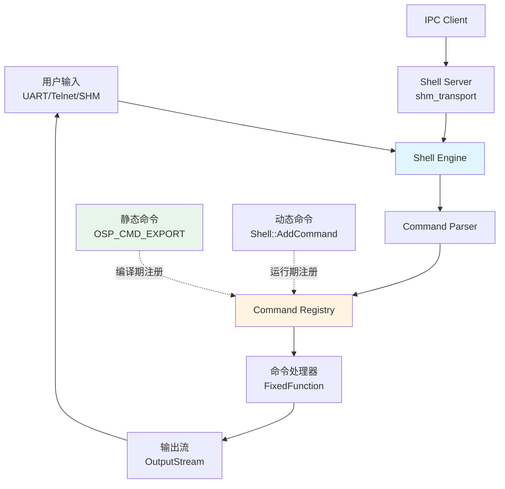

# newosp Shell 优化设计文档

## 1. 背景与动机

### 1.1 现状分析

当前 `newosp/shell.hpp` 基于 `embedded-cli` (C 库) 封装，存在以下问题：

1. **外部依赖**: 依赖第三方 C 库 embedded-cli，增加供应链风险
2. **类型安全欠缺**: C 风格 `void*` 上下文传递，缺乏编译期类型检查
3. **内存管理**: 动态堆分配隐患 (embedded-cli 内部使用 `malloc`)
4. **功能受限**: 缺乏 Tab 补全、命令历史、多行编辑等高级特性
5. **IPC 缺失**: 无法通过共享内存等 IPC 方式远程执行命令

### 1.2 优化目标

基于 MSH (RT-Thread FinSH) 和 newosp 核心设计原则，重构 shell 模块：

- **零外部依赖**: 纯 C++17 header-only 实现，无第三方库
- **零堆分配**: 使用 `FixedString<N>` / `FixedVector<T, N>`，热路径栈优先
- **类型安全**: 模板参数化 + constexpr，编译期分发
- **IPC 支持**: 基于 `shm_transport` 实现 Shell Server，支持跨进程命令执行
- **静态注册**: 宏驱动命令注册 (`OSP_CMD_EXPORT`)，零运行时开销
- **高级特性**: Tab 补全、命令历史、参数提示、多行输入

---

## 2. 总体架构

### 2.1 模块分层



### 2.2 核心组件

| 组件               | 职责                                      | 实现方式                       |
|--------------------|-------------------------------------------|--------------------------------|
| `Shell<N, M>`      | Shell 主引擎，管理输入输出和状态机          | 模板类 (N: 缓冲区大小, M: 最大命令数) |
| `CommandRegistry`  | 命令注册表 (静态 + 动态)                   | 静态数组 + FixedVector        |
| `Parser`           | 零拷贝分词器 (空格/引号/转义)              | constexpr 解析器              |
| `OutputStream`     | 抽象输出流 (UART/Telnet/SHM)              | 接口 + 适配器                  |
| `ShellServer`      | IPC Shell Server (基于 shm_transport)     | 事件驱动节点                   |
| `OSP_CMD_EXPORT`   | 静态命令注册宏                             | `__attribute__((constructor))` |

### 2.3 与现有 shell.hpp 的关系

**渐进式迁移路径**:

1. **Phase 1 (共存)**: 新 `shell_v2.hpp` 独立实现，保留旧 `shell.hpp`
2. **Phase 2 (适配层)**: 旧 `shell.hpp` 内部委托给 `shell_v2.hpp`
3. **Phase 3 (替换)**: 弃用 `shell.hpp`，推荐 `shell_v2.hpp`

---

## 3. 详细设计

### 3.1 Shell 引擎

#### 3.1.1 类模板定义

```cpp
namespace newosp {

template <size_t BufferSize = 256, size_t MaxCommands = 64>
class ShellV2 {
public:
    using CommandFunc = FixedFunction<void(const FixedVector<FixedString<32>, 16>&), 48>;

    explicit ShellV2(OutputStream& output);

    // 核心接口
    void ProcessInput(char ch);                     // 逐字符处理
    void ProcessLine(const char* line);             // 批处理模式
    void AddCommand(const FixedString<32>& name,    // 动态注册
                    CommandFunc func,
                    const char* help = nullptr);

    // 高级特性
    void EnableHistory(size_t depth = 10);
    void EnableCompletion();
    void SetPrompt(const char* prompt);

private:
    struct State {
        FixedString<BufferSize> input_buf;
        size_t cursor_pos{0};
        bool escape_mode{false};
        // Tab 补全状态
        FixedVector<FixedString<32>, MaxCommands> candidates;
        size_t candidate_idx{0};
        // 历史记录
        FixedVector<FixedString<BufferSize>, 16> history;
        size_t history_idx{0};
    };

    State state_;
    OutputStream& output_;

    void HandleNormalChar(char ch);
    void HandleEscapeSequence(char ch);
    void HandleTab();
    void HandleBackspace();
    void ExecuteLine();
};

} // namespace newosp
```

### 3.2 命令注册系统

#### 3.2.1 静态注册宏

```cpp
// 全局命令表
namespace newosp::detail {
    struct CommandEntry {
        const char* name;
        const char* help;
        void (*func)(const FixedVector<FixedString<32>, 16>&);
    };

    // 静态数组存储 (编译期已知)
    inline FixedVector<CommandEntry, 256> g_static_commands;

    struct CommandRegistrar {
        CommandRegistrar(const char* name, const char* help,
                         void (*func)(const FixedVector<FixedString<32>, 16>&)) {
            g_static_commands.emplace_back(CommandEntry{name, help, func});
        }
    };
}

#define OSP_CMD_EXPORT(name, help) \
    static void _osp_cmd_##name(const newosp::FixedVector<newosp::FixedString<32>, 16>&); \
    static newosp::detail::CommandRegistrar _osp_cmd_reg_##name(#name, help, _osp_cmd_##name); \
    static void _osp_cmd_##name(const newosp::FixedVector<newosp::FixedString<32>, 16>& args)
```

#### 3.2.2 使用示例

```cpp
// 应用代码
OSP_CMD_EXPORT(hello, "Print hello message") {
    printf("Hello from command!\n");
    for (const auto& arg : args) {
        printf("  arg: %s\n", arg.c_str());
    }
}
```

### 3.3 Parser 解析器

#### 3.3.1 零拷贝分词

```cpp
namespace newosp::detail {

// 零拷贝分词器 (返回视图)
class Parser {
public:
    using TokenView = std::pair<const char*, size_t>;  // (start, length)

    explicit Parser(const char* input) : input_(input) {}

    // 解析为参数数组 (避免内存拷贝)
    FixedVector<FixedString<32>, 16> Parse() {
        FixedVector<FixedString<32>, 16> result;

        const char* p = input_;
        while (*p) {
            p = SkipWhitespace(p);
            if (*p == '\0') break;

            if (*p == '"' || *p == '\'') {
                // 引号包裹
                auto [token, next] = ParseQuoted(p);
                result.emplace_back(token.first, token.second);
                p = next;
            } else {
                // 普通 token
                auto [token, next] = ParseWord(p);
                result.emplace_back(token.first, token.second);
                p = next;
            }
        }

        return result;
    }
};

} // namespace newosp::detail
```

### 3.4 IPC Shell Server

#### 3.4.1 协议定义

```cpp
namespace newosp {

// Shell 命令请求
struct ShellRequest {
    uint32_t request_id;        // 请求 ID (用于匹配响应)
    char command[256];          // 命令行
    uint32_t timeout_ms;        // 超时时间
};

// Shell 命令响应
struct ShellResponse {
    uint32_t request_id;        // 对应请求 ID
    int32_t exit_code;          // 退出码
    char output[1024];          // 命令输出
    uint32_t output_len;        // 输出长度
};

} // namespace newosp
```

#### 3.4.2 IPC Client 示例

```cpp
// 远程执行 shell 命令
class ShellClient {
public:
    explicit ShellClient(Node& node) : node_(node) {
        node_.Subscribe<ShellResponse>("shell/response",
            [this](const ShellResponse& resp) {
                HandleResponse(resp);
            });
    }

    // 同步执行 (阻塞等待)
    std::string ExecuteSync(const char* cmd, uint32_t timeout_ms = 5000) {
        ShellRequest req;
        // ... 发送请求并等待响应
        node_.Publish("shell/request", req);
        // ... wait_for cv ...
        return result;
    }
};
```

---

## 4. 迁移路径

### 4.1 Phase 1: 并存 (v0.3.0)

**目标**: 新实现独立，不影响现有代码

1. 创建 `include/newosp/shell_v2.hpp`
2. 添加测试 `tests/test_shell_v2.cpp`
3. 添加示例 `examples/shell_v2_demo.cpp`

### 4.2 Phase 2: 适配层 (v0.4.0)

**目标**: 旧接口委托给新实现，逐步迁移

```cpp
// shell.hpp 内部实现
namespace newosp {
    class Shell {
    public:
        void ProcessInput(const char* input) {
            impl_.ProcessLine(input);  // 委托
        }
    private:
        ShellV2<256, 64> impl_;
    };
}
```

### 4.3 Phase 3: 弃用 (v0.5.0)

**目标**: 移除旧实现，移除 embedded-cli 依赖。

---

## 5. 性能与资源预算

### 5.1 内存占用

| 组件                  | 栈占用           | 堆占用 | 备注                         |
|-----------------------|------------------|--------|------------------------------|
| `ShellV2<256, 64>`    | ~512 bytes       | 0      | 输入缓冲 + 状态机            |
| 静态命令表            | ~16 KB (64个)    | 0      | CommandEntry 数组            |
| 命令历史 (10条)       | ~2.5 KB          | 0      | FixedString<256> × 10        |
| **总计**              | **~20 KB**       | **0**  | 适用于 64MB+ RAM 的 ARM-Linux |

---

## 6. 未来扩展

- **脚本支持**: 支持简单的脚本语言 (类似 Bash)
- **管道与重定向**: 支持 `|` 和 `>` 操作符
- **Web Shell**: 基于 WebSocket 的浏览器终端
