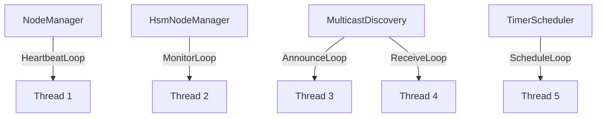
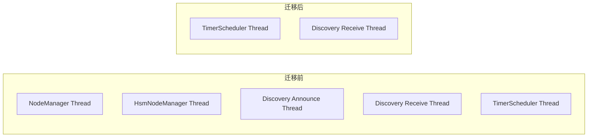

# 定时器与时间戳统一设计方案

## 1. 问题分析

### 1.1 重复的时间戳函数

项目中 7 个模块各自实现了功能相同的 `steady_clock` 时间戳获取函数：

| 模块 | 函数名 | 精度 | 状态 |
|------|--------|------|------|
| `platform.hpp` | `SteadyNowNs()` / `SteadyNowUs()` | ns / us | Phase 1 新增 (统一入口) |
| `timer.hpp` | `NowNs()` | ns | Phase 1 已替换 |
| `bus.hpp` | `GetTimestampUs()` | us | Phase 1 已替换 |
| `worker_pool.hpp` | `GetTimestampUs()` | us | Phase 1 已替换 |
| `node_manager.hpp` | `GetTimestampUs()` | us | Phase 1 已替换 |
| `node_manager_hsm.hpp` | `GetTimestampUs()` | us | Phase 1 已替换 |
| `connection.hpp` | `NowUs()` | us | Phase 1 已替换 |
| `discovery.hpp` (x2) | `GetTimestampUs()` | us | Phase 1 已替换 |

### 1.2 重复的周期性线程循环

多个模块各自创建独立的 `std::thread`，内部实现 `while(running) { work(); sleep_for(); }` 模式，
而非复用已有的 `TimerScheduler`：

| 模块 | 方法 | 用途 | 独立线程 |
|------|------|------|----------|
| `node_manager.hpp` | `HeartbeatLoop()` | 心跳发送 + 超时检测 | 1 |
| `node_manager_hsm.hpp` | `MonitorLoop()` | 超时检测 | 1 |
| `discovery.hpp` | `AnnounceLoop()` | 周期广播 | 1 |
| `discovery.hpp` | `ReceiveLoop()` + `CheckTimeouts()` | 接收 + 超时检测 | 1 |
| `service.hpp` | `AsyncClient::GetResult()` | spin-wait 轮询 | 0 (调用线程) |

问题：

- 线程浪费: 每个模块实例独占一个线程，N 个 NodeManager + M 个 Discovery = N+2M 个线程
- 代码重复: 每个循环都重复实现 elapsed 计算、sleep 补偿逻辑
- 维护成本: 修改定时精度策略需要改动多处

### 1.3 TimerScheduler 自身设计缺陷

在推进 Phase 2 之前，必须先修复 `TimerScheduler` 自身的两个设计问题：

**缺陷 1: 持锁执行回调 (死锁风险)**

`ScheduleLoop()` 在 `mutex_` 锁内调用 `slots_[i].fn(slots_[i].ctx)` (timer.hpp:262)。
Phase 2 中回调内部需要获取各模块自己的 mutex (如 `NodeManager::mutex_`)，形成固定锁序：

```
TimerScheduler::mutex_ → 回调 → NodeManager::mutex_
```

如果任何其他路径以相反顺序获取这两把锁，就会死锁。
更直接的问题：回调在锁内执行，`Add()`/`Remove()` 会被阻塞，所有回调串行化。

**缺陷 2: 裸 new/delete 堆分配**

构造函数 `slots_(new TaskSlot[max_tasks])` 和析构 `delete[] slots_` 违反项目
"栈优先，禁止裸 new/delete" 原则。作为核心调度器，应使用模板参数化 + 内嵌数组。

### 1.4 现有模块的已知问题

**AnnounceLoop 无 sleep 补偿**

`MulticastDiscovery::AnnounceLoop()` 直接 `sleep_for(announce_interval_ms)`，
没有像 `HeartbeatLoop` 那样减去执行耗时。迁移到 `TimerScheduler` 后自然解决。

**ReceiveLoop 的 recvfrom 阻塞问题**

`MulticastDiscovery::ReceiveLoop()` 中 `recvfrom` 虽然设置了 `O_NONBLOCK`，
但 `Stop()` 后 `join()` 仍依赖 100ms 的 sleep 轮询退出。
如果改为阻塞模式且未设置 `SO_RCVTIMEO`，`join()` 会永久卡住。
Phase 2 不改变 ReceiveLoop 的线程模型，但应确保非阻塞模式正确。

### 1.5 当前线程模型



理想状态下，周期性任务应收敛到 `TimerScheduler` 的单一调度线程。

---

## 2. Phase 1: 统一时间戳工具函数 (已完成)

### 2.1 方案

在 `platform.hpp` 中新增两个 inline 函数作为全局统一入口：

```cpp
// platform.hpp
inline uint64_t SteadyNowNs() noexcept;  // steady_clock nanoseconds
inline uint64_t SteadyNowUs() noexcept;  // steady_clock microseconds
```

### 2.2 影响范围

已完成替换的模块 (8 个文件):

- `timer.hpp`: `NowNs()` -> `SteadyNowNs()`
- `bus.hpp`: `GetTimestampUs()` -> `SteadyNowUs()`
- `worker_pool.hpp`: `GetTimestampUs()` -> `SteadyNowUs()`
- `node_manager.hpp`: `GetTimestampUs()` -> `SteadyNowUs()`
- `node_manager_hsm.hpp`: `GetTimestampUs()` -> `SteadyNowUs()`
- `connection.hpp`: `NowUs()` -> `SteadyNowUs()`
- `discovery.hpp` (StaticDiscovery): `GetTimestampUs()` -> `SteadyNowUs()`
- `discovery.hpp` (MulticastDiscovery): `GetTimestampUs()` -> `SteadyNowUs()`

### 2.3 兼容性

- 无公共 API 变更，仅内部实现替换
- 所有 564 测试通过
- `-fno-exceptions -fno-rtti` 兼容

---

## 3. Phase 1.5: TimerScheduler 修复 (Phase 2 前置依赖)

Phase 2 将回调注册到 TimerScheduler，必须先修复 1.3 节的两个缺陷。

### 3.1 修复持锁回调 — 收集-释放-执行模式

当前实现 (有问题):

```cpp
void ScheduleLoop() {
  while (running_.load(std::memory_order_acquire)) {
    std::lock_guard<std::mutex> lock(mutex_);  // 持锁
    for (auto& slot : slots_) {
      if (slot.active && now >= slot.next_fire_ns) {
        slot.fn(slot.ctx);  // 锁内执行回调 — 危险
      }
    }
  }
}
```

修复方案: 在锁内收集到期任务，释放锁后再执行回调：

```cpp
void ScheduleLoop() {
  // 栈上固定容量的到期任务收集数组
  struct PendingTask {
    TimerTaskFn fn;
    void* ctx;
  };

  while (running_.load(std::memory_order_acquire)) {
    PendingTask pending[kMaxPending];  // 栈分配，kMaxPending = MaxTasks
    uint32_t pending_count = 0;
    uint64_t min_remaining = UINT64_MAX;

    {
      std::lock_guard<std::mutex> lock(mutex_);
      uint64_t now = SteadyNowNs();

      for (uint32_t i = 0U; i < max_tasks_; ++i) {
        if (!slots_[i].active) continue;

        if (now >= slots_[i].next_fire_ns) {
          // 收集到期任务
          pending[pending_count].fn = slots_[i].fn;
          pending[pending_count].ctx = slots_[i].ctx;
          ++pending_count;

          // 推进 next_fire_ns
          slots_[i].next_fire_ns += slots_[i].period_ns;
          while (slots_[i].next_fire_ns <= now) {
            slots_[i].next_fire_ns += slots_[i].period_ns;
          }
        }

        // 计算最小剩余时间
        uint64_t after = SteadyNowNs();
        uint64_t remaining = (slots_[i].next_fire_ns > after)
                                 ? (slots_[i].next_fire_ns - after) : 0U;
        if (remaining < min_remaining) min_remaining = remaining;
      }
    }
    // mutex_ 已释放

    // 锁外执行回调 — 安全
    for (uint32_t i = 0; i < pending_count; ++i) {
      pending[i].fn(pending[i].ctx);
    }

    // sleep 逻辑不变
    uint64_t sleep_ns = (min_remaining == UINT64_MAX)
                            ? 10000000ULL : (min_remaining / 2);
    if (sleep_ns < 1000000ULL) sleep_ns = 1000000ULL;
    std::this_thread::sleep_for(std::chrono::nanoseconds(sleep_ns));
  }
}
```

关键变化:
- `Add()`/`Remove()` 不再被回调执行阻塞
- 回调内可安全获取其他模块的 mutex，无嵌套锁风险
- 回调执行期间新的到期任务不会丢失，下一轮循环会处理

注意: `pending` 数组大小等于 `max_tasks_`，当 `MaxTasks` 为模板参数时可直接用
`PendingTask pending[MaxTasks]`；运行时参数场景下需要 VLA 或固定上限。

### 3.2 修复裸 new/delete — 模板参数化

将运行时 `max_tasks` 改为编译期模板参数：

```cpp
template <uint32_t MaxTasks = 16>
class TimerScheduler final {
 public:
  explicit TimerScheduler() = default;
  ~TimerScheduler() { Stop(); }

 private:
  struct TaskSlot { /* ... */ };
  TaskSlot slots_[MaxTasks]{};  // 内嵌数组，零堆分配
  uint32_t next_id_ = 1;
  // ...
};
```

API 变更:
- 构造函数不再接受 `max_tasks` 参数
- 容量通过模板参数 `MaxTasks` 在编译期确定
- 现有代码 `TimerScheduler sched(8)` 改为 `TimerScheduler<8> sched`

### 3.3 ScheduleLoop 中 pending 数组的分配

模板参数化后，`PendingTask pending[MaxTasks]` 直接栈分配，大小编译期已知：

```cpp
template <uint32_t MaxTasks>
void TimerScheduler<MaxTasks>::ScheduleLoop() {
  struct PendingTask { TimerTaskFn fn; void* ctx; };
  PendingTask pending[MaxTasks];  // 栈分配，MaxTasks 编译期常量
  // ...
}
```

### 3.4 影响范围

| 变更 | 影响 |
|------|------|
| 模板参数化 | `TimerScheduler` -> `TimerScheduler<N>`，现有用户需指定容量 |
| 持锁回调修复 | 内部实现变更，无 API 变化 |
| 测试 | `test_timer.cpp` 需更新构造方式 |

---

## 4. Phase 2: 周期性任务统一到 TimerScheduler

### 4.1 前置条件

Phase 1.5 的两项修复必须先完成:
- 持锁回调修复 (否则 Phase 2 的回调注入会引入死锁)
- 模板参数化 (否则违反栈优先原则)

### 4.2 注入方案

采用构造函数可选注入 + 内部回退策略：

```cpp
template <uint32_t MaxNodes>
class NodeManager {
public:
  explicit NodeManager(const NodeManagerConfig& cfg = {},
                       TimerScheduler<>* scheduler = nullptr) noexcept;
};
```

当 `scheduler == nullptr` 时，保持现有行为 (内部创建线程)；
当注入外部 scheduler 时，通过 `scheduler->Add()` 注册周期任务。

### 4.3 迁移映射

| 模块 | 当前实现 | 迁移后 |
|------|----------|--------|
| `NodeManager::HeartbeatLoop()` | 独立线程 | `scheduler->Add(interval_ms, HeartbeatTick, this)` |
| `HsmNodeManager::MonitorLoop()` | 独立线程 | `scheduler->Add(interval_ms, MonitorTick, this)` |
| `MulticastDiscovery::AnnounceLoop()` | 独立线程 | `scheduler->Add(announce_ms, AnnounceTick, this)` |
| `MulticastDiscovery::CheckTimeouts()` | ReceiveLoop 内调用 | `scheduler->Add(timeout_check_ms, TimeoutTick, this)` |

回调适配示例 (Phase 1.5 修复后，回调在锁外执行，安全):

```cpp
// NodeManager 内部
static void HeartbeatTick(void* ctx) {
  auto* self = static_cast<NodeManager*>(ctx);
  std::lock_guard<std::mutex> lock(self->mutex_);
  for (uint32_t i = 0; i < MaxNodes; ++i) {
    if (self->nodes_[i].active && !self->nodes_[i].is_listener) {
      self->SendHeartbeat(self->nodes_[i]);
    }
  }
  self->CheckTimeouts();
}
```

### 4.4 线程数变化



- 迁移前: 5 个线程 (每个模块实例)
- 迁移后: 2 个线程 (TimerScheduler + Discovery 接收)
- Discovery 的 `ReceiveLoop` 因涉及阻塞 I/O (`recvfrom`)，不适合迁入 TimerScheduler
- 附带收益: AnnounceLoop 的 sleep 无补偿问题自然解决 (TimerScheduler 内部处理)

### 4.5 迁移步骤

1. 为各模块添加 `TimerScheduler<>*` 构造参数 (默认 nullptr)
2. 提取循环体为 static 回调函数 (`HeartbeatTick` / `MonitorTick` / `AnnounceTick`)
3. `Start()` 方法中根据 scheduler 是否为空选择注册定时任务或创建线程
4. `Stop()` 方法中根据模式选择 `Remove()` 定时任务或 join 线程
5. 更新测试，验证两种模式

---

## 5. Phase 3: TimerScheduler 增强

### 5.1 One-shot Timer

当前 `TimerScheduler` 仅支持周期任务。部分场景需要一次性定时器 (如连接超时)：

```cpp
expected<TimerTaskId, TimerError> AddOneShot(uint32_t delay_ms,
                                              TimerTaskFn fn,
                                              void* ctx = nullptr);
```

实现: 在 `TaskSlot` 中增加 `bool one_shot` 标志，触发后自动标记 `active = false`。

**Remove 语义**: one-shot 触发后 `active = false`，此时用原 `TimerTaskId` 调用 `Remove()`
应返回 `TimerError::kNotRunning` (与当前 "ID 未找到" 行为一致)。
用户不需要区分 "已触发自动移除" 和 "从未注册"，两者都是 "当前不活跃"。

### 5.2 动态调整 Period

当前不支持运行时修改已注册任务的周期。建议暂不实现，
需要时通过 `Remove()` + `Add()` 组合完成。

### 5.3 回调执行约束

所有任务在同一调度线程中顺序执行。如果某个回调耗时较长会影响其他任务精度。
约束: 回调函数应尽快返回 (建议 < 1ms)，耗时操作应投递到工作线程。

---

## 6. 风险和兼容性

| 风险 | 影响 | 缓解措施 |
|------|------|----------|
| Phase 1.5 模板参数化 | `TimerScheduler` -> `TimerScheduler<N>` | 搜索替换，影响范围小 |
| Phase 2 接口变更 | 构造函数签名变化 | 默认参数 nullptr 保持向后兼容 |
| 回调耗时过长 | 阻塞 TimerScheduler 调度 | 文档约束 + 回调内禁止阻塞 I/O |
| Discovery ReceiveLoop | 阻塞 I/O 不适合定时器 | 保留独立线程，确保非阻塞模式 |
| TimerScheduler 精度 | sleep 最小 1ms，最大 10ms | 对心跳/广播场景足够 (秒级) |
| One-shot Remove 语义 | 触发后 ID 失效 | 返回 kNotRunning，与未注册一致 |

---

## 7. 测试策略

### Phase 1 (已完成)
- 编译验证: 全量构建通过
- 回归测试: 564 测试全部通过
- 功能等价: 替换为统一函数后行为不变

### Phase 1.5
- 持锁回调修复: 验证回调内可安全获取外部 mutex (TSan 无报警)
- 模板参数化: 验证 `TimerScheduler<8>` / `TimerScheduler<32>` 等不同容量
- 并发测试: 回调执行期间调用 `Add()`/`Remove()` 不阻塞
- 回归: 现有 timer 测试全部通过

### Phase 2
- 单元测试: 每个模块分别测试注入模式和独立模式
- 集成测试: 多模块共享同一 TimerScheduler 实例
- 线程安全: TSan 验证无数据竞争、无死锁
- 精度测试: 验证心跳/广播间隔在可接受范围内 (误差 < 10%)

### Phase 3
- One-shot: 验证单次触发后自动移除，Remove 返回 kNotRunning
- 边界: 满槽时添加、移除不存在的任务

---

## 8. 实施优先级

| 阶段 | 内容 | 优先级 | 状态 |
|------|------|--------|------|
| Phase 1 | 统一时间戳工具函数 | P0 | 已完成 |
| Phase 1.5a | 持锁回调修复 (收集-释放-执行) | P0 | 已完成 |
| Phase 1.5b | 模板参数化 (消除裸 new/delete) | P0 | 已完成 |
| Phase 2 | 周期性任务迁移到 TimerScheduler | P1 | 已完成 |
| Phase 3 | One-shot timer / 回调约束文档化 | P2 | 待 Phase 2 完成 |
