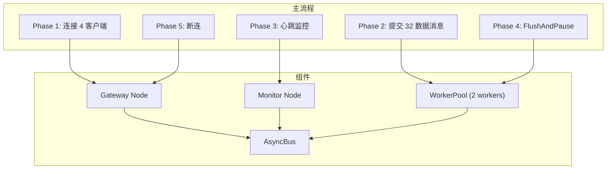
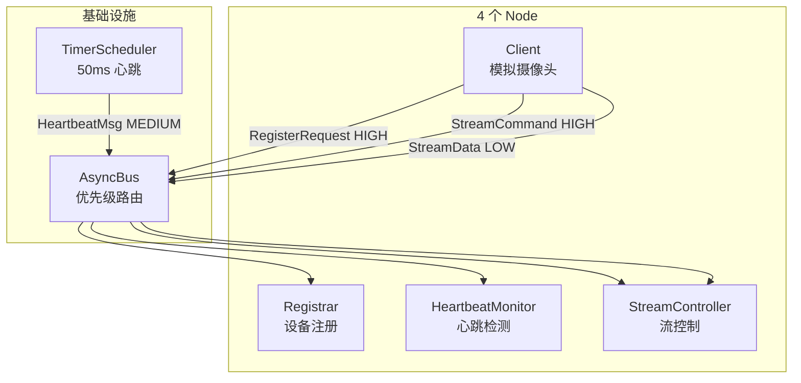
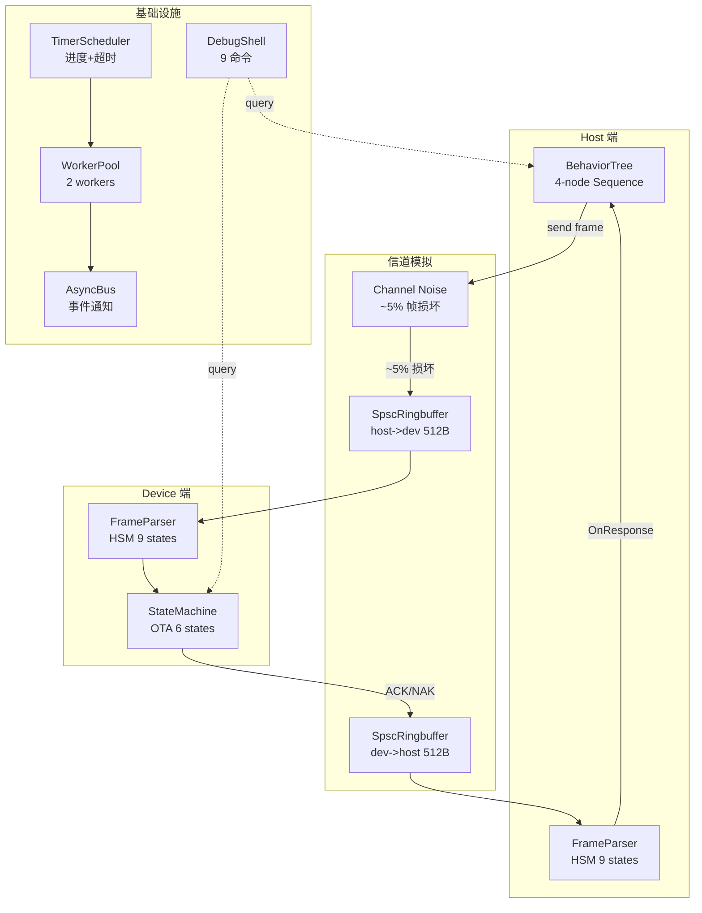
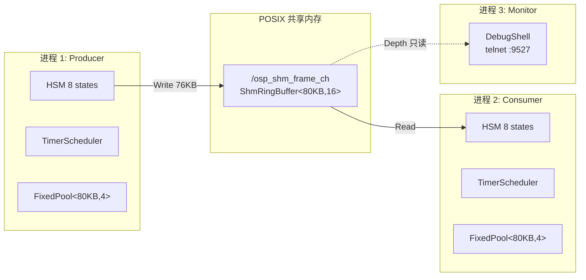
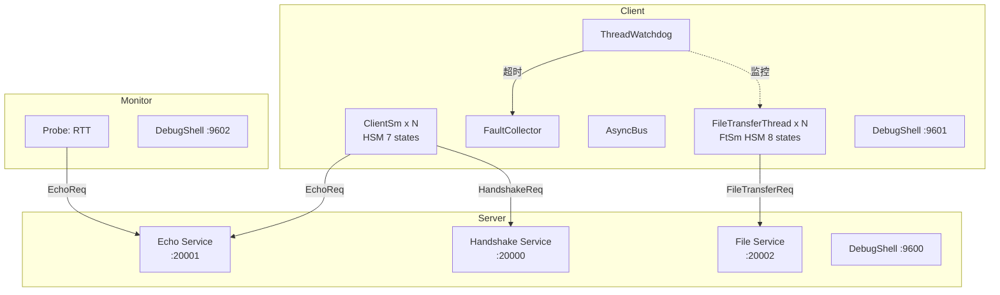

# newosp 示例设计文档

## 1. 概述

newosp 提供 13 个单文件示例和 5 个多文件应用示例，覆盖从基础消息总线到复杂多进程通信的完整技术栈。

### 设计目标

- 渐进式学习路径: 从简单的 Bus/Node 到复杂的 HSM+BT 组合
- 真实场景映射: IoT 网关、视频监控、工业串口、共享内存 IPC、网络压测
- 组件协同展示: 每个示例聚焦 2-12 个 newosp 组件的集成模式
- 零外部依赖: 除 sockpp (可选) 外，所有示例仅依赖 newosp header-only 库

### 示例分类

| 类别 | 数量 | 复杂度 | 典型场景 |
|------|------|--------|----------|
| 单文件示例 | 13 | 低-中 | 快速验证单个或少量组件功能 |
| 多文件应用 | 5 | 中-高 | 完整应用架构，多组件深度集成 |

## 2. 示例与架构层次映射

| 示例 | 基础层 | 核心层 | 状态机 | 网络传输 | 服务发现 | 应用层 | 可靠性 |
|------|--------|--------|--------|----------|----------|--------|--------|
| basic_demo | ✓ | Bus, Node | | | | | |
| benchmark | ✓ | Bus, Timer, MemPool, WorkerPool | | ShmRingBuffer, Transport | | | |
| bt_patrol_demo | ✓ | | BT | | | | |
| client_demo | ✓ | Bus, Node, WorkerPool, Shutdown | | | | | |
| codegen_demo | ✓ | Config | | | | | |
| hsm_bt_combo_demo | ✓ | | HSM, BT | | | | |
| hsm_protocol_demo | ✓ | | HSM | | | | |
| node_manager_hsm_demo | ✓ | | HSM | | | NodeManager | |
| priority_demo | ✓ | Bus, Node | | | | | |
| protocol_demo | ✓ | Bus, Node, Timer | | | | | |
| realtime_executor_demo | ✓ | Bus, Executor | | | | LifecycleNode, QoS | |
| serial_demo | ✓ | Timer | HSM, BT | SerialTransport | | | |
| worker_pool_demo | ✓ | Bus, WorkerPool | | | | | |
| client_gateway | ✓ | Bus, Node, WorkerPool | | | | | |
| streaming_protocol | ✓ | Bus, Node, Timer | | | | | |
| serial_ota | ✓ | Bus, Timer, WorkerPool, MemPool, Shell, Shutdown | HSM, BT | SpscRingbuffer | | | ✓ |
| shm_ipc | ✓ | Timer, MemPool, Shell, Shutdown | HSM | ShmChannel | | | Watchdog, FaultCollector |
| net_stress | ✓ | Bus, Node, Timer, Shell, Shutdown | HSM | | Service | | Watchdog, FaultCollector |

## 3. 单文件示例

### 3.1 basic_demo

**目的**: 演示 AsyncBus 和 Node 的基础 Pub/Sub 模式

**覆盖模块**:
- AsyncBus: 无锁 MPSC 消息总线
- Node: 轻量级发布订阅节点

**关键设计点**:
- 使用 `std::variant` 定义多类型消息 Payload
- 类型化订阅: `node.Subscribe<MsgType>(callback)`
- Bus 统计查询: `GetStats()` 获取发布/订阅计数

### 3.2 benchmark

**目的**: 测量核心组件的吞吐量、延迟和开销

**覆盖模块**:
- AsyncBus: publish/subscribe 性能
- ShmRingBuffer: 共享内存 SPSC 吞吐量
- Transport: 帧编码/解码开销
- MemPool: 分配/释放延迟
- Timer: 调度精度
- WorkerPool: 任务分发延迟

**关键设计点**:
- 热路径微秒级计时 (SteadyNowUs)
- 批量操作测量 (10k-100k 次迭代)
- 统计分析: min/avg/max/p99 延迟

### 3.3 bt_patrol_demo

**目的**: 展示行为树在机器人巡逻场景中的应用

**覆盖模块**:
- BehaviorTree: Sequence/Selector/Decorator 组合

**关键设计点**:
- 巡逻逻辑: Sequence(检查电量 -> 移动到航点 -> 执行任务)
- 紧急处理: Selector(检测紧急情况 -> 立即停止)
- 低电量返航: Decorator(电量 < 20% -> 返回基地)

### 3.4 client_demo

**目的**: 模拟网关并行数据处理和心跳监控

**覆盖模块**:
- Bus, Node: 事件分发
- WorkerPool: 并发任务执行
- Shutdown: 优雅关停

**关键设计点**:
- 4 客户端并发接入
- 32 条数据消息由 2 个 worker 并行处理
- 心跳监控独立节点
- FlushAndPause 确保数据不丢失

### 3.5 codegen_demo

**目的**: 演示 YAML 配置驱动的代码生成

**覆盖模块**:
- Config: INI 配置解析

**关键设计点**:
- YAML 定义消息结构
- 生成 C++ POD 结构和序列化代码

### 3.6 hsm_bt_combo_demo

**目的**: 工业设备控制器，HSM 管理模式，BT 管理行为

**覆盖模块**:
- HSM: 高层模式状态机 (Idle -> Initializing -> Running -> Error -> Shutdown)
- BehaviorTree: Running 模式下的行为序列 (检查传感器 -> 执行任务 -> 上报状态)

**关键设计点**:
- HSM 处理模式转换和错误恢复
- BT 处理 Running 模式内的细粒度行为
- 错误状态自动重试逻辑

### 3.7 hsm_protocol_demo

**目的**: 通信协议状态机 (TCP-lite/Modbus 风格)

**覆盖模块**:
- HSM: 层次状态继承

**关键设计点**:
- Connected 父状态处理 DISCONNECT 事件
- Idle 和 Active 子状态继承父状态的断连逻辑
- 展示 LCA (最低公共祖先) 转换算法

### 3.8 node_manager_hsm_demo

**目的**: 节点连接管理，心跳驱动状态转换

**覆盖模块**:
- HSM: 心跳状态机 (Connected -> Suspect -> Disconnected)
- NodeManager: 节点管理

**关键设计点**:
- 心跳超时检测 (Connected -> Suspect)
- 连续超时断连 (Suspect -> Disconnected)
- 断连回调通知
- 多节点独立状态机

### 3.9 priority_demo

**目的**: 优先级准入控制和背压行为

**覆盖模块**:
- Bus, Node: 优先级感知发布

**关键设计点**:
- 3 种优先级消息: CriticalAlert (HIGH), TelemetryData (MEDIUM), DiagnosticLog (LOW)
- 拥塞时优先保障高优先级消息
- 低优先级消息可能被丢弃

### 3.10 protocol_demo

**目的**: 视频流协议处理器 (GB28181/RTSP 风格)

**覆盖模块**:
- Bus, Node: 消息路由
- Timer: 周期心跳

**关键设计点**:
- 设备注册流程
- TimerScheduler 驱动周期心跳
- 流控制命令 (开始/停止)
- 优先级区分控制面和数据面

### 3.11 realtime_executor_demo

**目的**: 生命周期节点和实时调度器

**覆盖模块**:
- Bus, Executor: 调度器
- LifecycleNode: 状态机节点 (Unconfigured -> Inactive -> Active -> Finalized)
- QoS: 服务质量配置

**关键设计点**:
- SingleThreadExecutor 单线程调度
- 周期性传感器数据发布
- QoS 配置 (Reliability, History, Deadline, Lifespan)
- 控制节点命令处理

### 3.12 serial_demo

**目的**: 工业串口通信，HSM+BT 双驱动

**覆盖模块**:
- SerialTransport: CRC-CCITT 校验
- HSM: 传感器生命周期 (Init -> Calibrating -> Running -> Error)
- BehaviorTree: 控制器决策逻辑 (检查 -> 评估 -> 执行)
- Timer: 周期采样

**关键设计点**:
- PTY 对模拟硬件串口
- 双向可靠通信 (CRC + ACK)
- Node A (传感器) 用 HSM 管理状态
- Node B (控制器) 用 BT 管理行为

### 3.13 worker_pool_demo

**目的**: WorkerPool 任务分发和并行处理

**覆盖模块**:
- WorkerPool: 多线程任务队列
- Bus: 结果收集

**关键设计点**:
- dispatcher + N workers 架构
- 任务优先级分发
- 批量任务提交
- FlushAndPause 排空在途工作

## 4. 多文件应用示例

### 4.1 client_gateway

**应用场景**: IoT/视频监控边缘网关，多客户端并发接入

**覆盖模块**:
- AsyncBus, Node: 事件分发
- WorkerPool: 并行数据处理
- Shutdown: 优雅关停

**架构图**:



**关键设计点**:
- Variant 类型分发: 5 种消息类型统一路由
- WorkerPool + Node 分离: 数据密集型走 WorkerPool，轻量事件走 Node
- 栈分配统计: atomic 计数器，引用传递
- FlushAndPause 确保数据完整性


### 4.2 streaming_protocol

**应用场景**: GB28181/RTSP 视频监控协议流水线

**覆盖模块**:
- AsyncBus, Node: 多节点协作
- Timer: 周期心跳生成

**架构图**:



**关键设计点**:
- 多节点 topic 分发: 4 个角色节点按消息类型订阅
- 优先级感知发布: 控制面 (HIGH) 优先于数据面 (LOW)
- Timer 驱动心跳: 定时器回调生成心跳消息
- GB28181 信令映射: 注册 -> 心跳 -> 流控生命周期

### 4.3 serial_ota

**应用场景**: 工业串口固件升级，信道噪声模拟和 ACK 重传

**覆盖模块**:
- StateMachine: Device OTA 状态机 (6 states) + 双端帧解析器 (9 states)
- BehaviorTree: Host 升级流程 (Sequence: start -> chunks -> end -> verify)
- TimerScheduler: 进度上报 (250ms) + 超时监控 (500ms)
- AsyncBus: 无锁 MPSC 事件通知
- WorkerPool: 后台事件处理 (dispatcher + 2 workers)
- SpscRingbuffer: 模拟 UART 双向 FIFO (host<->device, 各 512B)
- FixedVector/FixedString: 栈分配固件缓冲区和状态名称
- expected/ScopeGuard: 无异常错误处理和 RAII 清理
- DebugShell: 9 条 telnet 调试命令
- log: 结构化日志

**架构图**:



**关键设计点**:
- 12 个 newosp 组件深度集成
- 信道噪声模拟: 5% 概率翻转随机字节导致 CRC 错误
- 偏移量检测: Device 检查 `chunk_offset == received_size`，不匹配发送 NAK
- 回卷重发: Host 检测 NAK 后回卷 `current_offset` 到 Device 的 `received_size`
- 末块保护: Device 校验 `received_size == total_size`，不匹配拒绝 END 命令
- 重试上限: 每块最多重试 3 次
- 零堆分配: FixedVector<uint8_t, 4096> 栈分配固件缓冲区

### 4.4 shm_ipc

**应用场景**: 跨进程共享内存视频帧流式传输 (producer-consumer)

**覆盖模块**:
- ShmChannel: 命名共享内存通道 (CreateWriter / OpenReader)
- ShmRingBuffer: 无锁 SPSC 环形缓冲区
- SharedMemorySegment: POSIX shm_open/mmap RAII 封装
- StateMachine: Producer/Consumer 生命周期 HSM (各 8 states)
- FixedPool: 帧缓冲区固定块分配 (零堆分配)
- TimerScheduler: 周期性统计吞吐量
- DebugShell: Telnet 调试 Shell (5 命令)
- ShutdownManager: 信号安全优雅关停
- Watchdog: 线程心跳监控
- FaultCollector: 结构化故障收集

**架构图**:



**关键设计点**:
- HSM 驱动背压: Producer 连续 3 次 ring full 进入 Throttled 降速状态
- 帧校验: Consumer 逐字节验证 `(seq_num + offset) & 0xFF` 模式
- 时间戳统一: 所有时间测量使用 `SteadyNowUs()`
- Stall 检测: Consumer 超过 3s 无数据进入 Stalled 状态
- 零堆分配: FixedPool 预分配帧缓冲，热路径无 malloc
- Shell 调试: 5 条命令 (status/stats/reset/peek/config)

### 4.5 net_stress

**应用场景**: TCP 网络压力测试，3 进程架构 (server/client/monitor)

**覆盖模块**:
- Service/Client: RPC 服务端和客户端 (handshake + echo + file)
- StateMachine: 连接 HSM (7 states) + 传输 HSM (8 states)
- AsyncBus, Node: 进程内事件 pub/sub
- ThreadWatchdog: 文件传输线程 + FCCU 消费者线程监控
- FaultCollector: 结构化故障收集 (线程超时/高错误率/文件失败)
- DebugShell: 3 实例 Telnet 调试 (3 端口)
- TimerScheduler: Echo tick + stats + watchdog check + probe
- FixedString/FixedVector: 栈分配容器
- expected/ScopeGuard: 无异常错误处理和 RAII 清理

**架构图**:



**关键设计点**:
- 双通道并行压测: Echo RPC (timer 驱动) 和文件传输 (独立线程) 同时运行
- HSM 驱动连接生命周期: 每客户端实例独立状态机
- 模拟丢包: 10% 概率丢包，HSM 驱动重传逻辑 (最多 3 次)
- ThreadWatchdog 线程监控: 10s 超时检测，超时/恢复回调自动上报/清除故障
- FaultCollector 结构化故障: 3 种故障码 (0x02010001/0x02020001/0x02030001)
- CAS 无锁统计: Monitor 使用 CAS 循环更新 min/max RTT
- Placement new: ClientCtx 含 atomic 成员，使用 aligned storage + placement new
- 3 个独立 Shell: server :9600, client :9601, monitor :9602

## 5. 示例复杂度与学习路径

### 推荐学习顺序

#### 第一阶段: 基础组件 (1-2 小时)

1. **basic_demo** -- Bus/Node 基础 Pub/Sub
2. **priority_demo** -- 优先级消息路由
3. **worker_pool_demo** -- 多线程任务分发
4. **client_demo** -- Bus + Node + WorkerPool 协同

#### 第二阶段: 状态机和行为树 (2-3 小时)

5. **hsm_protocol_demo** -- HSM 层次状态继承
6. **bt_patrol_demo** -- BT 巡逻机器人
7. **hsm_bt_combo_demo** -- HSM + BT 组合
8. **node_manager_hsm_demo** -- HSM 心跳状态机

#### 第三阶段: 定时器和调度器 (1-2 小时)

9. **protocol_demo** -- Timer 驱动心跳
10. **realtime_executor_demo** -- 生命周期节点 + QoS

#### 第四阶段: 串口和传输 (2-3 小时)

11. **serial_demo** -- 串口通信 HSM+BT
12. **benchmark** -- 性能基准测试

#### 第五阶段: 多文件应用 (5-8 小时)

13. **client_gateway** -- IoT 网关 (低复杂度)
14. **streaming_protocol** -- 视频监控协议 (低复杂度)
15. **serial_ota** -- 串口 OTA (高复杂度，12 组件集成)
16. **shm_ipc** -- 共享内存 IPC (高复杂度，跨进程)
17. **net_stress** -- TCP 压测 (高复杂度，3 进程)

### 复杂度评估

| 示例 | 代码量 | 组件数 | 进程数 | 复杂度 | 学习时间 |
|------|--------|--------|--------|--------|----------|
| basic_demo | ~100 行 | 2 | 1 | 低 | 15 分钟 |
| benchmark | ~300 行 | 6 | 1 | 中 | 30 分钟 |
| bt_patrol_demo | ~150 行 | 1 | 1 | 低 | 20 分钟 |
| client_demo | ~200 行 | 4 | 1 | 中 | 30 分钟 |
| hsm_bt_combo_demo | ~250 行 | 2 | 1 | 中 | 40 分钟 |
| hsm_protocol_demo | ~150 行 | 1 | 1 | 低 | 20 分钟 |
| node_manager_hsm_demo | ~200 行 | 2 | 1 | 中 | 30 分钟 |
| priority_demo | ~150 行 | 2 | 1 | 低 | 20 分钟 |
| protocol_demo | ~200 行 | 3 | 1 | 中 | 30 分钟 |
| realtime_executor_demo | ~200 行 | 4 | 1 | 中 | 40 分钟 |
| serial_demo | ~300 行 | 4 | 1 | 中 | 45 分钟 |
| worker_pool_demo | ~150 行 | 2 | 1 | 低 | 20 分钟 |
| client_gateway | ~300 行 | 3 | 1 | 低 | 45 分钟 |
| streaming_protocol | ~350 行 | 3 | 1 | 低 | 45 分钟 |
| serial_ota | ~1200 行 | 12 | 1 | 高 | 2-3 小时 |
| shm_ipc | ~1100 行 | 12 | 3 | 高 | 2-3 小时 |
| net_stress | ~1700 行 | 13 | 3 | 高 | 3-4 小时 |

### 按技术栈分类

#### 消息总线和节点

- basic_demo, priority_demo, client_demo, worker_pool_demo
- client_gateway, streaming_protocol

#### 状态机 (HSM)

- hsm_protocol_demo, node_manager_hsm_demo, hsm_bt_combo_demo
- serial_ota (Device OTA + 双端帧解析器)
- shm_ipc (Producer/Consumer 生命周期)
- net_stress (连接管理 + 文件传输)

#### 行为树 (BT)

- bt_patrol_demo, hsm_bt_combo_demo, serial_demo
- serial_ota (Host 升级流程)

#### 网络传输

- benchmark (Transport 帧编码/解码)
- net_stress (RPC echo + 文件传输)

#### 共享内存

- benchmark (ShmRingBuffer SPSC)
- shm_ipc (跨进程视频帧流)

#### 串口通信

- serial_demo (PTY 对 + CRC + ACK)
- serial_ota (SpscRingbuffer 模拟 UART)

#### 可靠性和监控

- shm_ipc (Watchdog + FaultCollector)
- net_stress (ThreadWatchdog + FaultCollector + 3 种故障码)

### 关键技术点映射

| 技术点 | 相关示例 |
|--------|----------|
| 无锁 MPSC 总线 | basic_demo, priority_demo, client_gateway, streaming_protocol, serial_ota, net_stress |
| 优先级路由 | priority_demo, streaming_protocol |
| 层次状态机 | hsm_protocol_demo, node_manager_hsm_demo, serial_ota, shm_ipc, net_stress |
| 行为树 | bt_patrol_demo, hsm_bt_combo_demo, serial_demo, serial_ota |
| 多线程任务池 | client_demo, worker_pool_demo, client_gateway, serial_ota |
| 定时器调度 | protocol_demo, realtime_executor_demo, serial_demo, serial_ota, shm_ipc, net_stress |
| 生命周期节点 | realtime_executor_demo |
| QoS 配置 | realtime_executor_demo |
| 串口传输 | serial_demo, serial_ota |
| 共享内存 IPC | shm_ipc |
| RPC 服务 | net_stress |
| 线程看门狗 | shm_ipc, net_stress |
| 故障收集器 | shm_ipc, net_stress |
| 调试 Shell | serial_ota, shm_ipc, net_stress |
| 优雅关停 | client_demo, serial_ota, shm_ipc, net_stress |
| 零堆分配 | serial_ota (FixedVector), shm_ipc (FixedPool), net_stress (FixedString) |
| Placement new | net_stress (ClientCtx) |
| CAS 无锁统计 | net_stress (Monitor RTT) |

## 6. 编译和运行

### 编译所有示例

```bash
cmake -B build -DOSP_BUILD_EXAMPLES=ON -DOSP_WITH_SOCKPP=ON
cmake --build build -j$(nproc)
```

### 运行单文件示例

```bash
./build/examples/basic_demo
./build/examples/serial_demo
./build/examples/benchmark
```

### 运行多文件应用

```bash
# 单进程
./build/examples/osp_client_gateway
./build/examples/osp_streaming_protocol
./build/examples/osp_serial_ota_demo

# 多进程 (需要多个终端)
# shm_ipc
./build/examples/shm_ipc/osp_shm_producer frame_ch 1000
./build/examples/shm_ipc/osp_shm_consumer frame_ch
./build/examples/shm_ipc/osp_shm_monitor frame_ch 9527

# net_stress
./build/examples/net_stress/osp_net_stress_server
./build/examples/net_stress/osp_net_stress_client 127.0.0.1 4
./build/examples/net_stress/osp_net_stress_monitor 127.0.0.1
```

### Telnet 调试

```bash
# serial_ota
telnet localhost 5090

# shm_ipc monitor
telnet localhost 9527

# net_stress
telnet localhost 9600  # server
telnet localhost 9601  # client
telnet localhost 9602  # monitor
```

## 7. 设计模式总结

### 消息总线模式

- Variant 类型分发: `std::variant<Msg1, Msg2, ...>` 统一 Payload
- 类型化订阅: `node.Subscribe<MsgType>(callback)`
- 优先级路由: `PublishWithPriority(msg, Priority::kHigh)`

### 状态机模式

- 层次状态继承: 父状态处理公共事件，子状态处理特定事件
- Entry/Exit action: 状态进入/退出时执行初始化/清理
- Guard 条件: 事件分发前检查条件，决定是否转换

### 行为树模式

- Sequence: 顺序执行子节点，任一失败则失败
- Selector: 顺序执行子节点，任一成功则成功
- Decorator: 修改子节点行为 (重复/反转/条件)

### 并发模式

- WorkerPool: dispatcher + N workers，优先级分发
- FlushAndPause: 排空在途工作，确保数据完整性
- 无锁 SPSC: 单写单读环形缓冲区，CAS 序列号

### 可靠性模式

- 重传机制: 偏移量检测 + 回卷重发 (serial_ota)
- 背压控制: 连续 ring full 进入 Throttled 降速 (shm_ipc)
- 线程监控: ThreadWatchdog 心跳超时检测 (shm_ipc, net_stress)
- 故障收集: FaultCollector 结构化故障上报 (shm_ipc, net_stress)

### 零堆分配模式

- FixedVector/FixedString: 栈分配容器
- FixedPool: 预分配固定块内存池
- Placement new: aligned storage + 显式构造/析构

### RAII 模式

- ScopeGuard: `OSP_SCOPE_EXIT` 自动清理
- expected: 无异常错误处理
- SharedMemorySegment: POSIX shm RAII 封装

