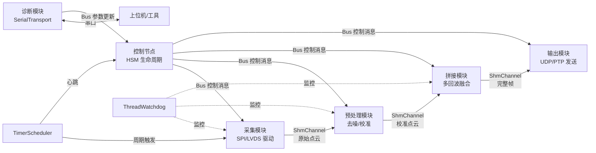
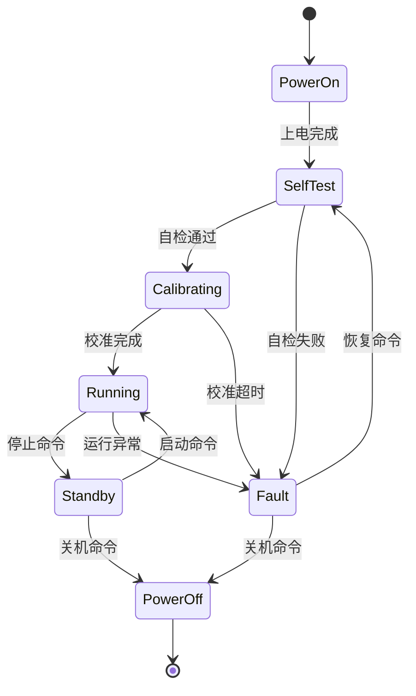

# newosp 性能评估: 工业激光雷达应用场景

> 从属于 [benchmark_report_zh.md](benchmark_report_zh.md) 实测数据
> 版本: 1.0
> 日期: 2026-02-14

## 1. 目标场景

newosp 作为激光雷达产品内部的嵌入式通信框架，运行在 ARM-Linux SoC 上，负责:

- 采集模块、预处理模块、点云拼接模块、输出模块之间的数据流调度
- 设备生命周期管理 (上电→校准→运行→故障→待机)
- 串口诊断通道 (配置下发、固件升级、故障上报)
- 定时器驱动的周期性任务 (扫描触发、心跳、看门狗)

## 2. 性能需求 vs 实测数据

### 2.1 典型激光雷达数据流参数

| 参数 | 典型值 | 说明 |
|------|--------|------|
| 扫描帧率 | 10-25 Hz | 机械旋转或 MEMS 扫描周期 |
| 单帧点数 | 10K-300K points | 取决于线数和角分辨率 |
| 单点大小 | 12-16 B | x/y/z/intensity/timestamp |
| 单帧数据量 | 120 KB - 4.8 MB | 点数 x 单点大小 |
| 内部模块数 | 4-8 | 采集/预处理/拼接/滤波/输出/诊断 |
| 模块间消息频率 | 100-1000 msgs/s | 控制消息 + 帧元数据 |
| 诊断串口波特率 | 115200-921600 bps | 配置/日志/OTA |

### 2.2 吞吐量对比

| 指标 | x86 实测 | ARM 估算 (1 GHz) | 激光雷达需求 | 裕量 |
|------|----------|-------------------|-------------|------|
| Bus 消息吞吐 | 5.9M msgs/s | 0.5-1.0M msgs/s | < 1K msgs/s (控制消息) | > 500x |
| SHM SPSC (256B) | 40M ops/s | 5-10M ops/s | < 30K ops/s (帧元数据) | > 150x |
| SHM SPSC (4KB) | 2.9M ops/s | 0.3-0.6M ops/s | < 25 ops/s (点云分包) | > 10000x |
| MemPool alloc/free | 98M ops/s | 10-20M ops/s | < 100K ops/s | > 100x |
| 串口 (512B, ACK) | 33K FPS | 受波特率限制 | < 100 FPS | 充足 |

所有指标相对需求均有 100x 以上裕量，不构成瓶颈。

### 2.3 延迟对比

| 指标 | x86 实测 | ARM 估算 | 激光雷达需求 | 评估 |
|------|----------|----------|-------------|------|
| Bus P99 延迟 | 157 ns | 500-1500 ns | < 100 us | 充足 |
| Timer 平均抖动 | < 10 us | < 50 us | < 1 ms | 充足 |
| Timer 最大抖动 | ~1 ms | 1-5 ms | < 10 ms | 充足 (非 RT 内核) |

对于扫描周期 40-100 ms (10-25 Hz) 的激光雷达，微秒级的 Bus 延迟和毫秒级的 Timer 抖动完全满足要求。

### 2.4 内存占用对比

| 资源 | newosp 占用 | 激光雷达 SoC 典型配置 | 占比 |
|------|-------------|----------------------|------|
| .text | ~80 KB | 256 MB - 1 GB Flash | < 0.1% |
| 运行时 RAM | < 2 MB | 256 MB - 2 GB DDR | < 1% |
| AsyncBus 实例 | ~520 KB | - | 可通过 QueueDepth 缩小 |

框架本身的资源占用可忽略不计，绝大部分内存留给点云缓冲和算法处理。

## 3. 模块适配分析

### 3.1 推荐使用的模块

| 模块 | 激光雷达用途 | 适配度 |
|------|-------------|--------|
| AsyncBus + Node | 模块间控制消息路由 (启停/模式切换/参数更新) | 高 |
| ShmChannel | 点云数据在进程间零拷贝传递 | 高 |
| HSM | 设备生命周期 (Init→Calibrating→Running→Error→Standby) | 高 |
| BehaviorTree | 自检流程 (检查激光器→检查电机→检查温度→就绪) | 高 |
| TimerScheduler | 扫描触发、心跳、温控采样周期 | 高 |
| SerialTransport | 诊断串口 (配置/日志/OTA)，CRC+ACK 保证可靠性 | 高 |
| ThreadWatchdog | 关键线程存活监控 | 高 |
| FaultCollector | 故障环形缓冲，掉电前持久化 | 高 |
| MemPool | 点云帧缓冲池，避免运行时堆分配 | 高 |
| WorkerPool | 并行点云预处理 (多核 SoC) | 中-高 |

### 3.2 数据流架构建议

关键设计原则:
- 点云数据 (大 payload) 走 ShmChannel 零拷贝，不经过 Bus
- Bus 仅传递控制消息和帧元数据 (< 256B)，保持 variant 轻量
- HSM 管理设备状态，BT 管理自检/恢复流程
- 串口通道独立于数据通路，不影响实时性

### 3.3 HSM 状态设计参考

## 4. 设计决策与注意事项

### 4.1 控制面/数据面分离

实测数据显示，当 variant 包含 8KB 类型时，Envelope sizeof 达 8232B，Bus 吞吐从 5.9M 降至 0.6M msgs/s。newosp 的架构设计已针对此做了分离:

- 数据面 (点云): 走 ShmChannel 零拷贝传递，不经过 Bus，吞吐不受 variant 大小影响
- 控制面 (消息): 走 Bus pub-sub，variant 仅包含控制消息类型 (< 256B)，Envelope sizeof 保持 ~300B，吞吐 > 5M msgs/s

这是架构层面的设计选择，而非运行时限制。

### 4.2 实时性保障

Timer 最大抖动 ~1ms (x86) / ~5ms (ARM，非 RT 内核)。对于 10-25 Hz 扫描周期 (40-100 ms) 足够。

如需更高确定性:
- 扫描触发等时间敏感操作使用 `RealtimeExecutor` (SCHED_FIFO + CPU affinity)
- 部署 PREEMPT_RT 内核补丁可将抖动降至 < 100 us
- newosp 已内置 `RealtimeExecutor` 支持，无需额外开发

### 4.3 多核缓存优化

ARM 平台的 cache coherency 开销高于 x86。ShmRingBuffer 在 1KB 处出现吞吐拐点 (L1 cache 边界)。newosp 已做如下优化:

- ShmRingBuffer cache line 对齐 (64B padding)
- explicit acquire/release memory fences (ARM 内存序加固)
- 点云分包大小建议 ≤ 512B 以获得最佳 SPSC 吞吐

## 5. 资源预算估算

以典型 ARM Cortex-A53/A72 (1.2-1.8 GHz, 512 MB DDR) 激光雷达 SoC 为例:

| 资源 | newosp 框架 | 点云缓冲 (3 帧 x 1MB) | 算法处理 | 总计 |
|------|-------------|----------------------|----------|------|
| RAM | ~2 MB | ~3 MB | ~10-50 MB | < 60 MB |
| .text | ~80 KB | - | ~1-5 MB | < 6 MB |
| 线程数 | 4-6 (Bus+Timer+Worker+Diag) | - | 2-4 | < 10 |
| CPU 占用 | < 5% | - | 30-60% | < 70% |

框架层资源占用极低，为点云算法留出充足空间。

## 6. 结论

newosp 的性能指标在所有维度上均满足激光雷达内部通信需求，且有 100x 以上裕量。其零堆分配、header-only、轻量级的设计特点与激光雷达嵌入式 SoC 的资源约束高度匹配。

推荐架构: Bus 负责控制面 (轻量消息)，ShmChannel 负责数据面 (点云零拷贝)，HSM 管理设备状态，SerialTransport 提供诊断通道。
