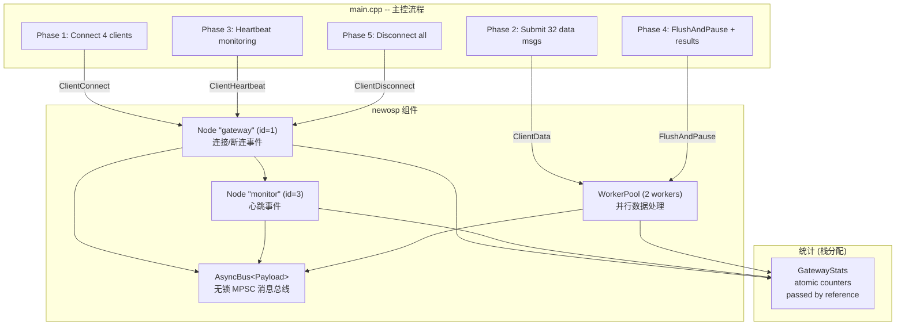

# Client Gateway Demo -- 多客户端网关示例

## 概述

模拟 IoT/视频监控边缘网关场景：多个客户端并发接入、数据并行处理、心跳监控、有序断连。
展示 newosp 的 Bus + Node + WorkerPool 多组件协同工作模式。

## 应用场景

- IoT 设备网关（大量传感器同时上报）
- 视频监控接入平台（多路摄像头注册/心跳/数据流）
- 边缘计算网关（数据汇聚 + 并行处理）

## 组件架构



## 使用的 newosp 组件

| 组件 | 头文件 | 用途 |
|------|--------|------|
| `AsyncBus<Payload>` | `osp/bus.hpp` | 无锁 MPSC 消息总线，类型路由 |
| `Node<Payload>` | `osp/node.hpp` | Gateway 和 Monitor 的轻量 Pub/Sub 节点 |
| `WorkerPool<Payload>` | `osp/worker_pool.hpp` | 2 线程并行处理 ClientData |
| `log` | `osp/log.hpp` | 结构化日志 |

## 消息类型

```cpp
using Payload = std::variant<
    ClientConnect,      // 客户端连接 (id, ip, port)
    ClientDisconnect,   // 客户端断连 (id, reason)
    ClientData,         // 数据消息 (id, data[512])
    ClientHeartbeat,    // 心跳 (id, rtt_us)
    ProcessResult       // 处理结果 (id, status, bytes)
>;
```

## 运行流程

| 阶段 | 操作 | 组件 |
|------|------|------|
| Phase 1 | 连接 4 个客户端 | Gateway Node |
| Phase 2 | 提交 32 条数据消息 (4 clients x 8 msgs) | WorkerPool (2 workers) |
| Phase 3 | 发送心跳到监控节点 | Gateway -> Monitor Node |
| Phase 4 | FlushAndPause 排空在途工作，汇总结果 | WorkerPool |
| Phase 5 | 有序断连所有客户端 | Gateway Node |

## 设计要点

1. **Variant 类型分发**: 5 种消息类型通过 `std::variant` 统一，Bus 根据类型自动路由到对应订阅者
2. **WorkerPool + Node 分离**: 数据密集型工作 (ClientData) 走 WorkerPool 并行处理；轻量事件 (connect/disconnect/heartbeat) 走 Node
3. **栈分配统计**: `GatewayStats` 使用 `std::atomic` 成员，栈上分配，引用传递给 lambda 捕获，无全局单例
4. **FlushAndPause 模式**: 在断连前排空所有在途工作，确保数据不丢失

## 文件说明

| 文件 | 说明 |
|------|------|
| `messages.hpp` | 5 种消息 POD 结构 + `Payload` variant 定义 |
| `handlers.hpp` | WorkerPool handler 注册 + Gateway/Monitor 订阅设置 |
| `main.cpp` | 5 阶段主流程 + 统计汇总 |

## 编译运行

```bash
cmake -B build -DOSP_BUILD_EXAMPLES=ON
cmake --build build --target osp_client_gateway
./build/examples/osp_client_gateway
```
