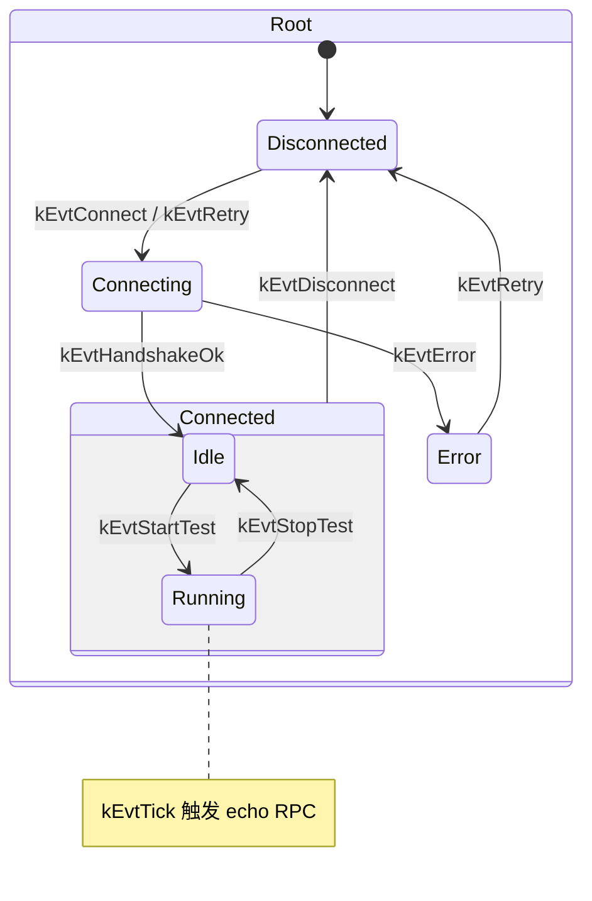
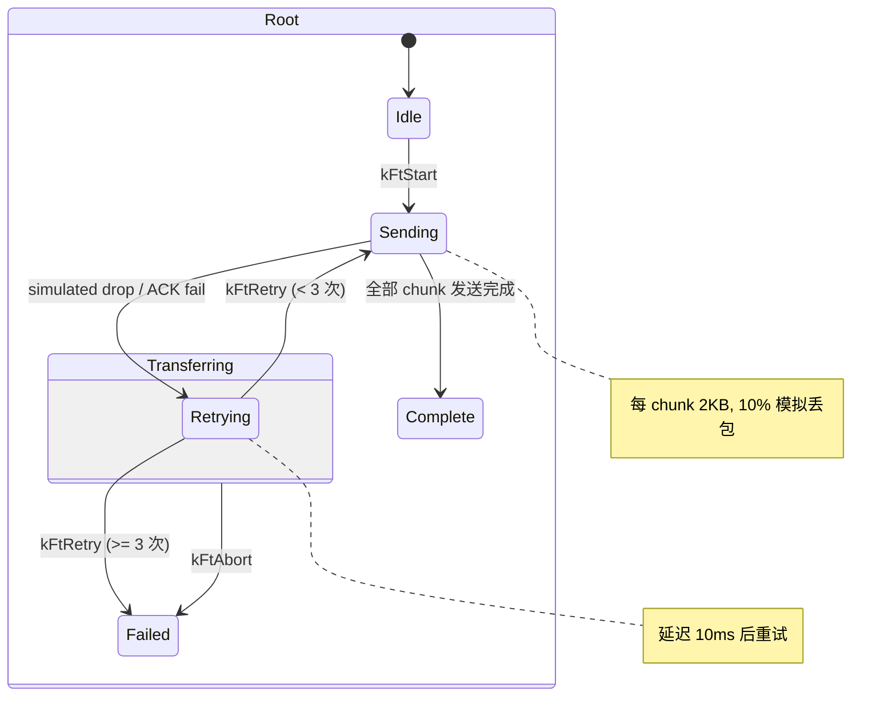

# Net Stress Demo -- TCP 网络压力测试

## 概述

完整的 TCP 网络压力测试框架，由 3 个独立进程组成（server / client / monitor），
从遗留 OSP 压测框架现代化重写。支持多客户端并发 RPC echo 压测 + 文件传输，
双通道并行运行，HSM 驱动连接管理和重传逻辑。

## 应用场景

- 工业部署前的网络性能验证（吞吐量、延迟、丢包率）
- 嵌入式 TCP 协议栈压力测试
- 服务端容量规划（最大并发客户端数、负载特性分析）

## 三进程架构

```mermaid
graph TB
    subgraph server["Server (server.cpp)"]
        HS_SVC["Service&lt;HandshakeReq, Resp&gt;<br/>port 20000"]
        ECHO_SVC["Service&lt;EchoReq, Resp&gt;<br/>port 20001"]
        FILE_SVC["Service&lt;FileTransferReq, Resp&gt;<br/>port 20002"]
        S_SHELL["DebugShell :9600<br/>cmd_stats / cmd_clients / cmd_quit"]
        S_TIMER["TimerScheduler&lt;2&gt;<br/>5s stats log"]
    end

    subgraph client["Client (client.cpp)"]
        C_HSM["ClientSm x N (HSM 7 states)<br/>Disconnected->Connecting->Connected{Idle,Running}->Error"]
        C_FT["FileTransferThread x N<br/>FtSm (HSM 8 states)<br/>Idle->Sending->WaitingAck->Retrying->Complete/Failed"]
        C_BUS["AsyncBus&lt;BusPayload&gt;<br/>PeerEvent / StatsSnapshot / EchoResult"]
        C_NODE["Node &quot;stress_client&quot;"]
        C_SHELL["DebugShell :9601<br/>7 commands"]
        C_TIMER["TimerScheduler&lt;4&gt;<br/>echo tick + stats + watchdog"]
    end

    subgraph monitor["Monitor (monitor.cpp)"]
        M_PROBE["Probe: periodic echo RTT"]
        M_BUS["AsyncBus&lt;MonBusPayload&gt;"]
        M_SHELL["DebugShell :9602<br/>cmd_probe / cmd_history"]
        M_TIMER["TimerScheduler&lt;2&gt;<br/>periodic probe"]
    end

    C_HSM -->|HandshakeReq| HS_SVC
    C_HSM -->|EchoReq (timer tick)| ECHO_SVC
    C_FT -->|FileTransferReq| FILE_SVC
    M_PROBE -->|EchoReq (probe)| ECHO_SVC

    C_HSM --> C_BUS
    C_FT --> C_BUS
    C_BUS --> C_NODE
```

## 使用的 newosp 组件

| 组件 | 头文件 | 用途 | 使用方 |
|------|--------|------|--------|
| `Service<Req, Resp>` | `osp/service.hpp` | RPC 服务端 (handshake + echo + file) | S |
| `Client<Req, Resp>` | `osp/service.hpp` | RPC 客户端 (handshake + echo + file) | C, M |
| `StateMachine<Ctx, N>` | `osp/hsm.hpp` | 连接 HSM (7 states) + 传输 HSM (8 states) | C |
| `AsyncBus<Payload>` | `osp/bus.hpp` | 进程内事件 pub/sub | C, M |
| `Node<Payload>` | `osp/node.hpp` | 类型化 pub/sub 封装 | C, M |
| `ThreadWatchdog<N>` | `osp/watchdog.hpp` | 文件传输线程 + FCCU 消费者线程监控 | C |
| `FaultCollector<M,Q>` | `osp/fault_collector.hpp` | 结构化故障收集 (线程超时/高错误率/文件失败) | C |
| `ThreadHeartbeat` | `osp/platform.hpp` | 原子心跳 (文件传输线程 Beat) | C |
| `DebugShell` | `osp/shell.hpp` | Telnet 调试 (3 实例, 3 端口) | S, C, M |
| `TimerScheduler<N>` | `osp/timer.hpp` | Echo tick + stats + watchdog check + probe | S, C, M |
| `FixedString` | `osp/vocabulary.hpp` | 栈分配字符串 | C, M |
| `FixedVector` | `osp/vocabulary.hpp` | 栈分配 RTT 历史 | M |
| `expected` | `osp/vocabulary.hpp` | 无异常错误处理 | S, C, M |
| `ScopeGuard` | `osp/vocabulary.hpp` | RAII 清理 (placement new 对象) | S, C, M |
| `log` | `osp/log.hpp` | 结构化日志 | S, C, M |

S = Server, C = Client, M = Monitor

## Client 连接状态机 (HSM)



## File Transfer 状态机 (HSM)



## 协议定义

| RPC 通道 | 端口 | 请求/响应 | 说明 |
|----------|------|-----------|------|
| Handshake | 20000 | `HandshakeReq` / `HandshakeResp` | 客户端注册，分配 slot |
| Echo | 20001 | `EchoReq` / `EchoResp` | 负载回显，计算 RTT |
| File | 20002 | `FileTransferReq` / `FileTransferResp` | 分块文件传输 |

### Bus 消息类型 (进程内)

```cpp
using BusPayload = std::variant<
    PeerEvent,        // 连接/断连事件
    StartTestCmd,     // 启动压测命令
    StopTestCmd,      // 停止压测命令
    StatsSnapshot,    // 聚合统计快照
    EchoResult,       // 单次 echo 结果
    FileProgress      // 文件传输进度
>;
```

## Watchdog + FaultCollector 集成

Client 进程集成了 `osp::ThreadWatchdog` 和 `osp::FaultCollector`，替代手写看门狗逻辑。

### 故障码定义

| 故障码 | 常量 | 说明 |
|--------|------|------|
| `0x02010001` | `kFaultThreadTimeout` | 文件传输线程心跳超时 (10s) |
| `0x02020001` | `kFaultHighErrorRate` | 客户端错误率 > 50% |
| `0x02030001` | `kFaultFileFail` | 文件传输失败 |

### 架构

```
TimerScheduler (3s 周期)
  --> ErrorRateCheckCallback
        --> g_watchdog.Check()     -- 检查所有已注册线程心跳
        --> 扫描客户端错误率       -- n_err > n_sent/2 则上报

ThreadWatchdog<kMaxInstances+1>
  --> 每个文件传输线程注册一个 slot
  --> FCCU 消费者线程注册一个 slot
  --> OnTimeout  --> ReportFault(kFiThreadTimeout)
  --> OnRecovered --> ClearFault(kFiThreadTimeout)

FaultCollector<8, 64>
  --> 消费者线程自带 ThreadHeartbeat (受 Watchdog 监控)
  --> DefaultHook 日志输出故障事件
  --> cmd_faults Shell 命令查看故障状态

FileTransferThread
  --> FtCtx.heartbeat->Beat() 每轮循环
  --> 传输失败时 ReportFault(kFiFileFail)
```

## Shell 调试命令

### Server (telnet localhost 9600)

| 命令 | 说明 |
|------|------|
| `cmd_stats` | 服务器统计 (echo 数/吞吐量/file chunks) |
| `cmd_clients` | 已连接客户端列表 (slot/name/age) |
| `cmd_quit` | 关闭服务器 |

### Client (telnet localhost 9601)

| 命令 | 说明 |
|------|------|
| `cmd_p` | 聚合统计 (sent/recv/err/avg RTT) |
| `cmd_s` | 启动压测 |
| `cmd_stop` | 停止压测 |
| `cmd_detail` | 每客户端 HSM 状态和计数器 |
| `cmd_bus` | AsyncBus 统计 |
| `cmd_file` | 每客户端文件传输状态 |
| `cmd_watchdog` | ThreadWatchdog 各 slot 状态 |
| `cmd_faults` | FaultCollector 故障记录 |
| `cmd_quit` | 退出客户端 |

### Monitor (telnet localhost 9602)

| 命令 | 说明 |
|------|------|
| `cmd_probe` | 探测统计 (min/avg/max RTT, loss%) |
| `cmd_history` | RTT 历史记录 (最近 64 条) |
| `cmd_bus_stats` | Monitor 本地 Bus 统计 |
| `cmd_quit` | 退出 Monitor |

## 与遗留 OSP 的对应关系

| 遗留 OSP | net_stress (newosp) |
|----------|---------------------|
| `CMyInstance` (N 实例) | `ClientCtx[]` + HSM per instance |
| `DaemonInstanceEntry` (timer tick) | `TimerScheduler` callback |
| `OspConnectTcpNode` | `osp::Client<>::Connect` |
| `OspPost(COMM_TEST_EVENT)` | `echo_cli->Call()` (同步 RPC) |
| `OspNodeDiscCBReg` | HSM disconnect handling |
| `p()` / `s()` 调试命令 | `DebugShell` `cmd_p` / `cmd_s` |
| `g_dwTotalSndMsgCount` | `std::atomic<uint32_t> n_sent` |

## 设计要点

1. **Placement new for non-default-constructible types**: `ClientCtx` 含 atomic 成员，`ClientSm` 构造需要 Context 引用，使用 aligned storage + placement new，`OSP_SCOPE_EXIT` 显式析构
2. **HSM 驱动连接生命周期**: 每个客户端实例的状态转换由层次状态机管理，自由函数 handler (无虚函数分发)
3. **双通道并行压测**: Echo RPC (timer 驱动周期性) 和文件传输 (独立线程 + HSM 重传) 同时运行
4. **模拟丢包**: `thread_local` PRNG 生成 10% 概率丢包，HSM 驱动重传逻辑
5. **ThreadWatchdog 线程监控**: `osp::ThreadWatchdog<N>` 监控文件传输线程和 FCCU 消费者线程心跳 (10s 超时)，超时/恢复回调自动上报/清除故障
6. **FaultCollector 结构化故障收集**: 3 种故障码 (线程超时/高错误率/文件失败)，lock-free MPSC 队列，优先级准入控制
7. **CAS 无锁统计**: Monitor 使用 CAS 循环更新 min/max RTT (无锁读写)

## 编译运行

```bash
cmake -B build -DOSP_BUILD_EXAMPLES=ON -DOSP_WITH_SOCKPP=ON
cmake --build build -j$(nproc)

# 终端 1: 启动 server
./build/examples/net_stress/osp_net_stress_server

# 终端 2: 启动 client (4 实例, 1s 间隔, 1KB 负载)
./build/examples/net_stress/osp_net_stress_client 127.0.0.1 4 1000 1

# 终端 3: 启动 monitor
./build/examples/net_stress/osp_net_stress_monitor 127.0.0.1

# 终端 4: telnet 调试
telnet localhost 9600   # server
telnet localhost 9601   # client
telnet localhost 9602   # monitor
```

## 参数配置

| 参数 | 默认值 | 说明 |
|------|--------|------|
| `kMaxClients` | 64 | 最大并发客户端数 |
| `kDefaultIntervalMs` | 1000 | Echo 发送间隔 (ms) |
| `kDefaultPayloadLen` | 1024 | Echo 负载大小 (bytes) |
| `kMaxPayloadBytes` | 4096 | 最大负载大小 |
| `kConnectTimeoutMs` | 3000 | 连接超时 |
| `kFileSize` | 32768 | 测试文件大小 (32KB) |
| `kChunkSize` | 2048 | 文件传输块大小 |
| `kMaxRetries` | 3 | 每块最大重试次数 |
| `drop_rate` | 0.1 | 模拟丢包率 (10%) |
| `kWatchdogTimeoutMs` | 10000 | 线程看门狗超时 |

## 文件说明

| 文件 | 说明 | 代码量 |
|------|------|--------|
| `protocol.hpp` | 协议定义: RPC 消息 + Bus 消息 + 工具函数 | ~200 行 |
| `client_sm.hpp` | 客户端连接 HSM (7 状态) + Handshake/Echo 辅助函数 | ~325 行 |
| `file_transfer.hpp` | 文件传输 HSM (8 状态) + 模拟丢包 + 重传逻辑 | ~350 行 |
| `server.cpp` | RPC 服务端 + Shell + Timer | ~350 行 |
| `client.cpp` | 多实例客户端 + 双通道压测 + ThreadWatchdog + FaultCollector | ~700 行 |
| `monitor.cpp` | 独立延迟探测 + CAS 统计 + Shell | ~295 行 |
| `CMakeLists.txt` | 3 个独立可执行文件构建配置 | -- |
