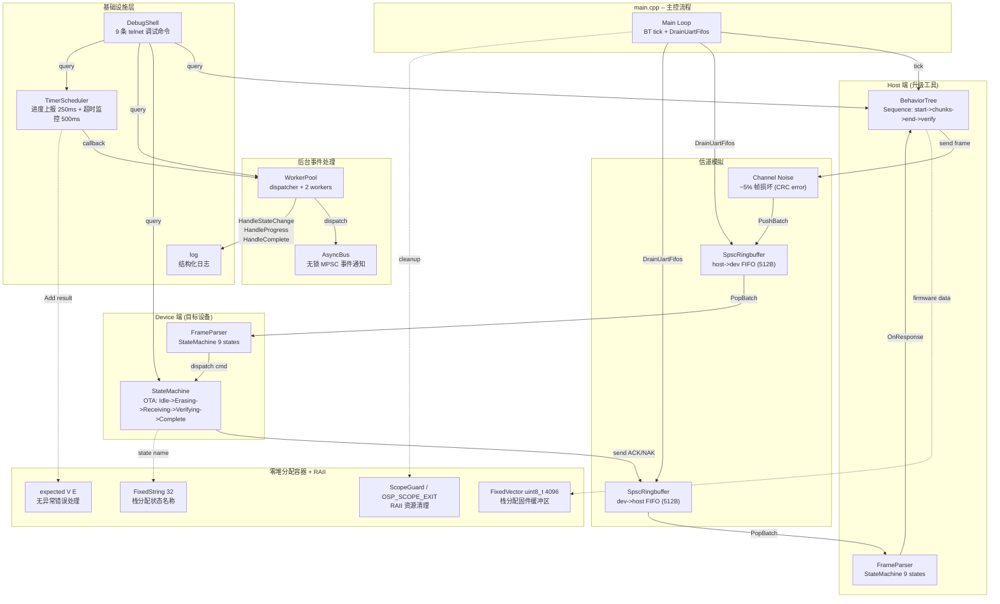
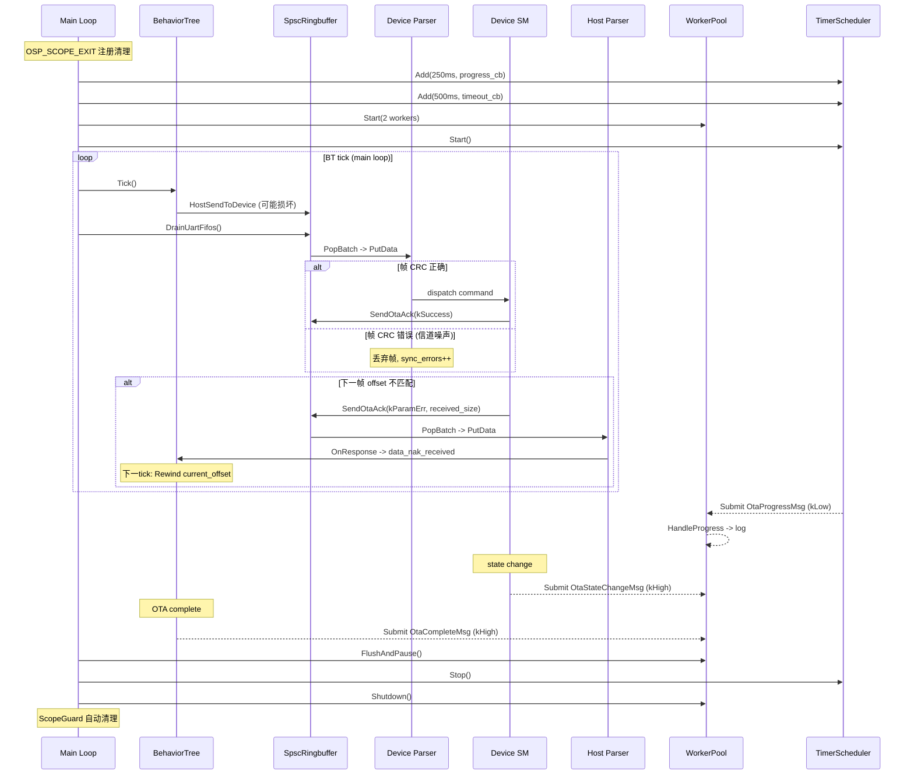
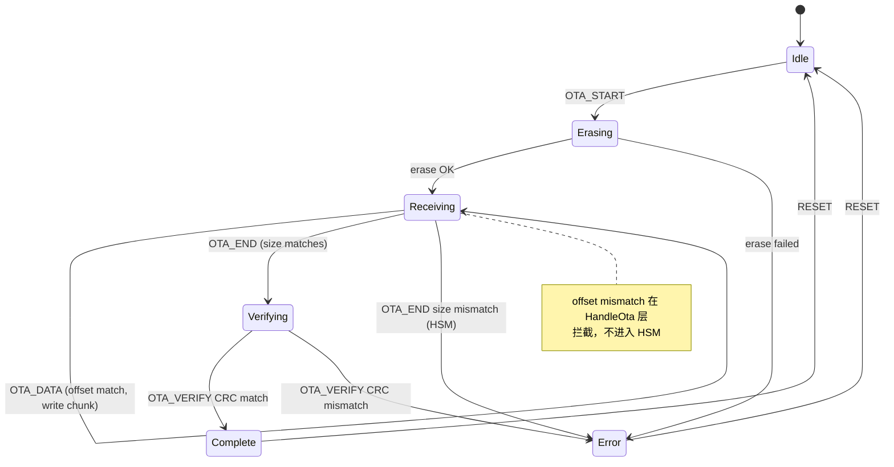
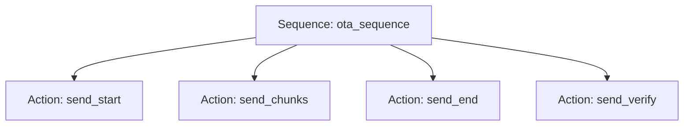

# Serial OTA Demo -- 串口固件升级示例

## 概述

基于 newosp 组件实现的工业级串口固件升级 (OTA) 示例，参考 [uart_statemachine_ringbuffer_linux](https://gitee.com/liudegui/uart_statemachine_ringbuffer_linux) 的协议设计和分层架构。

本示例综合展示了 newosp 库中 12 个核心组件的协同工作，包含信道噪声模拟和基于 ACK 的自动重传机制。

## 组件集成架构



## 组件交互时序



## 12 个 osp 组件一览

| # | 组件 | 头文件 | 在本 Demo 中的用途 |
|---|------|--------|-------------------|
| 1 | `StateMachine` | osp/hsm.hpp | Device OTA 状态机 (6 states) + 双端 HSM 帧解析器 (9 states) |
| 2 | `BehaviorTree` | osp/bt.hpp | Host 升级流程: Sequence(start -> chunks -> end -> verify) |
| 3 | `TimerScheduler` | osp/timer.hpp | 进度上报 (250ms) + 超时监控 (500ms, 上限 30s) |
| 4 | `AsyncBus` | osp/bus.hpp | 无锁 MPSC 总线: OtaProgressMsg / OtaStateChangeMsg / OtaCompleteMsg |
| 5 | `WorkerPool` | osp/worker_pool.hpp | 后台事件处理: dispatcher + 2 workers, 优先级分发 |
| 6 | `SpscRingbuffer` | osp/spsc_ringbuffer.hpp | 模拟 UART 双向 FIFO 通道 (host<->device, 各 512B) |
| 7 | `FixedVector` | osp/vocabulary.hpp | `FixedVector<uint8_t, 4096>` 栈分配固件缓冲区，零堆分配 |
| 8 | `FixedString` | osp/vocabulary.hpp | `FixedString<32>` 栈分配状态名称，用于 Bus 事件 |
| 9 | `expected` | osp/vocabulary.hpp | Timer Add / Shell Start 的无异常错误处理 |
| 10 | `ScopeGuard` | osp/vocabulary.hpp | `OSP_SCOPE_EXIT` 自动清理 timer、g_host、g_pool 指针 |
| 11 | `DebugShell` | osp/shell.hpp | 9 条 telnet 命令 (含 pool_stats / uart_fifo / retransmit) |
| 12 | `log` | osp/log.hpp | OSP_LOG_INFO / WARN / DEBUG 结构化日志 |

## 协议帧格式

兼容 uart_statemachine_ringbuffer_linux 的简单帧格式:

```
| 0xAA | LEN_LO | LEN_HI | CMD_CLASS | CMD | DATA[LEN-2] | CRC_LO | CRC_HI | 0x55 |
```

- 帧头: 0xAA, 帧尾: 0x55
- 长度: 2 字节小端序 (cmd_class + cmd + data 的总长度)
- CRC16-CCITT: constexpr 查表, 对 payload 部分校验

## OTA 命令定义

| 命令 | CMD | 方向 | 数据 |
|------|-----|------|------|
| OTA_START | 0x01 | Host -> Device | OtaStartReq (10B): total_size + start_addr + expected_crc |
| OTA_DATA | 0x02 | Host -> Device | OtaDataHdr (6B) + chunk_data[N] |
| OTA_END | 0x03 | Host -> Device | 无数据 |
| OTA_VERIFY | 0x04 | Host -> Device | 无数据 |
| OTA_ACK | 0x8x | Device -> Host | OtaAckResp (7B): status + received_size |
| VERIFY_RESP | 0x84 | Device -> Host | OtaVerifyResp (5B): status + calc_crc |

## 重传机制

基于现有 ACK 协议的隐式重传，无需新增协议字段:

```
Host                          Channel                       Device
  |--- DATA(offset=256) -------->X (CRC error) ------------>| (frame dropped)
  |--- DATA(offset=384) -------->|--------------------------->| offset mismatch!
  |<-- ACK(ParamErr, recv=256) --|<---------------------------| received_size=256
  |                               |                           |
  | Rewind: current_offset=256   |                           |
  |--- DATA(offset=256) -------->|--------------------------->| OK, write chunk
  |<-- ACK(Success) -------------|<---------------------------|
```

### 重传设计要点

1. **信道噪声模拟**: `HostSendToDevice` 以 `kDropRate` (默认 5%) 概率翻转 DATA 帧中随机一个字节，导致设备端 CRC 校验失败并丢帧
2. **偏移量检测**: 设备端 `HandleOta::kData` 在 HSM 分发前检查 `chunk_offset == received_size`，不匹配时发送 `ACK(kParamErr, received_size)`
3. **回卷重发**: 主机端 `SendChunks` 检测到失败 ACK 后，将 `current_offset` 回卷到设备的 `received_size`，重发丢失的数据块
4. **末块保护**: 设备端 `HandleOta::kEnd` 校验 `received_size == total_size`，不匹配时拒绝 END 命令，主机回卷补发
5. **重试上限**: 每个数据块最多重试 `kMaxChunkRetries` (3) 次，超过后 OTA 失败

## 数据结构 (packed, 字节对齐)

```cpp
#pragma pack(push, 1)

struct OtaStartReq {        // 10 bytes
  uint32_t total_size;
  uint32_t start_addr;
  uint16_t expected_crc;
};

struct OtaDataHdr {         // 6 bytes
  uint32_t chunk_offset;
  uint16_t chunk_len;
};

struct OtaAckResp {         // 7 bytes
  uint8_t  cmd_class;
  uint8_t  cmd;
  uint8_t  status;
  uint32_t received_size;   // 用于重传回卷
};

struct OtaVerifyResp {      // 5 bytes
  uint8_t  cmd_class;
  uint8_t  cmd;
  uint8_t  status;
  uint16_t calc_crc;
};

#pragma pack(pop)
```

## OTA 状态机 (Device 端)



## 行为树 (Host 端)



每个 Action 使用 ActionPhase (kSend/kWait/kDone) 模式处理 BT Sequence 的 re-tick 行为:
- send_start: 发送 OTA_START, 等待 ACK
- send_chunks: 逐包发送 OTA_DATA (128B/chunk), 返回 kRunning 直到全部发完; 检测到 NAK 时回卷重发
- send_end: 发送 OTA_END, 等待 ACK; 若设备报告 size mismatch 则回卷补发
- send_verify: 发送 OTA_VERIFY, 等待校验结果

## Shell 调试命令

通过 `telnet localhost 5090` 连接，支持以下命令:

| 命令 | 说明 | 示例 |
|------|------|------|
| `help` | 列出所有命令 | `help` |
| `cmd_ota_status` | OTA 状态机和传输进度 | `cmd_ota_status` |
| `cmd_serial_stats` | 双端解析器统计 | `cmd_serial_stats` |
| `cmd_bus_stats` | 消息总线统计 | `cmd_bus_stats` |
| `cmd_pool_stats` | WorkerPool 分发/处理统计 | `cmd_pool_stats` |
| `cmd_uart_fifo` | UART FIFO 状态 (SpscRingbuffer) | `cmd_uart_fifo` |
| `cmd_retransmit` | 信道损坏和重传统计 | `cmd_retransmit` |
| `cmd_flash_dump <addr> [len]` | 十六进制转储 Flash | `cmd_flash_dump 0x0 64` |
| `cmd_flash_crc <addr> <len>` | 计算 Flash CRC | `cmd_flash_crc 0x0 4096` |
| `cmd_timer_info` | 定时器配置信息 | `cmd_timer_info` |

## 参数配置

| 参数 | 值 | 说明 |
|------|-----|------|
| kFirmwareSize | 4096 | 模拟固件大小 |
| kChunkSize | 128 | 每包数据大小 |
| kFlashSize | 65536 | 模拟 Flash 大小 (64KB) |
| kFlashSectorSize | 4096 | Flash 扇区大小 |
| kFlashStartAddr | 0x0000 | Flash 写入起始地址 |
| kDropRate | 5 | 信道帧损坏概率 (~5%) |
| kMaxChunkRetries | 3 | 每块最大重试次数 |
| kWorkerNum | 2 | WorkerPool 工作线程数 |
| kWorkerQueueDepth | 64 | 每 worker SPSC 队列深度 |
| kUartFifoSize | 512 | 模拟 UART FIFO 深度 (字节) |
| Shell port | 5090 | Telnet 调试端口 |
| OTA tick | 5 ms | BT tick 间隔 |
| Progress report | 250 ms | 进度上报间隔 (TimerScheduler) |
| Timeout | 30000 ms | OTA 最大超时 |

## 编译运行

```bash
cmake -B build -DOSP_BUILD_EXAMPLES=ON
cmake --build build --target osp_serial_ota_demo
./build/examples/osp_serial_ota_demo
```

运行后可在另一个终端连接调试 shell:

```bash
telnet localhost 5090
```

## 典型输出

```
[INFO ] [OTA_MAIN] === Serial OTA Demo ===
[INFO ] [OTA_MAIN] Components: StateMachine + BehaviorTree + DebugShell +
                   TimerScheduler + AsyncBus + WorkerPool + SpscRingbuffer + vocabulary
[INFO ] [OTA_MAIN] Firmware: 4096 bytes, chunk: 128, addr: 0x0
[INFO ] [OTA_MAIN] WorkerPool: 2 workers, queue=64
[INFO ] [OTA_HOST] Starting OTA: size=4096 crc=0xE0B6 chunk=128
[INFO ] [OTA_HOST] START ACK received
[INFO ] [OTA_HOST] Rewind 640 -> 256 (retry 1/3)    -- 信道噪声触发重传
[INFO ] [OTA_HOST] Progress: 4096/4096 (100%)
[INFO ] [OTA_DEV] CRC: expected=0xE0B6 calculated=0xE0B6
[INFO ] [OTA_HOST] Verify SUCCESS: CRC=0xE0B6
[INFO ] [OTA_MAIN] ========== Results ==========
[INFO ] [OTA_MAIN] BT ticks:     40
[INFO ] [OTA_MAIN] Host status:  SUCCESS
[INFO ] [OTA_MAIN] Bytes sent:   4224 / 4096
[INFO ] [OTA_MAIN] Device state: Complete
[INFO ] [OTA_MAIN] Dev CRC err:  2 (corrupted: 2)
[INFO ] [OTA_MAIN] Retransmit:   retries=1 drops=1 (rate=5%)
[INFO ] [OTA_MAIN] FW CRC=0xE0B6  Flash CRC=0xE0B6  MATCH
[INFO ] [OTA_MAIN] OTA upgrade completed successfully!
[INFO ] [OTA_POOL] OTA OK: 125 ms, 40 ticks, CRC=0xE0B6, retries=1 drops=1
```

## 与参考项目的对应关系

| uart_statemachine_ringbuffer_linux | serial_ota_demo |
|-----------------------------------|-----------------|
| hsm_parser.c (C 状态机) | parser.hpp: osp::StateMachine (C++17 HSM) |
| cmd_handler.c (OTA 命令处理) | device.hpp: DeviceHandler + HSM state handlers |
| uart_protocol.h (帧格式) | protocol.hpp: packed structs + constexpr CRC |
| main.c (测试驱动) | host.hpp: osp::BehaviorTree (自动化流程) |
| printf 调试 | osp::DebugShell (telnet) + osp::log |
| -- | osp::TimerScheduler (定时调度) |
| -- | osp::AsyncBus + WorkerPool (事件分发+后台处理) |
| -- | osp::SpscRingbuffer (UART FIFO 模拟) |
| -- | osp::FixedVector/FixedString (零堆分配容器) |
| -- | osp::expected/ScopeGuard (RAII + 错误处理) |
| -- | 信道噪声模拟 + ACK-based 自动重传 |
