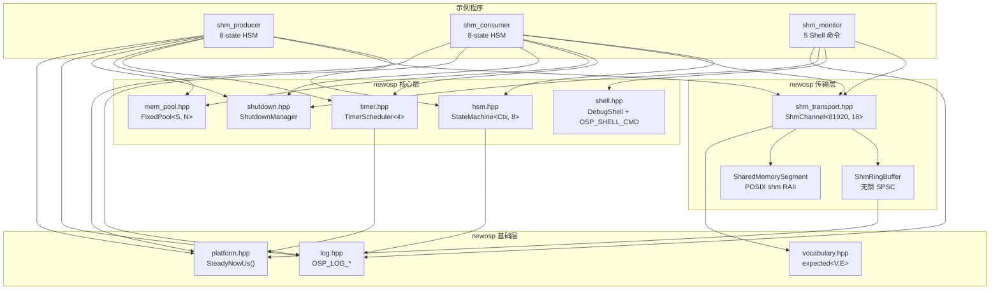
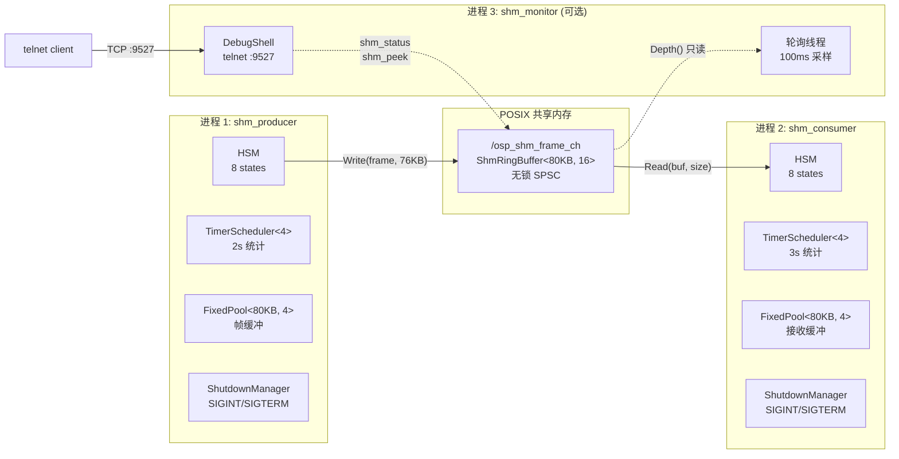
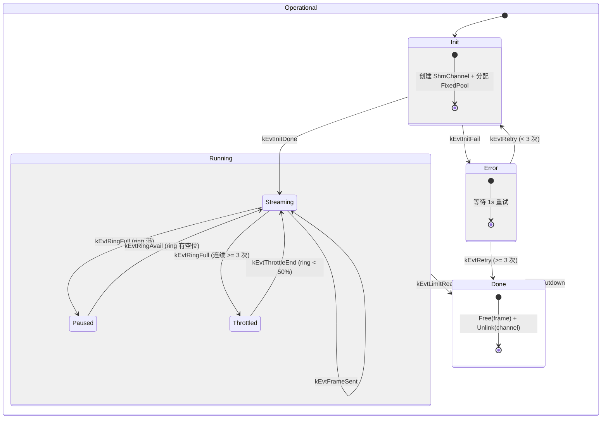
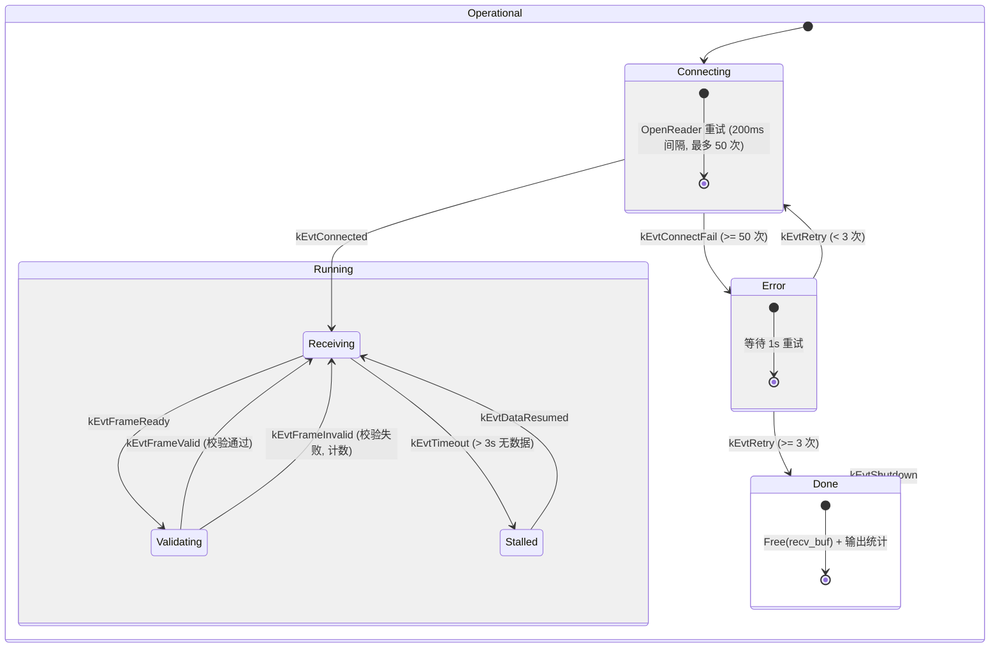

# SHM IPC Demo -- 共享内存进程间通信示例

## 概述

本示例演示 newosp 共享内存组件 (`ShmChannel` / `ShmRingBuffer` / `SharedMemorySegment`)
的跨进程通信能力，模拟工业场景中的视频帧流式传输 (producer-consumer 模式)。

参考项目: [cpp_py_shmbuf_sample](https://gitee.com/liudegui/cpp_py_shmbuf_sample)

## 组件依赖关系



## 进程交互架构



## 使用的 newosp 组件

| 组件 | 头文件 | 用途 | 使用方 |
|------|--------|------|--------|
| `ShmChannel<81920, 16>` | `shm_transport.hpp` | 命名共享内存通道 (CreateWriter / OpenReader) | P, C, M |
| `ShmRingBuffer` | `shm_transport.hpp` | 无锁 SPSC 环形缓冲区 (ShmChannel 内部) | 间接 |
| `SharedMemorySegment` | `shm_transport.hpp` | POSIX shm_open/mmap RAII 封装 (ShmChannel 内部) | 间接 |
| `StateMachine<Ctx, 8>` | `hsm.hpp` | 层次状态机驱动 producer/consumer 生命周期 | P, C |
| `FixedPool<81920, 4>` | `mem_pool.hpp` | 帧缓冲区固定块分配 (零堆分配) | P, C |
| `TimerScheduler<4>` | `timer.hpp` | 周期性统计吞吐量 (2s/3s 间隔) | P, C |
| `SteadyNowUs()` | `platform.hpp` | 统一时间戳 (FPS 计算、stall 检测) | P, C |
| `DebugShell` | `shell.hpp` | Telnet 调试 Shell (OSP_SHELL_CMD 注册) | M |
| `ShutdownManager` | `shutdown.hpp` | 信号安全优雅关停 (SIGINT/SIGTERM) | P, C, M |
| `expected<V, E>` | `vocabulary.hpp` | 错误处理 (CreateWriter/OpenReader 返回值) | P, C, M |
| `OSP_LOG_*` | `log.hpp` | 分级日志输出 | P, C, M |

P = Producer, C = Consumer, M = Monitor

## Producer HSM 状态转换



## Consumer HSM 状态转换



## 数据格式

```
┌─────────────────────────────────────────────┐
│ FrameHeader (16 bytes)                      │
│   uint32_t magic      = 0x4652414D ('FRAM') │
│   uint32_t seq_num    = 递增序号              │
│   uint32_t width      = 320                  │
│   uint32_t height     = 240                  │
├─────────────────────────────────────────────┤
│ Pixel data (width * height = 76800 bytes)   │
│   每字节 = (seq_num + offset) & 0xFF        │
└─────────────────────────────────────────────┘
```

帧大小: 76816 bytes, ShmChannel 配置: `<81920, 16>` (slot 80KB x 16)

## 时间戳统一

所有时间测量统一使用 `osp::SteadyNowUs()` (platform.hpp)，不直接使用 `std::chrono::steady_clock`。
与 `design_timer_unification_zh.md` Phase 1 保持一致。

| 用途 | 调用位置 | 说明 |
|------|----------|------|
| FPS 计算 | producer 主循环 | 每 100 帧计算一次 |
| FPS / MB/s 计算 | consumer OnValidating | 每 100 帧计算一次 |
| Stall 检测 | consumer 主循环 | `(now_us - last_frame_us) / 1000 > 3000ms` |
| Pause 时间戳 | producer OnEnterPaused | 记录背压开始时间 |

## Shell 调试命令

通过 `telnet localhost 9527` 连接 monitor 进程:

| 命令 | 说明 |
|------|------|
| `help` | 列出所有命令 |
| `shm_status` | 显示通道状态、队列深度 |
| `shm_stats` | 显示队列填充率、平均深度 |
| `shm_reset` | 重置统计计数器 |
| `shm_peek` | 读取并显示下一帧 header (消费帧) |
| `shm_config` | 显示通道配置参数 |

## 构建与运行

```bash
cmake -B build -DCMAKE_BUILD_TYPE=Release -DOSP_BUILD_EXAMPLES=ON
cmake --build build -j$(nproc)

# 终端 1: 启动 producer (1000 帧)
./build/examples/shm_ipc/osp_shm_producer frame_ch 1000

# 终端 2: 启动 consumer
./build/examples/shm_ipc/osp_shm_consumer frame_ch

# 终端 3: 启动 monitor (可选)
./build/examples/shm_ipc/osp_shm_monitor frame_ch 9527

# 终端 4: telnet 调试
telnet localhost 9527
```

## 文件说明

| 文件 | 说明 | 使用组件 |
|------|------|----------|
| `shm_producer.cpp` | HSM 驱动的帧生产者 (8 状态) | HSM, ShmChannel, Timer, FixedPool, Shutdown, Log, SteadyNowUs |
| `shm_consumer.cpp` | HSM 驱动的帧消费者 (8 状态) | HSM, ShmChannel, Timer, FixedPool, Shutdown, Log, SteadyNowUs |
| `shm_monitor.cpp` | Shell 调试监控 (5 个 telnet 命令) | ShmChannel, DebugShell, Shutdown, Log |
| `CMakeLists.txt` | 构建配置 (链接 osp, Threads, rt) | -- |

## 线程安全

| 组件 | 线程模型 | 说明 |
|------|----------|------|
| `ShmRingBuffer` | 无锁 CAS | 单写单读 (SPSC)，跨进程安全 |
| `ShmChannel` | 单写多读 | 写端和读端分属不同进程 |
| `DebugShell` | 内部 mutex | 命令注册表保护，会话线程隔离 |
| `TimerScheduler<4>` | 收集-释放-执行 | 锁内收集到期任务，锁外执行回调 |
| `FixedPool<80KB, 4>` | 内部 mutex | Allocate/Free 线程安全 |
| `ShutdownManager` | atomic flag | IsShutdownRequested() 无锁读取 |

## 设计要点

1. HSM entry action 中禁止调用 `sm->Dispatch()` (避免嵌套转换)，
   初始化和验证逻辑放在主循环中执行
2. `TimerScheduler<4>` 使用模板参数指定容量，零堆分配
3. `FixedPool<81920, 4>` 预分配帧缓冲，热路径无 malloc
4. 时间戳统一使用 `osp::SteadyNowUs()`，不引入 `steady_clock::time_point`
5. Producer 背压策略: 连续 3 次 ring full 后进入 Throttled 降速状态
6. Consumer 帧校验: 逐字节验证 `(seq_num + offset) & 0xFF` 模式
