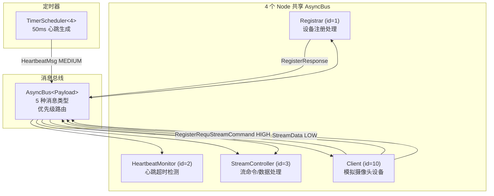
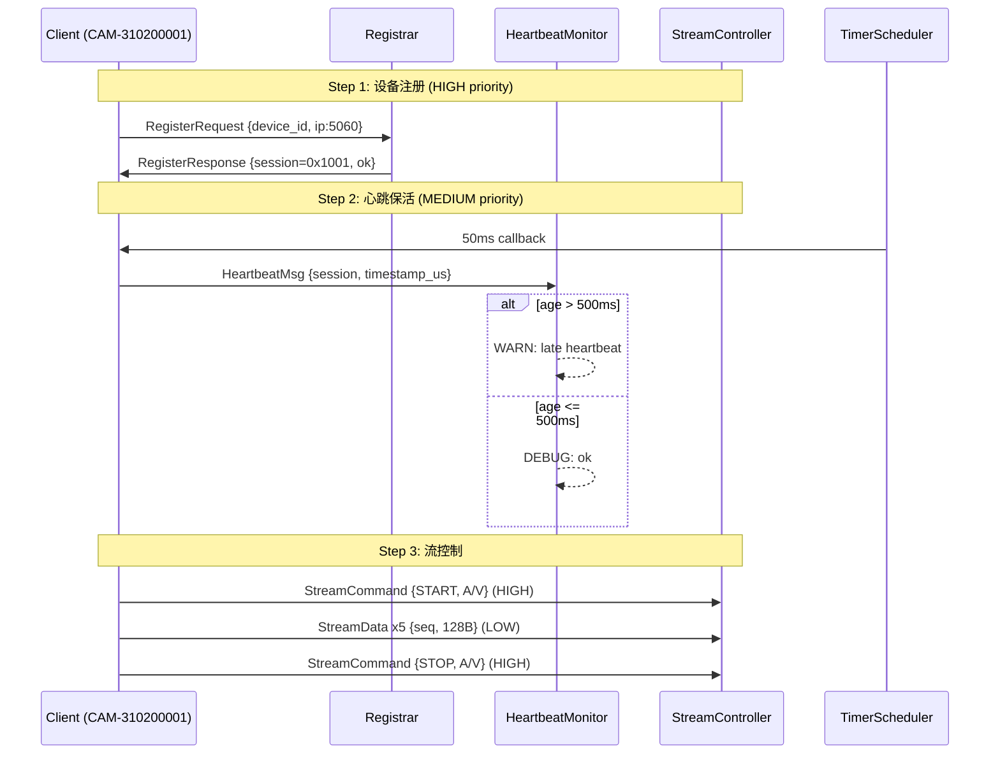

# Streaming Protocol Demo -- 视频监控协议示例

## 概述

模拟 GB28181/RTSP 风格的视频监控协议流水线：设备注册、周期心跳保活、流控制（开始/停止/数据帧）。
展示 newosp 的 Bus + Node + Timer 轻量级多节点协作模式。

## 应用场景

- GB28181 国标视频监控平台（SIP 注册 + 心跳 + 流控）
- RTSP 流媒体服务器（设备管理 + 会话控制）
- 工业视频采集系统（设备发现 + 数据流管理）

## 组件架构



## 使用的 newosp 组件

| 组件 | 头文件 | 用途 |
|------|--------|------|
| `AsyncBus<Payload>` | `osp/bus.hpp` | 无锁 MPSC 消息总线 |
| `Node<Payload>` | `osp/node.hpp` | 4 个角色节点 (Registrar/HeartbeatMonitor/StreamController/Client) |
| `TimerScheduler<4>` | `osp/timer.hpp` | 50ms 周期心跳生成 |
| `SteadyNowUs()` | `osp/platform.hpp` | 心跳时间戳 + 延迟检测 |
| `log` | `osp/log.hpp` | 结构化日志 |

## 消息类型

```cpp
using Payload = std::variant<
    RegisterRequest,    // 设备注册请求 (device_id, ip, port)
    RegisterResponse,   // 注册响应 (device_id, session_id, result)
    HeartbeatMsg,       // 心跳消息 (session_id, timestamp_us)
    StreamCommand,      // 流控命令 (session_id, start/stop, video/audio)
    StreamData          // 流数据 (session_id, seq, payload[256])
>;
```

## 协议流程



## 优先级策略

| 消息类型 | 优先级 | 说明 |
|----------|--------|------|
| `RegisterRequest` | HIGH | 控制面消息，优先处理 |
| `RegisterResponse` | 默认 | 注册响应 |
| `HeartbeatMsg` | MEDIUM | 周期保活 |
| `StreamCommand` | HIGH | 流控指令 (start/stop) |
| `StreamData` | LOW | 数据面消息，可降级 |

## 设计要点

1. **多节点 topic 分发**: 4 个节点按角色订阅不同消息类型，共享同一 Bus，实现松耦合通信
2. **优先级感知发布**: `PublishWithPriority` 区分控制面 (HIGH) 和数据面 (LOW)，拥塞时优先保障控制消息
3. **Timer 驱动心跳**: `TimerScheduler` 回调生成心跳消息并通过 Node 发布，展示定时器到总线的集成
4. **GB28181 信令映射**: 注册 -> 心跳 -> 流控生命周期映射真实视频监控平台信令流程
5. **最小化依赖**: 仅 3 个头文件 (Bus + Node + Timer)，展示轻量级集成

## 文件说明

| 文件 | 说明 |
|------|------|
| `messages.hpp` | 5 种协议消息 POD 结构 + `Payload` variant 定义 |
| `handlers.hpp` | 4 个节点的订阅设置 + 心跳定时器回调 |
| `main.cpp` | 3 步主流程: 注册 -> 心跳 -> 流控 |

## 编译运行

```bash
cmake -B build -DOSP_BUILD_EXAMPLES=ON
cmake --build build --target osp_streaming_protocol
./build/examples/osp_streaming_protocol
```
